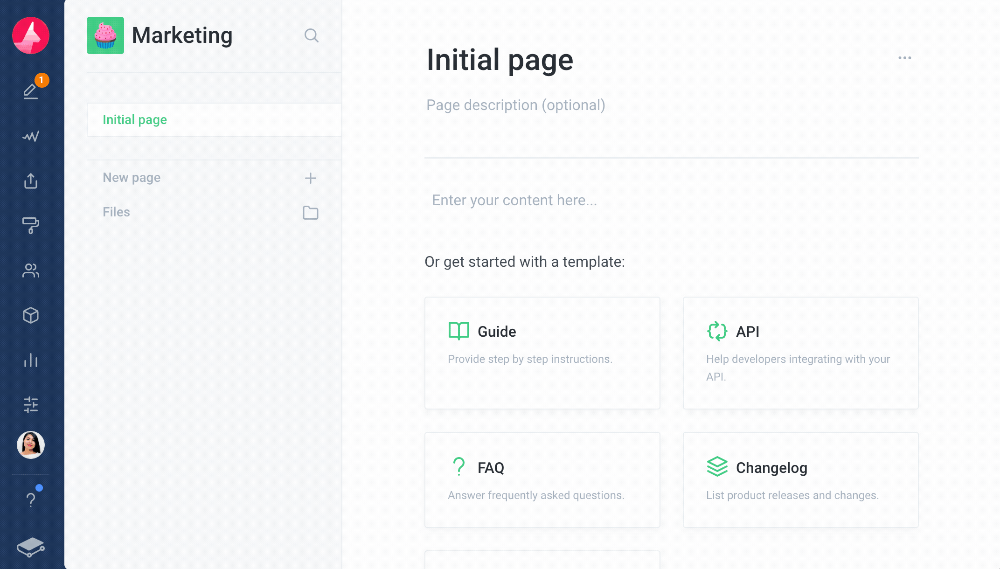
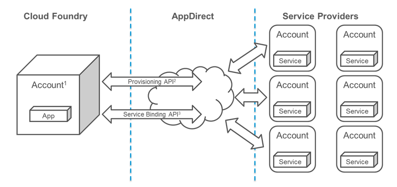
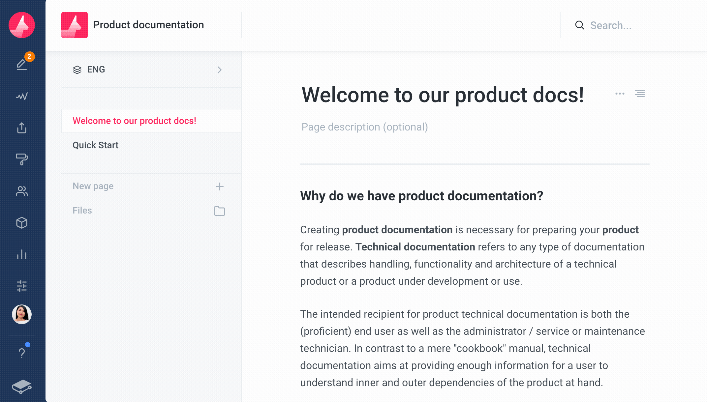
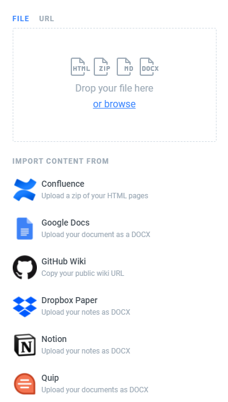
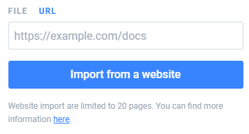

# gitbook-to-github

## **깃북아, 이사가야지** 

* 왜 깃북과 깃헙은 바로바로 연동이 되지 않고 지금까지 수정하지 않았을까 😂
* 이미지도 이상해, 버젼 관리도 안돼,,,

## 깃헙 &gt; 깃북 연동시 파일/경로 순서가 이상하다

* 처음부터 손봐야 할 것 같다

## 깃헙 &gt; 깃북 연동시 이미지 제대로 나오지 않는게 있다

다음은 깃북에서 선사하는 [두 가지 글 작성 방식](https://docs.gitbook.com/editing-content/rich-content)이다. 

> Thanks to our elegant _WYSIWYG_ editor, you can have **rich-content** and **rich-text**. ****✨ Let's start with rich content!
>
> There are 2 ways to add rich content to your docs:
>
> * With the [command palette](): choose among our rich content options and bring some life to your documentation.
> * With the [insert palette](): insert images, math formulas, links or emojis while writing your content.

 **rich-content** 와 **rich-text** 라고 하는데 ~~내가 부자였으면 좋겠다.~~ 두 가지를 살펴 보자.

------

### 1. [command palette](https://docs.gitbook.com/editing-content/rich-content/with-command-palette)

> The most common type of images is an "image block". They are full-width images containing a caption. You can center or align them to the left. You can insert them like this:

**Image block** 이라는 이미지 타입은 자동으로 이미지 사이즈가 **크게** 나온다. 그리고 이미지 **왼쪽 정렬**과 **가운데 정렬**을 지원한다.


------

### 2. [insert palette](https://docs.gitbook.com/editing-content/rich-content/with-insert-palette)

> You can insert inline images to your content. By default, their size is proportional to the font size as their main purpose is to be inserted in line to your content. This is great for inline badges and icons.‌
>
> There are 3 different sizes of inline images:‌
>
> 1. **Inline size:** the default one proportionally sized to the font
> 2. **Original size:** will remain inline but with its original size with a maximum width
> 3. **Convert to block:** this turns an inline image into a [block image]() with its original size
>
>   
>  **Note:** You cannot convert a block image to an inline image.

3가지 이미지 사이즈 방식을 지원한다.

1. 폰트 사이즈와 동일한 이미지 사진
2. 이미지 본 사이즈
3. 위에서 본 block image 로 변



------

### 3. 깃북 &lt;&gt; 깃헙 연동 

> 깃북에서는 소스보기가 지원 되지 않고 바로 md preview가 진행된다.

깃북 &gt; 깃헙 _\(깃북의 기능인 Integrations 를 통해 깃헙으로 연동\)_ 을 하고 소스를 보면 다음과 같다. command 방식과 insert 방식 둘 다 동일한 소스로 나온다.

```text

```

그리고 깃헙 &gt; 깃북을 진행하게 되면 어떻게나왔더라...?


깃북 &gt; 깃헙 연동을 하면 Image block 형식으로 저장이 된다. 아마 기본 형식인듯 하다.

깃헙 &gt; 깃북 연동을 하면 Image block 형식으로 저장이 된다.


## 깃북아, 버젼 관리는 어떻게  

### 1. [variants](https://docs.gitbook.com/editing-content/variants)

> A variant is another version of your content. 
>
> For an API or a library, this has two advantages:
>
> * Your readers can still access older versions of your documentation, while you work on the latest one
> * You can improve and correct errors in older versions of your documentation even after releasing new versions of your product.

뭐 그렇다.





My Tip : variant 생성 후 variant 설정에 slug 라는 항목이 있는데 이는 해당 variant 의 prefix url 을 의미한다.


### 2. GitHub integration and variants

> When using the GitHub integration, **all variants will be mapped to branches on GitHub**. When creating a new variant from the GitBook editor, a matching branch will be created on GitHub. When creating a branch on GitHub, it will be imported as a release on GitBook if it matches your branch filter settings

> **Note:** A GitBook variant is not the same thing as a GitHub release or tags. GitBook variants are mapped to GitHub _branches_.

‌깃헙의 **브랜치**와 유사하다.


### 3. GitHub integration

> When configuring the GitHub integration with an existing repository, you'll be prompted to choose which content to use \(GitBook or GitHub\).‌
>
> * When choosing GitHub, it'll replace your space's content with the repository's content
> * When choosing GitBook, it'll push your space's content to GitHub

두 가지 방식이 있는데 **어떤 브랜치**에서 수행지 선택 하고 첫 Sync를 **깃헙 &gt; 깃북** 인지, **깃북 &gt; 깃헙** 인지 선택해야 한다.


## 깃북아, 이삿짐은 어떻게 해 ?

안타깝게도 깃북에서의 Export 기능은 PDF 밖에 없다. ~~꾸졌어~~

그래도 아래와 같이 Import는 여러가지를 지원한다.

 

> 위 두 이미지들은는 insert 방식으로 이미지를 삽입했다

하지만 깃북에 있는것을 가져오려는 지금 상황에서 이 모든 Import 기능은 무용지물이다. ~~꾸졌어2~~

그래서 Export/Import 기능은 사용하지 않고 Integration을 통해 깃헙의 데이터를 옮기는건 어떨까? 

깃북 &gt; 깃헙 &gt; 깃북은 정상적으로 작동 할테니까. \(파일순서, 이미지깨짐은 어떡해 ?\)


예상 시나리오는 이렇다.

* 기존 깃북의 내용을 깃헙으로 Integration
* Integration 된 깃헙의 내용을 새로운 깃북과 Integration
* 쨔잔 !


## 깃북아, 엄마가 너랑 언제까지 놀라고 했니

현재는 깃헙의 소스를 깃북에 손수 옮겨주고 있다. 아무래도 제일 행복한 방법은 깃북에서 **딱 한번만** 업로드를 하고 끝내는 것이다. 깃북과 깃헙의 차이점은 뭐가 있을까 ? ~~깃북을 왜쓰지?~~

```text
엄마 전 커서 깃헙이 될래요 ! 엄마 전 커서 깃헙이 될래요 ! 엄마 전 커서 깃헙이 될래요 !
엄마 전 커서 깃헙이 될래요 ! 엄마 전 커서 깃헙이 될래요 ! 엄마 전 커서 깃헙이 될래요 !
엄마 전 커서 깃헙이 될래요 ! 엄마 전 커서 깃헙이 될래요 ! 엄마 전 커서 깃헙이 될래요 !
엄마 전 커서 깃헙이 될래요 ! 엄마 전 커서 깃헙이 될래요 ! 엄마 전 커서 깃헙이 될래요 !
엄마 전 커서 깃헙이 될래요 ! 엄마 전 커서 깃헙이 될래요 ! 엄마 전 커서 깃헙이 될래요 !
엄마 전 커서 깃헙이 될래요 ! 엄마 전 커서 깃헙이 될래요 ! 엄마 전 커서 깃헙이 될래요 !
엄마 전 커서 깃헙이 될래요 ! 엄마 전 커서 깃헙이 될래요 ! 엄마 전 커서 깃헙이 될래요 !
엄마 전 커서 깃헙이 될래요 ! 엄마 전 커서 깃헙이 될래요 ! 엄마 전 커서 깃헙이 될래요 !
엄마 전 커서 깃헙이 될래요 ! 엄마 전 커서 깃헙이 될래요 ! 엄마 전 커서 깃헙이 될래요 !
엄마 전 커서 깃헙이 될래요 ! 엄마 전 커서 깃헙이 될래요 ! 엄마 전 커서 깃헙이 될래요 !
```


