# PAAS-TA\_PORTAL\_API\_SERVICE\_INSTALL\_GUIDE\_V1.0

### Table of Contents

1. [문서 개요](paas-ta_portal_api_service_install_guide_v1.0.md#1) 1.1. [목적](paas-ta_portal_api_service_install_guide_v1.0.md#1.1) 1.2. [범위](paas-ta_portal_api_service_install_guide_v1.0.md#1.2) 1.3. [시스템 구성도](paas-ta_portal_api_service_install_guide_v1.0.md#1.3) 1.4. [참고자료](paas-ta_portal_api_service_install_guide_v1.0.md#1.4)
2. [PaaS-TA Portal 설치](paas-ta_portal_api_service_install_guide_v1.0.md#2) 2.1. [Prerequisite](paas-ta_portal_api_service_install_guide_v1.0.md#2.1) 2.2. [Stemcell 확인](paas-ta_portal_api_service_install_guide_v1.0.md#2.2) 2.3. [Deployment 다운로드](paas-ta_portal_api_service_install_guide_v1.0.md#2.3) 2.4. [Deployment 파일 수정](paas-ta_portal_api_service_install_guide_v1.0.md#2.4) 2.5. [서비스 설치](paas-ta_portal_api_service_install_guide_v1.0.md#2.5) 2.6. [서비스 설치 - 다운로드 된 PaaS-TA Release 파일 이용 방식](paas-ta_portal_api_service_install_guide_v1.0.md#2.6) 2.7. [서비스 설치 확인](paas-ta_portal_api_service_install_guide_v1.0.md#2.7)
3. [PaaS-TA Portal 운영](paas-ta_portal_api_service_install_guide_v1.0.md#3) 3.1. [사용자의 조직 생성 Flag 활성화](paas-ta_portal_api_service_install_guide_v1.0.md#3.1) 3.2. [사용자포탈 UAA 페이지 오류](paas-ta_portal_api_service_install_guide_v1.0.md#3.2) 3.3. [운영자포탈 유저 페이지 조회 오류](paas-ta_portal_api_service_install_guide_v1.0.md#3.3) 3.4. [DB Migration](paas-ta_portal_api_service_install_guide_v1.0.md#3.4) 3.5. [Log](paas-ta_portal_api_service_install_guide_v1.0.md#3.5) 3.6. [카탈로그 적용](paas-ta_portal_api_service_install_guide_v1.0.md#3.6)

### 1. 문서 개요

#### 1.1. 목적

본 문서\(PaaS-TA Portal Release 설치 가이드\)는 전자정부표준프레임워크 기반의 PaaS-TA에서 제공되는 PaaS-TA Portal Release를 Bosh2.0을 이용하여 설치 하는 방법을 기술하였다. PaaS-TA 3.5 버전부터는 Bosh2.0 기반으로 deploy를 진행하며 내부 네트워크는 link를 적용시켜 자동으로 Ip가 할당이 된다. 기존 Bosh1.0 기반으로 설치를 원할경우에는 PaaS-TA 3.1 이하 버전의 문서를 참고한다.

#### 1.2. 범위

설치 범위는 PaaS-TA Portal Release를 검증하기 위한 기본 설치를 기준으로 작성하였다.

#### 1.3. 시스템 구성도

본 문서의 설치된 시스템 구성도이다. Binary Storage, Mariadb, Proxy, Gateway Api, Registration Api, Portal Api, Common Api, Log Api, Storage Api, Webadmin, Webuser로 최소사항을 구성하였다.


* Paas-TA Portal 설치할때 cloud config에 추가적으로 정의한 VM\_Tpye명과 스펙 

| VM\_Type | 스펙 |
| :--- | :--- |
| portal\_tiny | 1vCPU / 256MB RAM / 4GB Disk |
| portal\_medium | 1vCPU / 1GB RAM / 4GB Disk |
| portal\_small | 1vCPU / 512MB RAM / 4GB Disk |

* Paas-TA Portal각 Instance의 Resource Pool과 스펙

| 구분 | Resource Pool | 스펙 |
| :--- | :--- | :--- |
| binary\_storage | portal\_small | 1vCPU / 512MB RAM / 4GB Disk 10GB\(영구적 Disk\) |
| haproxy | portal\_small | 1vCPU / 512MB RAM / 4GB Disk |
| mariadb | portal\_small | 1vCPU / 512MB RAM / 4GB Disk +10GB\(영구적 Disk\) |
| paas-ta-portal-registration | portal\_small | 1vCPU / 512MB RAM / 4GB Disk |
| paas-ta-portal-gateway | portal\_small | 1vCPU / 512MB RAM / 4GB Disk |
| paas-ta-portal-api | portal\_medium | 1vCPU / 1GB RAM / 4GB Disk |
| paas-ta-portal-common-api | portal\_small | 1vCPU / 512MB RAM / 4GB Disk |
| paas-ta-portal-log-api | portal\_small | 1vCPU / 512MB RAM / 4GB Disk |
| paas-ta-portal-storage-api | portal\_small | 1vCPU / 512MB RAM / 4GB Disk |

#### 1.4. 참고자료

[**http://bosh.io/docs**](http://bosh.io/docs)  
[**http://docs.cloudfoundry.org/**](http://docs.cloudfoundry.org/)

### 2. PaaS-TA Portal 설치

#### 2.1. Prerequisite

본 설치 가이드는 Linux 환경에서 설치하는 것을 기준으로 하였다. 서비스팩 설치를 위해서는 먼저 BOSH CLI v2 가 설치 되어 있어야 하고 BOSH 에 로그인이 되어 있어야 한다.  
 BOSH CLI v2 가 설치 되어 있지 않을 경우 먼저 BOSH2.0 설치 가이드 문서를 참고 하여 BOSH CLI v2를 설치를 하고 사용법을 숙지 해야 한다.  


* BOSH2.0 사용자 가이드
  * [BOSH2 사용자 가이드](../bosh/paas-ta_bosh2_install_guide_v5.0.md) 
  * [BOSH CLI V2 사용자 가이드](https://github.com/PaaS-TA/Guide-4.0-ROTELLE/blob/master/Use-Guide/Bosh/PaaS-TA_BOSH_CLI_V2_사용자_가이드v1.0.md)

#### 2.2. Stemcell 확인

Stemcell 목록을 확인하여 서비스 설치에 필요한 Stemcell이 업로드 되어 있는 것을 확인한다. \(PaaS-TA 5.5.1 과 동일 stemcell 사용\)

> $ bosh -e ${BOSH\_ENVIRONMENT} stemcells

```text
Using environment '10.0.1.6' as client 'admin'

Name                                     Version  OS             CPI  CID  
bosh-aws-xen-hvm-ubuntu-xenial-go_agent  621.94*  ubuntu-xenial  -    ami-0297ff649e8eea21b  

(*) Currently deployed

1 stemcells

Succeeded
```

#### 2.3. Deployment 다운로드

서비스 설치에 필요한 Deployment를 Git Repository에서 받아 서비스 설치 작업 경로로 위치시킨다.

* Portal Deployment Git Repository URL : [https://github.com/PaaS-TA/portal-deployment/tree/v5.1.1](https://github.com/PaaS-TA/portal-deployment/tree/v5.1.1)

```text
# Deployment 다운로드 파일 위치 경로 생성 및 설치 경로 이동
$ mkdir -p ~/workspace/paasta-5.5.1/deployment
$ cd ~/workspace/paasta-5.5.1/deployment

# Deployment 파일 다운로드
$ git clone https://github.com/PaaS-TA/portal-deployment.git -b v5.1.1
```

#### 2.4. Deployment 파일 수정

BOSH Deployment manifest는 Components 요소 및 배포의 속성을 정의한 YAML 파일이다. Deployment 파일에서 사용하는 network, vm\_type, disk\_type 등은 Cloud config를 활용하고, 활용 방법은 BOSH 2.0 가이드를 참고한다.

* Cloud config 설정 내용을 확인한다.   

> $ bosh -e ${BOSH\_ENVIRONMENT} cloud-config

```text
Using environment '10.0.1.6' as client 'admin'

azs:
- cloud_properties:
    availability_zone: ap-northeast-2a
  name: z1
- cloud_properties:
    availability_zone: ap-northeast-2a
  name: z2

... ((생략)) ...

disk_types:
- disk_size: 1024
  name: default
- disk_size: 1024
  name: 1GB

... ((생략)) ...

networks:
- name: default
  subnets:
  - az: z1
    cloud_properties:
      security_groups: paasta-security-group
      subnet: subnet-00000000000000000
    dns:
    - 8.8.8.8
    gateway: 10.0.1.1
    range: 10.0.1.0/24
    reserved:
    - 10.0.1.2 - 10.0.1.9
    static:
    - 10.0.1.10 - 10.0.1.120

... ((생략)) ...

vm_types:
- cloud_properties:
    ephemeral_disk:
      size: 3000
      type: gp2
    instance_type: t2.small
  name: minimal
- cloud_properties:
    ephemeral_disk:
      size: 10000
      type: gp2
    instance_type: t2.small
  name: small

... ((생략)) ...

Succeeded
```

* common\_vars.yml을 서버 환경에 맞게 수정한다. 
* Portal-API에서 사용하는 변수는 system\_domain, paasta\_admin\_username, paasta\_admin\_password, paasta\_database\_ips, paasta\_database\_port, paasta\_database\_type, paasta\_database\_driver\_class, paasta\_cc\_db\_id, paasta\_cc\_db\_password, paasta\_uaa\_db\_id, paasta\_uaa\_db\_password, uaa\_client\_admin\_id, uaa\_client\_admin\_secret, monitoring\_api\_url, portal\_web\_user\_url이다.

> $ vi ~/workspace/paasta-5.5.1/deployment/common/common\_vars.yml
>
> \`\`\`
>
> ## BOSH INFO
>
> bosh\_ip: "10.0.1.6" \# BOSH IP bosh\_url: "[https://10.0.1.6](https://10.0.1.6)" \# BOSH URL \(e.g. "[https://00.000.0.0](https://00.000.0.0)"\) bosh\_client\_admin\_id: "admin" \# BOSH Client Admin ID bosh\_client\_admin\_secret: "ert7na4jpew" \# BOSH Client Admin Secret\('echo $\(bosh int ~/workspace/paasta-5.5.1/deployment/paasta-deployment/bosh/{iaas}/creds.yml --path /admin\_password\)' 명령어를 통해 확인 가능\) bosh\_director\_port: 25555 \# BOSH director port bosh\_oauth\_port: 8443 \# BOSH oauth port bosh\_version: 271.2 \# BOSH version\('bosh env' 명령어를 통해 확인 가능, on-demand service용, e.g. "271.2"\)

## PAAS-TA INFO

system\_domain: "61.252.53.246.xip.io" \# Domain \(xip.io를 사용하는 경우 HAProxy Public IP와 동일\) paasta\_admin\_username: "admin" \# PaaS-TA Admin Username paasta\_admin\_password: "admin" \# PaaS-TA Admin Password paasta\_nats\_ip: "10.0.1.121" paasta\_nats\_port: 4222 paasta\_nats\_user: "nats" paasta\_nats\_password: "7EZB5ZkMLMqT7" \# PaaS-TA Nats Password \(CredHub 로그인후 'credhub get -n /micro-bosh/paasta/nats\_password' 명령어를 통해 확인 가능\) paasta\_nats\_private\_networks\_name: "default" \# PaaS-TA Nats 의 Network 이름 paasta\_database\_ips: "10.0.1.123" \# PaaS-TA Database IP \(e.g. "10.0.1.123"\) paasta\_database\_port: 5524 \# PaaS-TA Database Port \(e.g. 5524\(postgresql\)/13307\(mysql\)\) -- Do Not Use "3306"&"13306" in mysql paasta\_database\_type: "postgresql" \# PaaS-TA Database Type \(e.g. "postgresql" or "mysql"\) paasta\_database\_driver\_class: "org.postgresql.Driver" \# PaaS-TA Database driver-class \(e.g. "org.postgresql.Driver" or "com.mysql.jdbc.Driver"\) paasta\_cc\_db\_id: "cloud\_controller" \# CCDB ID \(e.g. "cloud\_controller"\) paasta\_cc\_db\_password: "cc\_admin" \# CCDB Password \(e.g. "cc\_admin"\) paasta\_uaa\_db\_id: "uaa" \# UAADB ID \(e.g. "uaa"\) paasta\_uaa\_db\_password: "uaa\_admin" \# UAADB Password \(e.g. "uaa\_admin"\) paasta\_api\_version: "v3"

## UAAC INFO

uaa\_client\_admin\_id: "admin" \# UAAC Admin Client Admin ID uaa\_client\_admin\_secret: "admin-secret" \# UAAC Admin Client에 접근하기 위한 Secret 변수 uaa\_client\_portal\_secret: "clientsecret" \# UAAC Portal Client에 접근하기 위한 Secret 변수

## Monitoring INFO

metric\_url: "10.0.161.101" \# Monitoring InfluxDB IP syslog\_address: "10.0.121.100" \# Logsearch의 ls-router IP syslog\_port: "2514" \# Logsearch의 ls-router Port syslog\_transport: "relp" \# Logsearch Protocol saas\_monitoring\_url: "61.252.53.248" \# Pinpoint HAProxy WEBUI의 Public IP monitoring\_api\_url: "61.252.53.241" \# Monitoring-WEB의 Public IP

#### Portal INFO

portal\_web\_user\_ip: "52.78.88.252" portal\_web\_user\_url: "[http://portal-web-user.52.78.88.252.xip.io](http://portal-web-user.52.78.88.252.xip.io)"

#### ETC INFO

abacus\_url: "[http://abacus.61.252.53.248.xip.io](http://abacus.61.252.53.248.xip.io)" \# abacus url \(e.g. "[http://abacus.xxx.xxx.xxx.xxx.xip.io](http://abacus.xxx.xxx.xxx.xxx.xip.io)"\)

```text
- Deployment YAML에서 사용하는 변수 파일을 서버 환경에 맞게 수정한다.

> $ vi ~/workspace/paasta-5.5.1/deployment/portal-deployment/portal-api/vars.yml
```

## STEMCELL INFO

stemcell\_os: "ubuntu-xenial" \# stemcell os stemcell\_version: "621.94" \# stemcell version

## NETWORKS INFO

private\_networks\_name: "default" \# private network name public\_networks\_name: "vip" \# public network name

## MARIADB INFO

mariadb\_azs: \[z6\] \# mariadb : azs mariadb\_instances: 1 \# mariadb : instances \(1\) mariadb\_vm\_type: "minimal" \# mariadb : vm type mariadb\_persistent\_disk\_type: "10GB" \# mariadb : persistent disk type mariadb\_port: "" \# mariadb : database port \(e.g. 13306\) -- Do Not Use "3306" mariadb\_admin\_password: "" \# mariadb : database admin password \(e.g. "Paasta@2019"\)

## HAPROXY INFO

haproxy\_azs: \[z7\] \# haproxy : azs haproxy\_instances: 1 \# haproxy : instances \(1\) haproxy\_vm\_type: "small" \# haproxy : vm type haproxy\_public\_ips: "" \# haproxy : public ips \(e.g. "00.00.00.00"\) haproxy\_infra\_admin: false \# haproxy : infra admin \(default "false"\)

## BINARY\_STORAGE INFO

binary\_storage\_azs: \[z6\] \# binary storage : azs binary\_storage\_instances: 1 \# binary storage : instances \(1\) binary\_storage\_vm\_type: "minimal" \# binary storage : vm type binary\_storage\_persistent\_disk\_type: "10GB" \# binary storage : persistent disk type binary\_storage\_auth\_port: "" \# binary storage : keystone port \(e.g. 15001\) -- Do Not Use "5000" binary\_storage\_username: "" \# binary storage : username \(e.g. "paasta-portal"\) binary\_storage\_password: "" \# binary storage : password \(e.g. "paasta"\) binary\_storage\_tenantname: "" \# binary storage : tenantname \(e.g. "paasta-portal"\) binary\_storage\_email: "" \# binary storage : email \(e.g. "paasta@paasta.com"\)

## PORTAL\_GATEWAY INFO

gateway\_azs: \[z6\] \# gateway : azs gateway\_instances: 1 \# gateway : instances \(1\) gateway\_vm\_type: "small" \# gateway : vm type

## PORTAL\_REGISTRATION INFO

registration\_azs: \[z6\] \# registration : azs registration\_instances: 1 \# registration : instances \(1\) registration\_vm\_type: "small" \# registration : vm type registration\_infra\_admin: false \# registration : infra admin \(default "false"\)

## PORTAL\_API INFO

api\_azs: \[z6\] \# portal-api : azs api\_instances: 1 \# portal-api : instances \(1\) api\_vm\_type: "minimal" \# portal-api : vm type api\_infra\_admin: false \# portal-api : infra admin \(default "false"\)

## PORTAL\_COMMON\_API INFO

common\_api\_azs: \[z6\] \# portal-common-api : azs common\_api\_instances: 1 \# portal-common-api : instances \(1\) common\_api\_vm\_type: "small" \# portal-common-api : vm type common\_api\_infra\_admin: false \# portal-common-api : infra admin \(default "false"\)

## PORTAL\_STORAGE\_API INFO

storage\_api\_azs: \[z6\] \# portal-storage-api : azs storage\_api\_instances: 1 \# portal-storage-api : instances \(1\) storage\_api\_vm\_type: "small" \# portal-storage-api : vm type storage\_api\_infra\_admin: false \# portal-storage-api : infra admin \(default "false"\)

## PORTAL\_LOG\_API INFO

log\_api\_azs: \[z6\] \# portal-log-api : azs log\_api\_instances: 1 \# portal-log-api : instances \(1\) log\_api\_vm\_type: "small" \# portal-log-api : vm type log\_api\_infra\_admin: false \# portal-log-api : infra admin \(default "false"\)

## MAIL\_SMTP INFO

mail\_smtp\_host: "" \# mail-smtp : host \(e.g. "smtp.gmail.com"\) mail\_smtp\_port: "" \# mail-smtp : port \(e.g. "465"\) mail\_smtp\_username: "" \# mail-smtp : user name mail\_smtp\_password: "" \# mail-smtp : password mail\_smtp\_useremail: "" \# mail-smtp : user email mail\_smtp\_properties\_auth: "true" \# mail-smtp : properties auth mail\_smtp\_properties\_starttls\_enable: "true" \# mail-smtp : properties starttls enable mail\_smtp\_properties\_starttls\_required: "true" \# mail-smtp : properties starttls required mail\_smtp\_properties\_subject: "" \# mail-smtp : properties subject \(e.g. "PaaS-TA User Potal"\)

```text
### <div id="2.5"/> 2.5. 서비스 설치

- 서버 환경에 맞추어 Deploy 스크립트 파일의 VARIABLES 설정을 수정하고, Option file을 추가할지 선택한다.  
     (선택) -o operations/use-compiled-releases.yml (ubuntu-xenial/621.94로 컴파일 된 릴리즈 사용) 

> $ vi ~/workspace/paasta-5.5.1/deployment/portal-deployment/portal-api/deploy.sh
```

## !/bin/bash

## VARIABLES

COMMON\_VARS\_PATH="" \# common\_vars.yml File Path \(e.g. ../../common/common\_vars.yml\) CURRENT\_IAAS="${CURRENT\_IAAS}" \# IaaS Information \(PaaS-TA에서 제공되는 create-bosh-login.sh 미 사용시 aws/azure/gcp/openstack/vsphere 입력\) BOSH\_ENVIRONMENT="${BOSH\_ENVIRONMENT}" \# bosh director alias name \(PaaS-TA에서 제공되는 create-bosh-login.sh 미 사용시 bosh envs에서 이름을 확인하여 입력\)

## DEPLOY

bosh -e ${BOSH\_ENVIRONMENT} -n -d portal-api deploy --no-redact portal-api.yml  -o operations/${CURRENT\_IAAS}-network.yml  -l ${COMMON\_VARS\_PATH}  -l vars.yml

```text
- 서비스를 설치한다.
```

$ cd ~/workspace/paasta-5.5.1/deployment/portal-deployment/portal-api  
$ sh ./deploy.sh

```text
### <div id="2.6"/> 2.6. 서비스 설치 - 다운로드 된 PaaS-TA Release 파일 이용 방식

- 서비스 설치에 필요한 릴리즈 파일을 다운로드 받아 Local machine의 서비스 설치 작업 경로로 위치시킨다.  

  - 설치 릴리즈 파일 다운로드 : [paasta-portal-api-release-2.4.0.tgz](https://nextcloud.paas-ta.org/index.php/s/im9LWHZGs9aaP2d/download)
```

## 릴리즈 다운로드 파일 위치 경로 생성

$ mkdir -p ~/workspace/paasta-5.5.1/release/portal

## 릴리즈 파일 다운로드 및 파일 경로 확인

$ ls ~/workspace/paasta-5.5.1/release/portal paasta-portal-api-release-2.4.0.tgz

```text
- 서버 환경에 맞추어 Deploy 스크립트 파일의 VARIABLES 설정을 수정하고 Option file 및 변수를 추가한다.  
     (추가) -o operations/use-offline-releases.yml (미리 다운받은 offline 릴리즈 사용)  
     (추가) -v releases_dir="<RELEASE_DIRECTORY>"  

> $ vi ~/workspace/paasta-5.5.1/deployment/portal-deployment/portal-api/deploy.sh
```

## !/bin/bash

## VARIABLES

COMMON\_VARS\_PATH="" \# common\_vars.yml File Path \(e.g. ../../common/common\_vars.yml\) CURRENT\_IAAS="${CURRENT\_IAAS}" \# IaaS Information \(PaaS-TA에서 제공되는 create-bosh-login.sh 미 사용시 aws/azure/gcp/openstack/vsphere 입력\) BOSH\_ENVIRONMENT="${BOSH\_ENVIRONMENT}" \# bosh director alias name \(PaaS-TA에서 제공되는 create-bosh-login.sh 미 사용시 bosh envs에서 이름을 확인하여 입력\)

## DEPLOY

bosh -e ${BOSH\_ENVIRONMENT} -n -d portal-api deploy --no-redact portal-api.yml  -o operations/use-offline-releases.yml  -o operations/${CURRENT\_IAAS}-network.yml  -l ${COMMON\_VARS\_PATH}  -l vars.yml  -v releases\_dir="/home/ubuntu/workspace/paasta-5.5.1/release"

```text
- 서비스를 설치한다.
```

$ cd ~/workspace/paasta-5.5.1/deployment/portal-deployment/portal-api  
$ sh ./deploy.sh

```text
### <div id="2.7"/> 2.7. 서비스 설치 확인

설치 완료된 서비스를 확인한다.  

> $ bosh -e ${BOSH_ENVIRONMENT} -d portal-api vms
```

Using environment '10.0.1.6' as client 'admin'

Task 4823. Done

Deployment 'portal-api'

Instance Process State AZ IPs VM CID VM Type Active  
binary\_storage/9f58a9b7-2a3d-4ee9-8975-7b04b99c0a21 running z5 10.30.107.212 vm-e65ad396-ce65-4ef0-962d-5c54fa411769 portal\_large true  
haproxy/8cc2d633-2b43-4f3d-a2e8-72f5279c11d5 running z5 10.30.107.213 vm-315bfa1b-9829-46de-a19d-3bd65e9f9ad4 portal\_large true  
115.68.46.214  
mariadb/117cbf05-b223-4133-bf61-e15f16494e21 running z5 10.30.107.211 vm-bc5ae334-12d4-41d4-8411-d9315a96a305 portal\_large true  
paas-ta-portal-api/48fa0c5a-52eb-4ae8-a7b9-91275615318c running z5 10.30.107.217 vm-9d2a1929-0157-4c77-af5e-707ec496ed87 portal\_medium true  
paas-ta-portal-common-api/060320fa-7f26-4032-a1d9-6a7a41a044a8 running z5 10.30.107.219 vm-f35e9838-74cf-40e0-9f97-894b53a68d1f portal\_medium true  
paas-ta-portal-gateway/6baba810-9a4a-479d-98b2-97e5ba651784 running z5 10.30.107.214 vm-7ec75160-bf34-442e-b755-778ae7dd3fec portal\_medium true  
paas-ta-portal-log-api/a4460008-42b5-4ba0-84ee-fff49fe6c1bd running z5 10.30.107.218 vm-9ec0a1b0-09f6-415b-8e23-53af91fd94b8 portal\_medium true  
paas-ta-portal-registration/3728ed73-451e-4b93-ab9b-c610826c3135 running z5 10.30.107.215 vm-c4020514-c458-41c6-bcbc-7e0ee1bc6f42 portal\_small true  
paas-ta-portal-storage-api/2940366a-8294-4509-a9c0-811c8140663a running z5 10.30.107.220 vm-79ad6ee1-1bb5-4308-8b71-9ed30418e2c1 portal\_medium true

9 vms

Succeeded

```text
## <div id="3"/>3. PaaS-TA Portal 운영

### <div id="3.1"/> 3.1. 사용자의 조직 생성 Flag 활성화

PaaS-TA는 기본적으로 일반 사용자는 조직을 생성할 수 없도록 설정되어 있다. 포털 배포를 위해 조직 및 공간을 생성해야 하고 또 테스트를 구동하기 위해서도 필요하므로 사용자가 조직을 생성할 수 있도록 user_org_creation FLAG를 활성화 한다. FLAG 활성화를 위해서는 PaaS-TA 운영자 계정으로 로그인이 필요하다.
```

$ cf enable-feature-flag user\_org\_creation

```text

```

Setting status of user\_org\_creation as admin... OK

Feature user\_org\_creation Enabled.

\`\`\`

#### 3.2. 사용자포탈 UAA페이지 오류

> 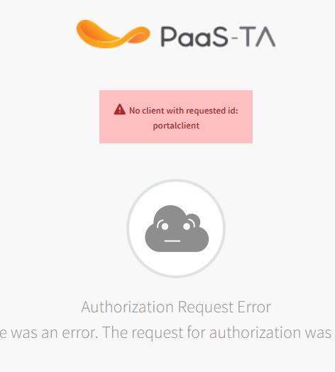 1. uaac portalclient가 등록이 되어있지 않다면 해당 화면과 같이 redirect오류가 발생한다. 2. uaac client add를 통해 potalclient를 추가시켜주어야 한다. $ uaac target $ uaac token client get Client ID: admin Client secret: **\***

1. uaac client add portalclient –s “portalclient Secret”

   > --redirect\_uri "사용자포탈 Url, 사용자포탈 Url/callback" $ uaac client add portalclient -s xxxxx --redirect\_uri "[http://portal-web-user.xxxx.xip.io](http://portal-web-user.xxxx.xip.io), [http://portal-web-user.xxxx.xip.io/callback](http://portal-web-user.xxxx.xip.io/callback)"  --scope "cloud\_controller\_service\_permissions.read , openid , cloud\_controller.read , cloud\_controller.write , cloud\_controller.admin"  --authorized\_grant\_types "authorization\_code , client\_credentials , refresh\_token"  --authorities="uaa.resource"  --autoapprove="openid , cloud\_controller\_service\_permissions.read"
   >
   > 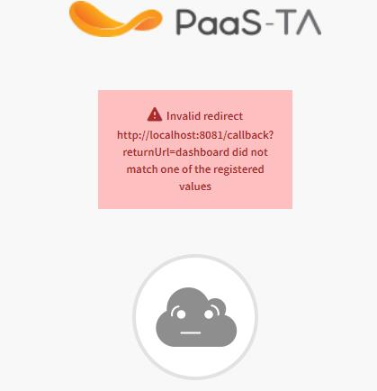

2. uaac portalclient가 url이 잘못 등록되어있다면 해당 화면과 같이 redirect오류가 발생한다. 
3. uaac client update를 통해 url을 수정해야한다.

   > $ uaac target $ uaac token client get Client ID: admin Client secret: **\***

4. uaac client update portalclient --redirect\_uri "사용자포탈 Url, 사용자포탈 Url/callback"

   > $ uaac client update portalclient --redirect\_uri "[http://portal-web-user.xxxx.xip.io](http://portal-web-user.xxxx.xip.io), [http://portal-web-user.xxxx.xip.io/callback](http://portal-web-user.xxxx.xip.io/callback)"

#### 3.3. 운영자 포탈 유저 페이지 조회 오류

1. 페이지 이동시 정보를 가져오지 못하고 오류가 났을 경우 common-api VM으로 이동후에 DB 정보 config를 수정후 재시작을 해 주어야 한다.

#### 3.4. DB Migration

이전버전에서 사용한 Portal DB를 PaaS-TA 3.5 Portal DB에 마이그레이션 하는 방법을 설명한다.

**1. DB tool을 이용해 기존에 사용한 DB와 Paas-TA 3.5 Portal DB를 연결한다.**

* 가이드의 DB tool을 이용한 마이그레이션 설명은 navicat을 기준으로 한다.

  **2. 마이그레이션할 table의 레코드 데이터를 전부 삭제한다.**

  > 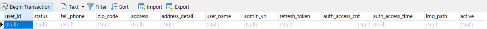
  >
  > **3. Tools - Data Transfer를 클릭해서 마이그레이션 설정창을 띄운다.**
  >
  > 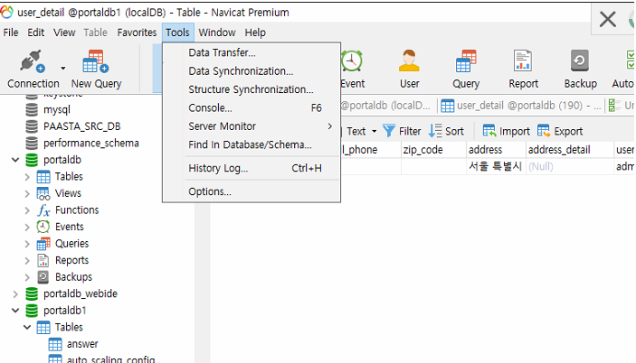
  >
  > **4. 마이그레이션할 source DB\(기존 DB\), target DB\(Paas-TA 3.5 Portal DB\)를 설정한다.**
  >
  > 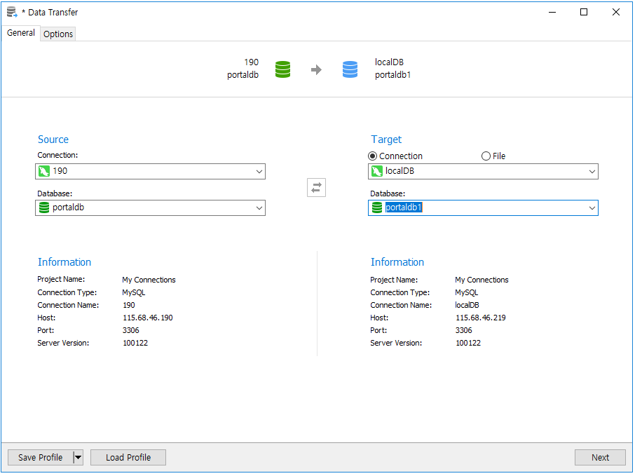
  >
  > **5. Option에 들어가 Table Options의 Create tables 옵션에 체크를 해제, Orther Options의 Contiune on error를 체크한 후 next를 누른다.**
  >
  > 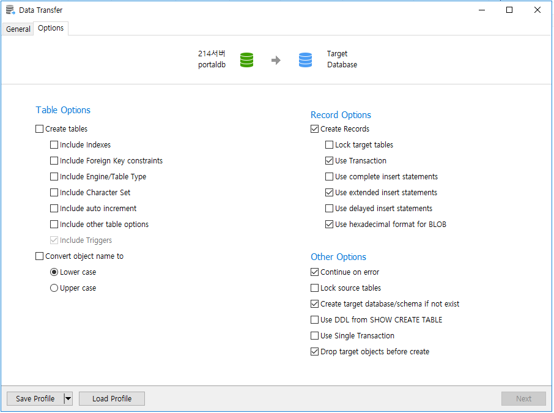
  >
  > **6. 데이터를 이동할 테이블을 설정 후 next를 누른다.**
  >
  > 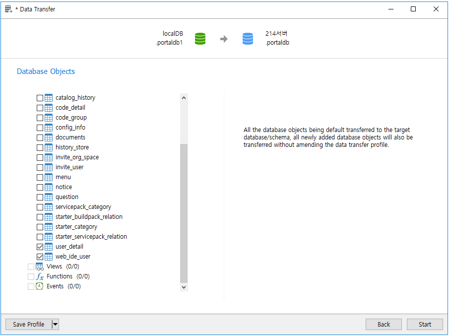
  >
  > **7-1. 마이그레이션이 정상적으로 완료된 모습**
  >
  > 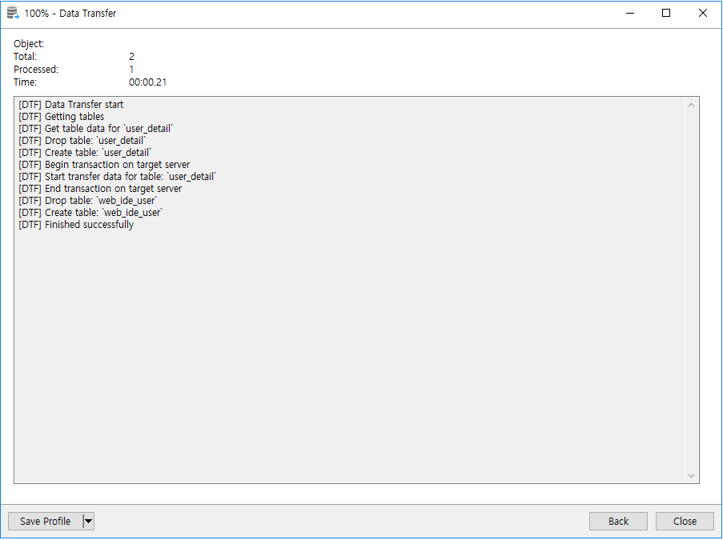
  >
  > **7-2. 마이그레이션 오류난 모습**
  >
  > 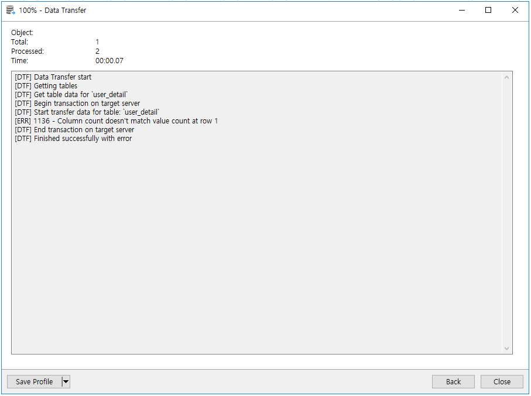
  >
  > **7-3. 기존 DB에 오류난 Paas-TA Portal table의 Design에 맞춰 수정후에 다시 마이그레이션을 진행한다.**

#### 3.5. Log

Paas-TA Portal 각각 Instance의 log를 확인 할 수 있다. 1. 로그를 확인할 Instance에 접근한다.

> bosh ssh -d \[deployment name\] \[instance name\]

```text
   Instance                                                          Process State  AZ  IPs            VM CID                                   VM Type        Active  
   binary_storage/9f58a9b7-2a3d-4ee9-8975-7b04b99c0a21               running        z5  10.30.107.212  vm-e65ad396-ce65-4ef0-962d-5c54fa411769  portal_large   true  
   haproxy/8cc2d633-2b43-4f3d-a2e8-72f5279c11d5                      running        z5  10.30.107.213  vm-315bfa1b-9829-46de-a19d-3bd65e9f9ad4  portal_large   true  
                                                                                        115.68.46.214                                                            
   mariadb/117cbf05-b223-4133-bf61-e15f16494e21                      running        z5  10.30.107.211  vm-bc5ae334-12d4-41d4-8411-d9315a96a305  portal_large   true  
   paas-ta-portal-api/48fa0c5a-52eb-4ae8-a7b9-91275615318c           running        z5  10.30.107.217  vm-9d2a1929-0157-4c77-af5e-707ec496ed87  portal_medium  true  
   paas-ta-portal-common-api/060320fa-7f26-4032-a1d9-6a7a41a044a8    running        z5  10.30.107.219  vm-f35e9838-74cf-40e0-9f97-894b53a68d1f  portal_medium  true  
   paas-ta-portal-gateway/6baba810-9a4a-479d-98b2-97e5ba651784       running        z5  10.30.107.214  vm-7ec75160-bf34-442e-b755-778ae7dd3fec  portal_medium  true  
   paas-ta-portal-log-api/a4460008-42b5-4ba0-84ee-fff49fe6c1bd       running        z5  10.30.107.218  vm-9ec0a1b0-09f6-415b-8e23-53af91fd94b8  portal_medium  true  
   paas-ta-portal-registration/3728ed73-451e-4b93-ab9b-c610826c3135  running        z5  10.30.107.215  vm-c4020514-c458-41c6-bcbc-7e0ee1bc6f42  portal_small   true  
   paas-ta-portal-storage-api/2940366a-8294-4509-a9c0-811c8140663a   running        z5  10.30.107.220  vm-79ad6ee1-1bb5-4308-8b71-9ed30418e2c1  portal_medium  true  
   paas-ta-portal-webadmin/8047fcbd-9a98-4b61-b161-0cbb277fa643      running        z5  10.30.107.221  vm-188250fd-e918-4aab-9cbe-7d368852ea8a  portal_medium  true  
   paas-ta-portal-webuser/cb206717-81c9-49ed-a0a8-e6c3b957cb66       running        z5  10.30.107.222  vm-822f68a5-91c8-453a-b9b3-c1bbb388e377  portal_medium  true  

   11 vms

   Succeeded
   inception@inception:~$ bosh ssh -d paas-ta-portal-v2 paas-ta-portal-api  << instance 접근(bosh ssh) 명령어 입력
   Using environment '10.30.40.111' as user 'admin' (openid, bosh.admin)

   Using deployment 'paas-ta-portal-v2'

   Task 5195. Done
   Unauthorized use is strictly prohibited. All access and activity
   is subject to logging and monitoring.
   Welcome to Ubuntu 14.04.5 LTS (GNU/Linux 4.4.0-92-generic x86_64)

    * Documentation:  https://help.ubuntu.com/

   The programs included with the Ubuntu system are free software;
   the exact distribution terms for each program are described in the
   individual files in /usr/share/doc/*/copyright.

   Ubuntu comes with ABSOLUTELY NO WARRANTY, to the extent permitted by
   applicable law.

   Last login: Tue Sep  4 07:11:42 2018 from 10.30.20.28
   To run a command as administrator (user "root"), use "sudo <command>".
   See "man sudo_root" for details.

   paas-ta-portal-api/48fa0c5a-52eb-4ae8-a7b9-91275615318c:~$ 
```

1. 로그파일이 있는 폴더로 이동한다.

   > 위치 : /var/vcap/sys/log/\[job name\]/

   ```text
     paas-ta-portal-api/48fa0c5a-52eb-4ae8-a7b9-91275615318c:~$ cd /var/vcap/sys/log/paas-ta-portal-api/
     paas-ta-portal-api/48fa0c5a-52eb-4ae8-a7b9-91275615318c:/var/vcap/sys/log/paas-ta-portal-api$ ls
     paas-ta-portal-api.stderr.log  paas-ta-portal-api.stdout.log
   ```

2. 로그파일을 열어 내용을 확인한다.

   > vim \[job name\].stdout.log

   ```text
    예)
    vim paas-ta-portal-api.stdout.log
    2018-09-04 02:08:42.447 ERROR 7268 --- [nio-2222-exec-1] p.p.a.e.GlobalControllerExceptionHandler : Error message : Response : org.springframework.security.web.firewall.FirewalledResponse@298a1dc2
    Occured an exception : 403 Access token denied.
    Caused by...
    org.cloudfoundry.client.lib.CloudFoundryException: 403 Access token denied. (error="access_denied", error_description="Access token denied.")
            at org.cloudfoundry.client.lib.oauth2.OauthClient.createToken(OauthClient.java:114)
            at org.cloudfoundry.client.lib.oauth2.OauthClient.init(OauthClient.java:70)
            at org.cloudfoundry.client.lib.rest.CloudControllerClientImpl.initialize(CloudControllerClientImpl.java:187)
            at org.cloudfoundry.client.lib.rest.CloudControllerClientImpl.<init>(CloudControllerClientImpl.java:163)
            at org.cloudfoundry.client.lib.rest.CloudControllerClientFactory.newCloudController(CloudControllerClientFactory.java:69)
            at org.cloudfoundry.client.lib.CloudFoundryClient.<init>(CloudFoundryClient.java:138)
            at org.cloudfoundry.client.lib.CloudFoundryClient.<init>(CloudFoundryClient.java:102)
            at org.openpaas.paasta.portal.api.service.LoginService.login(LoginService.java:47)
            at org.openpaas.paasta.portal.api.controller.LoginController.login(LoginController.java:51)
            at sun.reflect.NativeMethodAccessorImpl.invoke0(Native Method)
            at sun.reflect.NativeMethodAccessorImpl.invoke(NativeMethodAccessorImpl.java:62)
            at sun.reflect.DelegatingMethodAccessorImpl.invoke(DelegatingMethodAccessorImpl.java:43)
            at java.lang.reflect.Method.invoke(Method.java:498)
            at org.springframework.web.method.support.InvocableHandlerMethod.doInvoke(InvocableHandlerMethod.java:205)
            at org.springframework.web.method.support.InvocableHandlerMethod.invokeForRequest(InvocableHandlerMethod.java:133)
            at org.springframework.web.servlet.mvc.method.annotation.ServletInvocableHandlerMethod.invokeAndHandle(ServletInvocableHandlerMethod.java:97)
            at org.springframework.web.servlet.mvc.method.annotation.RequestMappingHandlerAdapter.invokeHandlerMethod(RequestMappingHandlerAdapter.java:827)
            at org.springframework.web.servlet.mvc.method.annotation.RequestMappingHandlerAdapter.handleInternal(RequestMappingHandlerAdapter.java:738)
            at org.springframework.web.servlet.mvc.method.AbstractHandlerMethodAdapter.handle(AbstractHandlerMethodAdapter.java:85)
            at org.springframework.web.servlet.DispatcherServlet.doDispatch(DispatcherServlet.java:967)
            at org.springframework.web.servlet.DispatcherServlet.doService(DispatcherServlet.java:901)
            at org.springframework.web.servlet.FrameworkServlet.processRequest(FrameworkServlet.java:970)
            at org.springframework.web.servlet.FrameworkServlet.doPost(FrameworkServlet.java:872)
            at javax.servlet.http.HttpServlet.service(HttpServlet.java:661)
            at org.springframework.web.servlet.FrameworkServlet.service(FrameworkServlet.java:846)
            at javax.servlet.http.HttpServlet.service(HttpServlet.java:742)
            at org.apache.catalina.core.ApplicationFilterChain.internalDoFilter(ApplicationFilterChain.java:231)
            at org.apache.catalina.core.ApplicationFilterChain.doFilter(ApplicationFilterChain.java:166)
            at org.apache.tomcat.websocket.server.WsFilter.doFilter(WsFilter.java:52)
            at org.apache.catalina.core.ApplicationFilterChain.internalDoFilter(ApplicationFilterChain.java:193)
            at org.apache.catalina.core.ApplicationFilterChain.doFilter(ApplicationFilterChain.java:166)
   ```

#### 3.6. 카탈로그 적용

**1. Catalog 빌드팩, 서비스팩 추가**

Paas-TA Portal 설치 후에 관리자 포탈에서 빌드팩, 서비스팩을 등록해야 사용자 포탈에서 사용이 가능하다.

1. 관리자 포탈에 접속한다.\(portal-web-admin.\[public ip\].xip.io\)

   > 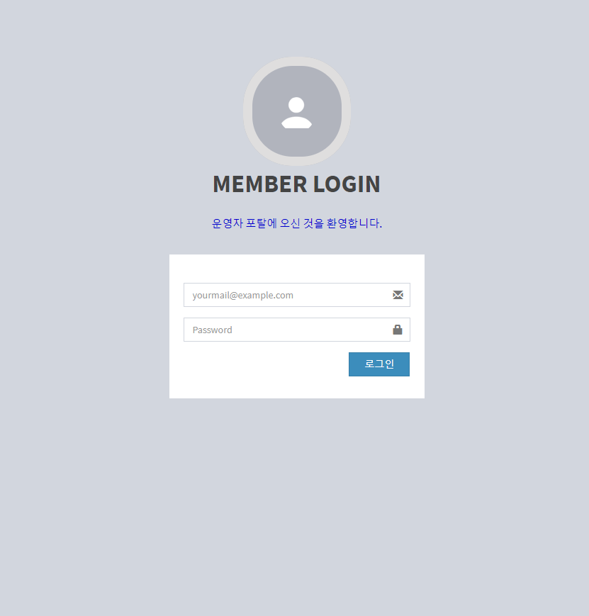

2. 운영관리를 누른다.

   > 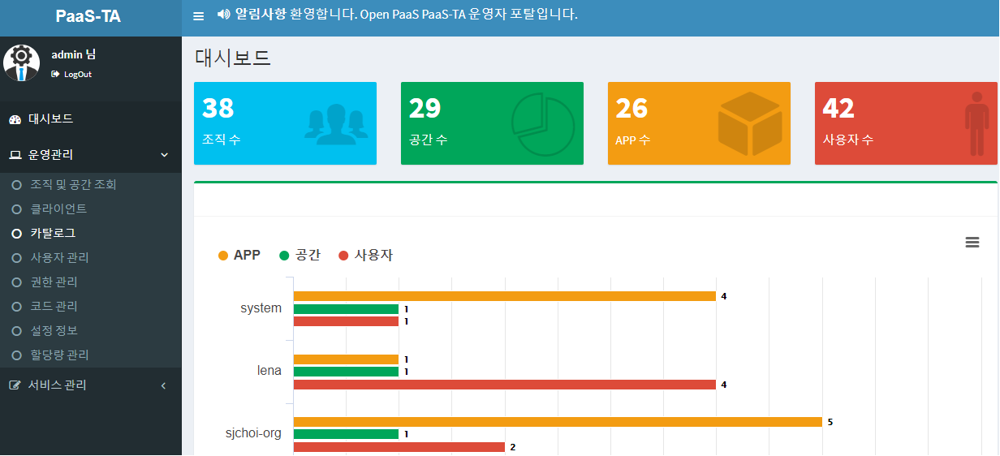

3. 카탈로그 페이지에 들어간다.

   > 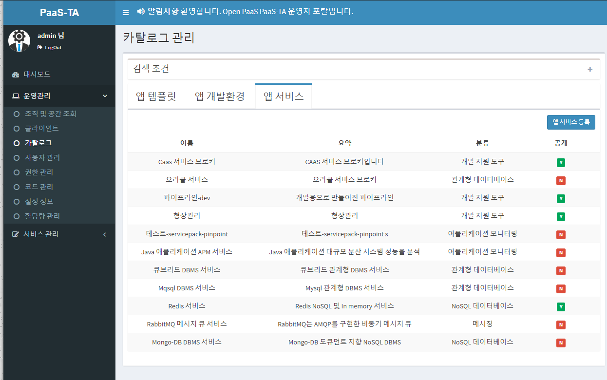

4. 빌드팩, 서비스팩 상세화면에 들어가서 각 항목란에 값을 입력후에 저장을 누른다.

   > 

5. 사용자포탈에서 변경된값이 적용되어있는지 확인한다.

   > 

