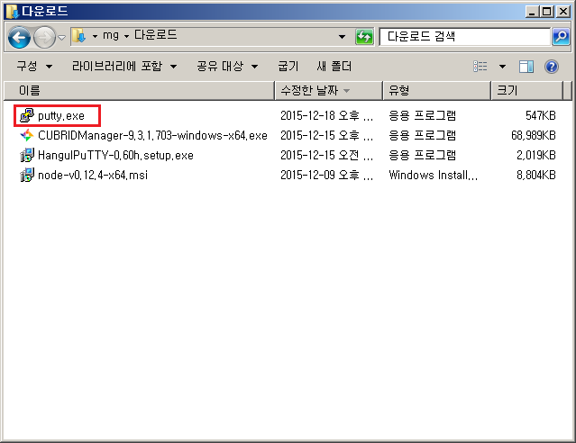
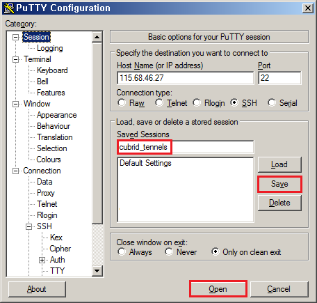
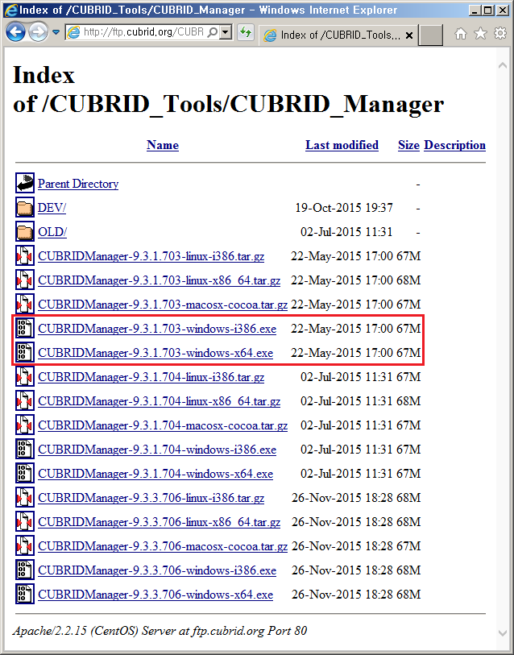
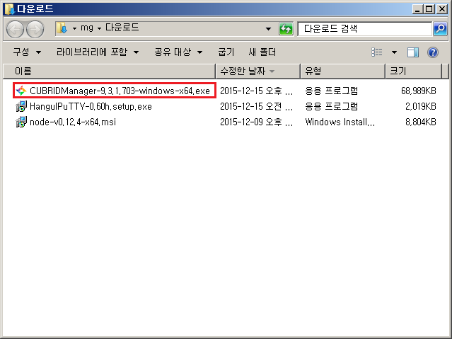
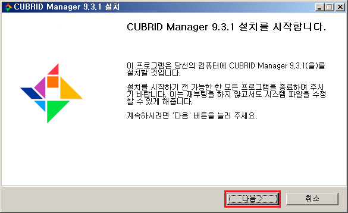
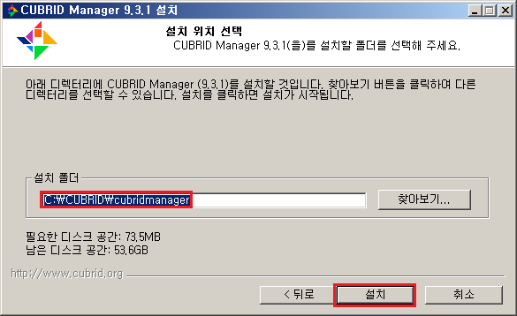
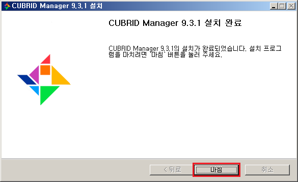
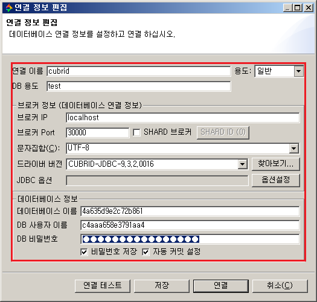
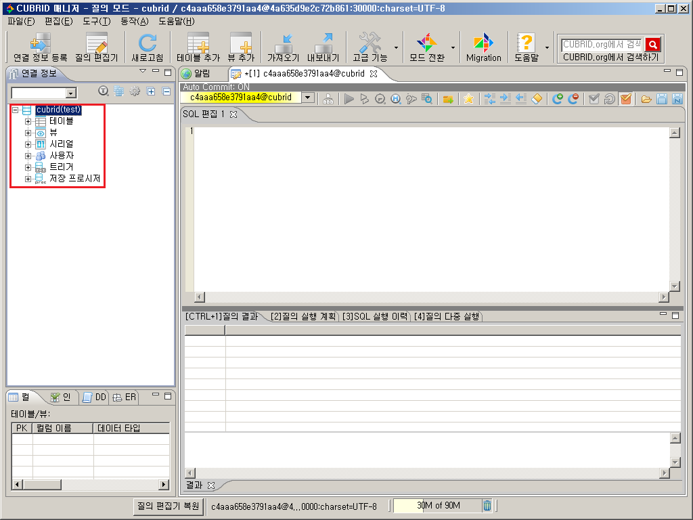

# PAAS-TA\_CUBRID\_SERVICE\_INSTALL\_GUIDE\_V1.0

### Table of Contents

1. [문서 개요](paas-ta_cubrid_service_install_guide_v1.0.md#1) 1.1. [목적](paas-ta_cubrid_service_install_guide_v1.0.md#1.1) 1.2. [범위](paas-ta_cubrid_service_install_guide_v1.0.md#1.2) 1.3. [시스템 구성도](paas-ta_cubrid_service_install_guide_v1.0.md#1.3) 1.4. [참고자료](paas-ta_cubrid_service_install_guide_v1.0.md#1.4)
2. [Cubrid 서비스 설치](paas-ta_cubrid_service_install_guide_v1.0.md#2) 2.1. [Prerequisite](paas-ta_cubrid_service_install_guide_v1.0.md#2.1) 2.2. [Stemcell 확인](paas-ta_cubrid_service_install_guide_v1.0.md#2.2) 2.3. [Deployment 다운로드](paas-ta_cubrid_service_install_guide_v1.0.md#2.3) 2.4. [Deployment 파일 수정](paas-ta_cubrid_service_install_guide_v1.0.md#2.4) 2.5. [서비스 설치](paas-ta_cubrid_service_install_guide_v1.0.md#2.5) 2.6. [서비스 설치 - 다운로드 된 PaaS-TA Release 파일 이용 방식](paas-ta_cubrid_service_install_guide_v1.0.md#2.6) 2.7. [서비스 설치 확인](paas-ta_cubrid_service_install_guide_v1.0.md#2.7)
3. [Cubrid 연동 Sample App 설명](paas-ta_cubrid_service_install_guide_v1.0.md#3) 3.1. [서비스 브로커 등록](paas-ta_cubrid_service_install_guide_v1.0.md#3.1) 3.2. [Sample App 구조](paas-ta_cubrid_service_install_guide_v1.0.md#3.2) 3.3. [PaaS-TA에서 서비스 신청](paas-ta_cubrid_service_install_guide_v1.0.md#3.3) 3.4. [Sample App에 서비스 바인드 신청 및 App 확인](paas-ta_cubrid_service_install_guide_v1.0.md#3.4)
4. [Cubrid Client 툴 접속](paas-ta_cubrid_service_install_guide_v1.0.md#4) 4.1. [Putty 다운로드 및 터널링](paas-ta_cubrid_service_install_guide_v1.0.md#4.1) 4.2. [Cubrid Manager 설치 및 연결](paas-ta_cubrid_service_install_guide_v1.0.md#4.2)

### 1. 문서 개요

#### 1.1. 목적

본 문서\(Cubrid 서비스팩 설치 가이드\)는 전자정부표준프레임워크 기반의 PaaS-TA에서 제공되는 서비스팩인 Cubrid 서비스팩을 Bosh를 이용하여 설치 하는 방법과 PaaS-TA의 SaaS 형태로 제공하는 Application 에서 Cubrid 서비스를 사용하는 방법을 기술하였다. PaaS-TA 3.5 버전부터는 Bosh2.0 기반으로 deploy를 진행하며 기존 Bosh1.0 기반으로 설치를 원할경우에는 PaaS-TA 3.1 이하 버전의 문서를 참고한다.

#### 1.2. 범위

설치 범위는 Cubrid 서비스팩을 검증하기 위한 기본 설치를 기준으로 작성하였다.

#### 1.3. 시스템 구성도

본 문서의 설치된 시스템 구성도이다. Cubrid Server, Cubrid 서비스 브로커로 최소사항을 구성하였다.  


* 설치할때 cloud config에서 사용하는 VM\_Tpye명과 스펙 

| VM\_Type | 스펙 |
| :--- | :--- |
| minimal | 1vCPU / 1GB RAM / 8GB Disk |
| default | 1vCPU / 2GB RAM / 10GB Disk |

* 각 Instance의 Resource Pool과 스펙

| 구분 | Resource Pool | 스펙 |
| :--- | :--- | :--- |
| cubrid | default | 1vCPU / 1GB RAM / 8GB Disk |
| cubrid\_broker | minimal | 1vCPU / 2GB RAM / 10GB Disk |

#### 1.4. 참고자료

[http://bosh.io/docs](http://bosh.io/docs)  
[http://docs.cloudfoundry.org/](http://docs.cloudfoundry.org/)

### 2. Cubrid 서비스 설치

#### 2.1. Prerequisite

본 설치 가이드는 Linux 환경에서 설치하는 것을 기준으로 하였다. 서비스 설치를 위해서는 BOSH 2.0과 PaaS-TA 5.0 이상, PaaS-TA 포털이 설치되어 있어야 한다.

#### 2.2. Stemcell 확인

Stemcell 목록을 확인하여 서비스 설치에 필요한 Stemcell이 업로드 되어 있는 것을 확인한다. \(PaaS-TA 5.5.1 과 동일 stemcell 사용\)

> $ bosh -e micro-bosh stemcells

```text
Using environment '10.0.1.6' as client 'admin'

Name                                     Version  OS             CPI  CID  
bosh-aws-xen-hvm-ubuntu-xenial-go_agent  621.94*  ubuntu-xenial  -    ami-0297ff649e8eea21b  

(*) Currently deployed

1 stemcells

Succeeded
```

#### 2.3. Deployment 다운로드

서비스 설치에 필요한 Deployment를 Git Repository에서 받아 서비스 설치 작업 경로로 위치시킨다.

* Service Deployment Git Repository URL : [https://github.com/PaaS-TA/service-deployment/tree/v5.0.6](https://github.com/PaaS-TA/service-deployment/tree/v5.0.6)

```text
# Deployment 다운로드 파일 위치 경로 생성 및 설치 경로 이동
$ mkdir -p ~/workspace/paasta-5.5.1/deployment
$ cd ~/workspace/paasta-5.5.1/deployment

# Deployment 파일 다운로드
$ git clone https://github.com/PaaS-TA/service-deployment.git -b v5.0.6
```

#### 2.4. Deployment 파일 수정

BOSH Deployment manifest는 Components 요소 및 배포의 속성을 정의한 YAML 파일이다. Deployment 파일에서 사용하는 network, vm\_type, disk\_type 등은 Cloud config를 활용하고, 활용 방법은 BOSH 2.0 가이드를 참고한다.

* Cloud config 설정 내용을 확인한다.   

> $ bosh -e micro-bosh cloud-config

```text
Using environment '10.0.1.6' as client 'admin'

azs:
- cloud_properties:
    availability_zone: ap-northeast-2a
  name: z1
- cloud_properties:
    availability_zone: ap-northeast-2a
  name: z2

... ((생략)) ...

disk_types:
- disk_size: 1024
  name: default
- disk_size: 1024
  name: 1GB

... ((생략)) ...

networks:
- name: default
  subnets:
  - az: z1
    cloud_properties:
      security_groups: paasta-security-group
      subnet: subnet-00000000000000000
    dns:
    - 8.8.8.8
    gateway: 10.0.1.1
    range: 10.0.1.0/24
    reserved:
    - 10.0.1.2 - 10.0.1.9
    static:
    - 10.0.1.10 - 10.0.1.120

... ((생략)) ...

vm_types:
- cloud_properties:
    ephemeral_disk:
      size: 3000
      type: gp2
    instance_type: t2.small
  name: minimal
- cloud_properties:
    ephemeral_disk:
      size: 10000
      type: gp2
    instance_type: t2.small
  name: small

... ((생략)) ...

Succeeded
```

* Deployment YAML에서 사용하는 변수 파일을 서버 환경에 맞게 수정한다.

> $ vi ~/workspace/paasta-5.5.1/deployment/service-deployment/cubrid/vars.yml
>
> \`\`\`
>
> ## STEMCELL
>
> stemcell\_os: "ubuntu-xenial" \# stemcell os stemcell\_version: "621.94" \# stemcell version

## NETWORK

private\_networks\_name: "default" \# private network name

## CUBRID

cubrid\_azs: \[z5\] \# cubrid azs cubrid\_instances: 1 \# cubrid instances \(1\) cubrid\_vm\_type: "medium" \# cubrid vm type

## CUBRID BROKER

cubrid\_broker\_azs: \[z5\] \# cubrid broker azs cubrid\_broker\_instances: 1 \# cubrid broker instances \(1\) cubrid\_broker\_vm\_type: "minimal" \# cubrid broker vm type

## CUBRID ACCESS INFO

cubrid\_max\_clients: 200 \# cubrid access max clients cubrid\_db\_port: 30000 \# cubrid port cubrid\_db\_name: "cubrid\_broker" \# cubrid service 관리를 위한 데이터베이스 이름 cubrid\_db\_user: "dba" \# 브로커 관리용 데이터베이스 접근 사용자이름 cubrid\_db\_passwd: "paasta" \# 브로커 관리용 데이터베이스 접근 사용자 비밀번호 cubrid\_ssh\_port: 22 \# cubrid가 설치된 서버 SSH 접속 포트 cubrid\_ssh\_user: "vcap" \# cubrid가 설치된 서버 SSH 접속 사용자 이름

```text
### <div id="2.5"/> 2.5. 서비스 설치

- 서버 환경에 맞추어 Deploy 스크립트 파일의 VARIABLES 설정을 수정하고, Option file을 추가할지 선택한다.  
     (선택) -o operations/use-compiled-releases.yml (ubuntu-xenial/621.94로 컴파일 된 릴리즈 사용)  


> $ vi ~/workspace/paasta-5.5.1/deployment/service-deployment/cubrid/deploy.sh
```

## !/bin/bash

## VARIABLES

COMMON\_VARS\_PATH="" \# common\_vars.yml File Path \(e.g. ../../common/common\_vars.yml\) BOSH\_ENVIRONMENT="${BOSH\_ENVIRONMENT}" \# bosh director alias name \(PaaS-TA에서 제공되는 create-bosh-login.sh 미 사용시 bosh envs에서 이름을 확인하여 입력\)

## DEPLOY

bosh -e ${BOSH\_ENVIRONMENT} -n -d cubrid deploy --no-redact cubrid.yml  -l ${COMMON\_VARS\_PATH}  -l vars.yml

```text
- 서비스를 설치한다.
```

$ cd ~/workspace/paasta-5.5.1/deployment/service-deployment/cubrid  
$ sh ./deploy.sh

```text
### <div id="2.6"/> 2.6. 서비스 설치 - 다운로드 된 PaaS-TA Release 파일 이용 방식

- 서비스 설치에 필요한 릴리즈 파일을 다운로드 받아 Local machine의 서비스 설치 작업 경로로 위치시킨다.  

  - 설치 릴리즈 파일 다운로드 : [paasta-cubrid-2.0.1.tgz](http://45.248.73.44/index.php/s/ic6tB9gcgdL3XQK/download)
```

## 릴리즈 다운로드 파일 위치 경로 생성

$ mkdir -p ~/workspace/paasta-5.5.1/release/service

## 릴리즈 파일 다운로드 및 파일 경로 확인

$ ls ~/workspace/paasta-5.5.1/release/service paasta-cubrid-2.0.1.tgz

```text
- 서버 환경에 맞추어 Deploy 스크립트 파일의 VARIABLES 설정을 수정하고 Option file 및 변수를 추가한다.  
     (추가) -o operations/use-offline-releases.yml (미리 다운받은 offline 릴리즈 사용)  
     (추가) -v releases_dir="<RELEASE_DIRECTORY>"  

> $ vi ~/workspace/paasta-5.5.1/deployment/service-deployment/cubrid/deploy.sh
```

## !/bin/bash

## VARIABLES

COMMON\_VARS\_PATH="" \# common\_vars.yml File Path \(e.g. ../../common/common\_vars.yml\) BOSH\_ENVIRONMENT="${BOSH\_ENVIRONMENT}" \# bosh director alias name \(PaaS-TA에서 제공되는 create-bosh-login.sh 미 사용시 bosh envs에서 이름을 확인하여 입력\)

## DEPLOY

bosh -e ${BOSH\_ENVIRONMENT} -n -d cubrid deploy --no-redact cubrid.yml  -l ${COMMON\_VARS\_PATH}  -l vars.yml  -v releases\_dir="/home/ubuntu/workspace/paasta-5.5.1/release"

```text
- 서비스를 설치한다.
```

$ cd ~/workspace/paasta-5.5.1/deployment/service-deployment/cubrid  
$ sh ./deploy.sh

```text
### <div id="2.7"/> 2.7. 서비스 설치 확인

설치 완료된 서비스를 확인한다.  

> $ bosh -e micro-bosh -d cubrid vms
```

Using environment '10.0.1.6' as client 'admin'

Task 6424. Done

Deployment 'cubrid'

Instance Process State AZ IPs VM CID VM Type Active  
cubrid/e60ec9e8-4834-4655-a1f0-f8e2468d0ff5 running z5 10.30.101.0 vm-1a5805f4-8e7b-4e3e-bf17-270976d2b566 medium true  
cubrid\_broker/4e887b24-c621-492f-bd92-f061f7c0ce80 running z5 10.30.101.1 vm-77133451-0d7a-4be0-9d24-ae094ca12ea9 minimal true

2 vms

Succeeded

```text
##  <div id='3'> 3. Cubrid연동 Sample App 설명

본 Sample Web App은 PaaS-TA에 배포되며 Cubrid의 서비스를 Provision과 Bind를 한 상태에서 사용이 가능하다.

### <div id='3.1'> 3.1. 서비스 브로커 등록
Cubrid 서비스팩 배포가 완료 되었으면 Application에서 서비스 팩을 사용하기 위해서 먼저 Cubrid 서비스 브로커를 등록해 주어야 한다.  
서비스 브로커 등록시 PaaS-TA에서 서비스브로커를 등록할 수 있는 사용자로 로그인이 되어있어야 한다.

##### 서비스 브로커 목록을 확인한다.

>`cf service-brokers`
```

$ cf service-brokers Getting service brokers as admin...

name url No service brokers found

```text
##### Cubrid 서비스 브로커를 등록한다.

>`$ cf create-service-broker [SERVICE_BROKER] [USERNAME] [PASSWORD] [SERVICE_BROKER_URL]`
> - [SERVICE_BROKER] : 서비스 브로커 명  
> - [USERNAME] / [PASSWORD] : 서비스 브로커에 접근할 수 있는 사용자 ID / PASSWORD  
> - [SERVICE_BROKER_URL] : 서비스 브로커 접근 URL

>`cf create-service-broker cubrid-service-broker admin cloudfoundry http://10.30.101.1:8080`
```

$ cf create-service-broker cubrid-service-broker admin cloudfoundry [http://10.30.101.1:8080](http://10.30.101.1:8080) Creating service broker cubrid-service-broker as admin... OK

```text
##### 등록된 Cubrid 서비스 브로커를 확인한다.

>`$ cf service-brokers`
```

$ cf service-brokers Getting service brokers as admin...

name url cubrid-service-broker [http://10.30.101.1:8080](http://10.30.101.1:8080)

```text
- 접근 가능한 서비스 목록을 확인한다.

>`$ cf service-access`
```

$ cf service-access Getting service access as admin... broker: cubrid-service-broker service plan access orgs CubridDB utf8 none CubridDB euckr none

```text
##### 서비스 브로커 생성시 디폴트로 접근을 허용하지 않는다.

##### 특정 조직에 해당 서비스 접근 허용을 할당하고 접근 서비스 목록을 다시 확인한다. (전체 조직)

>`$ cf enable-service-access CubridDB `<br>
>`$ cf service-access `
```

$ cf enable-service-access CubridDB Enabling access to all plans of service CubridDB for all orgs as admin... OK

$ cf service-access Getting service access as admin... broker: cubrid-service-broker service plan access orgs CubridDB utf8 all CubridDB euckr all

```text
### <div id='3.2'> 3.2. Sample App 구조
Sample Web App은 PaaS-TA에 App으로 배포가 된다. App을 배포하여 구동시 Bind 된 Cubrid 서비스 연결정보로 접속하여 초기 데이터를 생성하게 된다. 배포 완료 후 정상적으로 App 이 구동되면 브라우져나 curl로 해당 App에 접속 하여 Cubrid 환경정보(서비스 연결 정보)와 초기 적재된 데이터를 보여준다.

Sample Web App 구조는 다음과 같다.
<table>
  <tr>
    <td>이름</td>
    <td>설명</td>
  </tr>
  <tr>
    <td>src</td>
    <td>Sample 소스 디렉토리</td>
  </tr>
  <tr>
    <td>manifest.yml</td>
    <td>PaaS-TA에 app 배포시 필요한 설정을 저장하는 파일</td>
  </tr>
  <tr>
    <td>pom.xml</td>
    <td>메이븐 project 설정 파일</td>
  </tr>
  <tr>
    <td>target</td>
    <td>메이븐 빌드시 생성되는 디렉토리(war 파일, classes 폴더 등)</td>
  </tr>
</table>

##### PaaS-TA-Sample-Apps을 다운로드 받고 Service 폴더안에 있는 Cubrid Sample Web App인 hello-spring-cubrid를 복사한다.

>`$ ls -all `

>![3-1-0-0]

<br>

### <div id='3.3'> 3.3. PaaS-TA에서 서비스 신청
Sample Web App에서 Cubrid 서비스를 사용하기 위해서는 서비스 신청(Provision)을 해야 한다.  
(참고: 서비스 신청시 PaaS-TA에서 서비스를신청 할 수 있는 사용자로 로그인이 되어 있어야 한다.)

##### 먼저 PaaS-TA Marketplace에서 서비스가 있는지 확인을 한다.

>`$ cf marketplace `
```

$ cf marketplace Getting services from marketplace in org demo / space dev as demo... OK

service plans description CubridDB utf8, euckr A simple cubrid implementation

TIP: Use 'cf marketplace -s SERVICE' to view descriptions of individual plans of a given service.

```text
##### Marketplace에서 원하는 서비스가 있으면 서비스 신청(Provision)을 한다.

>`$ cf create-service {서비스명} {서비스플랜} {내서비스명}  `

**서비스명** CubridDB로 Marketplace에서 보여지는 서비스 명칭이다.  
**서비스플랜** 서비스에 대한 정책으로 plans에 있는 정보 중 하나를 선택한다. Cubrid 서비스는 100mb, 1gb를 지원한다.  
**내서비스명**내 서비스에서 보여지는 명칭이다. 이 명칭을 기준으로 환경설정정보를 가져온다.  

>`$ cf create-service CubridDB utf8 cubrid-service-instance `
```

$ cf create-service CubridDB utf8 cubrid-service-instance Creating service instance cubrid-service-instance in org demo / space dev as demo... OK

```text
##### 생성된 Cubrid 서비스 인스턴스를 확인한다.

>`$ cf services`
```

$ cf services Getting services in org demo / space dev as demo... OK

name service plan bound apps last operation cubrid-service-instance CubridDB utf8 create succeeded

```text
### <div id='3.4'> 3.4. Sample App에 서비스 바인드 신청 및 App 확인
서비스 신청이 완료되었으면 Sample Web App 에서는 생성된 서비스 인스턴스를 Bind 하여 App에서 Cubrid 서비스를 이용한다.  
*참고: 서비스 Bind 신청시 PaaS-TA에서 서비스 Bind신청 할 수 있는 사용자로 로그인이 되어 있어야 한다.

##### Sample Web App 디렉토리로 이동하여 manifest 파일을 확인한다.
다운로드 :: http://45.248.73.44/index.php/s/x8Tg37WDFiL5ZDi/download
```

$ wget -O sample.zip [http://45.248.73.44/index.php/s/x8Tg37WDFiL5ZDi/download](http://45.248.73.44/index.php/s/x8Tg37WDFiL5ZDi/download) $ unzip sample.zip -d sample $ cd sample/Service/hello-spring-cubrid

```text
>`$ vi manifest.yml` <br>
```

applications:

* name: hello-spring-cubrid \# 배포할 App 이름 memory: 1024M \# 배포시 메모리 사이즈 instances: 1 \# 배포 인스턴스 수 path: target/hello-spring-cubrid-1.0.0-BUILD-SNAPSHOT.war \#배포하는 App 파일 PATH

  \`\`\`

* 참고: ./build/libs/hello-spring-cubrid.war 파일이 존재 하지 않을 경우 gradle 빌드를 수행 하면 파일이 생성된다.

**--no-start 옵션으로 App을 배포한다.**

**--no-start: App 배포시 구동은 하지 않는다.**

> `$ cf push --no-start`

```text
$ cf push --no-start
Using manifest file D:\sample-app\hello-spring-cubrid\manifest.yml

Creating app hello-spring-cubrid in org demo / space dev as demo...
OK

Creating route hello-spring-cubrid.115.68.47.178.xip.io...
OK

Binding hello-spring-cubrid.115.68.47.178.xip.io to hello-spring-cubrid...
OK

Uploading hello-spring-cubrid...
Uploading app files from: C:\Users\demo\AppData\Local\Temp\unzipped-app845663023
Uploading 7.2M, 59 files
Done uploading
OK
```

**배포된 Sample App을 확인하고 로그를 수행한다.**

> `$ cf apps`
>
> \`\`\`  
> $ cf apps Getting apps in org demo / space dev as demo... OK

name requested state instances memory disk urls hello-spring-cubrid stopped 0/1 1G 1G hello-spring-cubrid.115.68.47.178.xip.io sampleapp started 1/1 1G 1G sampleapp.115.68.47.178.xip.io

```text
>`$ cf logs {배포된 App명}` <br>
>`$ cf logs hello-spring-cubrid`
```

$ cf logs hello-spring-cubrid Retrieving logs for app hello-spring-cubrid in org demo / space dev as demo...

```text
###### Sample Web App에서 생성한 서비스 인스턴스 바인드 신청을 한다. 

>`$ cf bind-service hello-spring-cubrid cubrid-service-instance`
```

$ cf bind-service hello-spring-cubrid cubrid-service-instance Binding service cubrid-service-instance to app hello-spring-cubrid in org demo / space dev as demo... OK TIP: Use 'cf restage hello-spring-cubrid' to ensure your env variable changes take effect

```text
##### 바인드가 적용되기 위해서 App을 재기동한다.
>`$ cf restart hello-spring-cubrid`
```

$ cf restart hello-spring-cubrid

Starting app hello-spring-cubrid in org demo / space dev as demo... Downloading binary\_buildpack... Downloading java\_buildpack... Downloading go\_buildpack... Downloading nodejs\_buildpack... Downloading php\_buildpack... Downloaded php\_buildpack \(301.5K\) Downloading nginx\_buildpack... Downloading r\_buildpack... Downloaded java\_buildpack \(224.7K\) Downloaded go\_buildpack \(5M\) Downloading python\_buildpack... Downloaded nodejs\_buildpack \(5.1M\) Downloading ruby\_buildpack... Downloaded r\_buildpack \(4.8M\) Downloading dotnet\_core\_buildpack... Downloaded binary\_buildpack \(8.2M\) Downloaded nginx\_buildpack \(8.2M\) Downloading staticfile\_buildpack... Downloaded python\_buildpack \(5M\) Downloaded ruby\_buildpack \(5M\) Downloaded dotnet\_core\_buildpack \(5.3M\) Downloaded staticfile\_buildpack \(5.6M\) Cell 215698eb-793e-4271-80e0-2fd7962f93b6 creating container for instance abd243fa-552d-49d4-81f8-685dc26af007 Cell 215698eb-793e-4271-80e0-2fd7962f93b6 successfully created container for instance abd243fa-552d-49d4-81f8-685dc26af007 Downloading app package... Downloaded app package \(7.6M\) -----&gt; Java Buildpack v4.19.1 \| [https://github.com/cloudfoundry/java-buildpack.git\#3f4eee2](https://github.com/cloudfoundry/java-buildpack.git#3f4eee2) -----&gt; Downloading Jvmkill Agent 1.16.0\_RELEASE from [https://java-buildpack.cloudfoundry.org/jvmkill/bionic/x86\_64/jvmkill-1.16.0-RELEASE.so](https://java-buildpack.cloudfoundry.org/jvmkill/bionic/x86_64/jvmkill-1.16.0-RELEASE.so) \(0.3s\) -----&gt; Downloading Open Jdk JRE 1.8.0\_212 from [https://java-buildpack.cloudfoundry.org/openjdk/bionic/x86\_64/openjdk-jre-1.8.0\_212-bionic.tar.gz](https://java-buildpack.cloudfoundry.org/openjdk/bionic/x86_64/openjdk-jre-1.8.0_212-bionic.tar.gz) \(1.2s\) Expanding Open Jdk JRE to .java-buildpack/open\_jdk\_jre \(1.3s\) JVM DNS caching disabled in lieu of BOSH DNS caching -----&gt; Downloading Open JDK Like Memory Calculator 3.13.0\_RELEASE from [https://java-buildpack.cloudfoundry.org/memory-calculator/bionic/x86\_64/memory-calculator-3.13.0-RELEASE.tar.gz](https://java-buildpack.cloudfoundry.org/memory-calculator/bionic/x86_64/memory-calculator-3.13.0-RELEASE.tar.gz) \(0.1s\) Loaded Classes: 10196, Threads: 250 -----&gt; Downloading Client Certificate Mapper 1.8.0\_RELEASE from [https://java-buildpack.cloudfoundry.org/client-certificate-mapper/client-certificate-mapper-1.8.0-RELEASE.jar](https://java-buildpack.cloudfoundry.org/client-certificate-mapper/client-certificate-mapper-1.8.0-RELEASE.jar) \(0.0s\) -----&gt; Downloading Container Security Provider 1.16.0\_RELEASE from [https://java-buildpack.cloudfoundry.org/container-security-provider/container-security-provider-1.16.0-RELEASE.jar](https://java-buildpack.cloudfoundry.org/container-security-provider/container-security-provider-1.16.0-RELEASE.jar) \(5.1s\) -----&gt; Downloading Spring Auto Reconfiguration 2.7.0\_RELEASE from [https://java-buildpack.cloudfoundry.org/auto-reconfiguration/auto-reconfiguration-2.7.0-RELEASE.jar](https://java-buildpack.cloudfoundry.org/auto-reconfiguration/auto-reconfiguration-2.7.0-RELEASE.jar) \(0.4s\) -----&gt; Downloading Tomcat Instance 9.0.19 from [https://java-buildpack.cloudfoundry.org/tomcat/tomcat-9.0.19.tar.gz](https://java-buildpack.cloudfoundry.org/tomcat/tomcat-9.0.19.tar.gz) \(0.3s\) Expanding Tomcat Instance to .java-buildpack/tomcat \(0.2s\) -----&gt; Downloading Tomcat Access Logging Support 3.3.0\_RELEASE from [https://java-buildpack.cloudfoundry.org/tomcat-access-logging-support/tomcat-access-logging-support-3.3.0-RELEASE.jar](https://java-buildpack.cloudfoundry.org/tomcat-access-logging-support/tomcat-access-logging-support-3.3.0-RELEASE.jar) \(0.1s\) -----&gt; Downloading Tomcat Lifecycle Support 3.3.0\_RELEASE from [https://java-buildpack.cloudfoundry.org/tomcat-lifecycle-support/tomcat-lifecycle-support-3.3.0-RELEASE.jar](https://java-buildpack.cloudfoundry.org/tomcat-lifecycle-support/tomcat-lifecycle-support-3.3.0-RELEASE.jar) \(5.0s\) -----&gt; Downloading Tomcat Logging Support 3.3.0\_RELEASE from [https://java-buildpack.cloudfoundry.org/tomcat-logging-support/tomcat-logging-support-3.3.0-RELEASE.jar](https://java-buildpack.cloudfoundry.org/tomcat-logging-support/tomcat-logging-support-3.3.0-RELEASE.jar) \(0.1s\) Exit status 0 Uploading droplet, build artifacts cache... Uploading droplet... Uploading build artifacts cache... Uploaded build artifacts cache \(53.7M\) Uploaded droplet \(60.1M\) Uploading complete Cell 215698eb-793e-4271-80e0-2fd7962f93b6 stopping instance abd243fa-552d-49d4-81f8-685dc26af007 Cell 215698eb-793e-4271-80e0-2fd7962f93b6 destroying container for instance abd243fa-552d-49d4-81f8-685dc26af007 Cell 215698eb-793e-4271-80e0-2fd7962f93b6 successfully destroyed container for instance abd243fa-552d-49d4-81f8-685dc26af007

0 of 1 instances running, 1 starting 0 of 1 instances running, 1 starting 0 of 1 instances running, 1 starting 0 of 1 instances running, 1 starting 1 of 1 instances running

App started

OK

App hello-spring-cubrid was started using this command `JAVA_OPTS="-agentpath:$PWD/.java-buildpack/open_jdk_jre/bin/jvmkill-1.16.0_RELEASE=printHeapHistogram=1 -Djava.io.tmpdir=$TMPDIR -XX:ActiveProcessorCount=$(nproc) -Djava.ext.dirs=$PWD/.java-buildpack/container_security_provider:$PWD/.java-buildpack/open_jdk_jre/lib/ext -Djava.security.properties=$PWD/.java-buildpack/java_security/java.security $JAVA_OPTS -Daccess.logging.enabled=false -Dhttp.port=$PORT" && CALCULATED_MEMORY=$($PWD/.java-buildpack/open_jdk_jre/bin/java-buildpack-memory-calculator-3.13.0_RELEASE -totMemory=$MEMORY_LIMIT -loadedClasses=12719 -poolType=metaspace -stackThreads=250 -vmOptions="$JAVA_OPTS") && echo JVM Memory Configuration: $CALCULATED_MEMORY && JAVA_OPTS="$JAVA_OPTS $CALCULATED_MEMORY" && MALLOC_ARENA_MAX=2 JAVA_OPTS=$JAVA_OPTS JAVA_HOME=$PWD/.java-buildpack/open_jdk_jre exec $PWD/.java-buildpack/tomcat/bin/catalina.sh run`

Showing health and status for app hello-spring-cubrid in org demo / space dev as demo... OK

requested state: started instances: 1/1 usage: 1G x 1 instances urls: hello-spring-cubrid.115.68.47.178.xip.io last uploaded: Mon Nov 18 08:47:44 UTC 2019 stack: cflinuxfs3 buildpack: client-certificate-mapper=1.8.0\_RELEASE container-security-provider=1.16.0\_RELEASE java-buildpack=v4.19.1-[https://github.com/cloudfoundry/java-buildpack.git\#3f4eee2](https://github.com/cloudfoundry/java-buildpack.git#3f4eee2) java-opts java-security jvmkill-agent=1.16.0\_RELEASE open-jdk-like-jre=1.8.0\_2...

```text
 state     since                    cpu    memory       disk           details
```

## 0   running   2019-11-18 06:10:42 PM   0.0%   125M of 1G   128.8M of 1G

```text
- (참고) 바인드 후 App구동시 Cubrid 서비스 접속 에러로 App 구동이 안될 경우 보안 그룹을 추가한다.
```

**rule.json 화일을 만들고 아래와 같이 내용을 넣는다.**

$ vi rule.json \[ { "protocol": "tcp", "destination": "10.30.101.0", "ports": "30000" } \]

**보안 그룹을 생성한 후, 모든 App에 Cubrid 서비스를 사용할수 있도록 생성한 보안 그룹을 적용한다.**

$ cf create-security-group CubridDB rule.json $ cf bind-running-security-group CubridDB

**App을 리부팅 한다.**

$ cf restart hello-spring-cubrid

```text
##### App이 정상적으로 Cubrid 서비스를 사용하는지 확인한다.

##### curl 로 확인
>`$ curl hello-spring-cubrid.115.68.47.178.xip.io`
```

$ curl hello-spring-cubrid.115.68.47.178.xip.io

Hello Spring Cubrid

## Hello Spring Cubrid!

**Database Info:**

 DataSource: jdbc:cubrid:10.30.101.0::bd545a9031ffed9f:d795c4b014d3c5ce:3e114ab842f46dff:  


**Current States:**

 State \[id=1, stateCode=MA, name=Massachusetts\]  
 State \[id=2, stateCode=NH, name=New Hampshire\]  
 State \[id=3, stateCode=ME, name=Maine\]  
 State \[id=4, stateCode=VT, name=Vermont\]  


\`\`\`

**브라우져에서 확인**

> 

### 4. Cubrid Client 툴 접속

Application에 바인딩된 Cubrid 서비스 연결정보는 Private IP로 구성되어 있기 때문에 Cubrid Client 툴에서 직접 연결할수 없다. 따라서 Cubrid Client 툴에서 SSH 터널, Proxy 터널 등을 제공하는 툴을 사용해서 연결하여야 한다. 본 가이드는 무료 SSH 및 텔넷 접속 툴인 Putty를 이용하여 SSH 터널을 통해 연결 하는 방법을 제공하며 Cubrid Client 툴로써는 Cubrid에서 제공하는 Cubrid Manager로 가이드한다. Cubrid Manager 에서 접속하기 위해서 먼저 SSH 터널링 할수 있는 VM 인스턴스를 생성해야한다. 이 인스턴스는 SSH로 접속이 가능해야 하고 접속 후 Open PaaS 에 설치한 서비스팩에 Private IP 와 해당 포트로 접근이 가능하도록 시큐리티 그룹을 구성해야 한다. 이 부분은 vSphere관리자 및 OpenPaaS 운영자에게 문의하여 구성한다.

#### 4.1.  Putty 다운로드 및 터널링

Putty 프로그램은 SSH 및 텔넷 접속을 할 수 있는 무료 소프트웨어이다.

* Putty를 다운로드 하기 위해 아래 URL로 이동하여 파일을 다운로드 한다. 별도의 설치과정없이 사용할 수 있다.

  [http://www.chiark.greenend.org.uk/~sgtatham/putty/download.html](http://www.chiark.greenend.org.uk/~sgtatham/putty/download.html)  

  

**다운받은 putty.exe.파일을 더블클릭하여 실행한다.**

> 

**Session 탭의 Host name과 Port란에. OpenPaaS 운영 관리자에게 제공받은 SSH 터널링 가능한 서버 정보를 입력한다.**

> 

**Connection-&gt;SSH-&gt;Tunnels 탭에서 Source port\(내 로컬에서 접근할 포트\), Destination\(터널링으로 연결할 서버정보\)를 입력하고 Local, Auto를 선택 후 Add를 클릭한다.**

  
  
서버 정보는 Application에 바인드되어 있는 서버 정보를 입력한다. cf env  명령어로 이용하여 확인한다.  
예\) $ cf env hello-spring-cubrid

> 

**Session 탭에서 Saved Sessions에 저장할 이름을 입력하고 Save를 눌러 저장한 후 Open버튼을 누른다.**

> 

**서버 접속정보를 입력하여 접속하여 터널링을 완료한다.**

만약 ssh 인증이 Password방식이 아닌 Key인증 방식일 경우, Connection-&gt;SSH-&gt;인증탭의 '인증 개인키 파일'에 key 파일을 등록하여 인증한다.  
Key파일의 확장자가 .pem이라면 putty설치시 같이 설치된 puttygen을 사용하여 ppk파일로 변환한뒤 사용한다.

> 

#### 4.2.  Cubrid Manager 설치 & 연결

Cubrid Manager 프로그램은 Cubrid에서 제공하는 무료로 사용할 수 있는 소프트웨어이다.

* Cubrid Manager를 다운로드 하기 위해 아래 URL로 이동하여 설치파일을 다운로드 한다.  

  [http://ftp.cubrid.org/CUBRID\_Tools/CUBRID\_Manager/](http://ftp.cubrid.org/CUBRID_Tools/CUBRID_Manager/)  

  

**다운받은 파일을 더블클릭하여 실행한다.**

> 

**한국어를 선택하고 OK를 누른다.**

> 

**다음을 눌러 계속 진행한다.**

> 

**동의함을 눌러 계속 진행한다.**

> 

**바로가기 옵션을 선택 후 다음을 눌러 계속 진행한다.**

> 

**설치 경로를 입력하고 설치를 눌러 설치를 시작한다.**

> 

**설치가 완료되면 다음을 눌러 계속 진행한다.**

> 

**마침을 눌러 설치를 완료한다.**

> 

**설치된 Cubrid Manager를 실행하면 처음 나오는 화면이다. Workspace를 선택 후 OK를 눌러 실행한다. 만약 이 창을 다시보기를 원치않는다면 '기본적으로 이것을 사용하고 다시 물어 보지 않기' 옵션을 선택한다.**

> 

**관리 모드, 질의 모드 둘중 목적에 맞게 선택 후 확인을 눌러 실행한다. 여기서는 질의 모드로 실행한다.**

> 

**연결정보를 입력하기 위해서 연결 정보 등록을 누른다.**

> 

**Server에 접속하기 위한 Connection 정보를 입력한다.**

> 

**서버 정보는 Application에 바인드되어 있는 서버 정보를 입력한다. cf env  명령어로 이용하여 확인한다.**

> `cf env hello-spring-cubrid`
>
> 

**연결 테스트 버튼을 클릭하여 접속 테스트를 한다.**

> 

**정보가 정상적으로 입력되었다면 '연결이 성공하였습니다.'라는 메시지가 나온다.**

확인 버튼을 눌러 창을 닫는다.

> 

**연결 버튼을 클릭하여 접속한다**

> 

**접속이 완료되면 좌측에 스키마 정보가 나타난다.**

> 

**질의 편집기 버튼을 클릭하면 오른쪽 창에 query를 입력할 수 있는 창이 열린다.**

> 

**우측 화면에 쿼리 항목에 Query문을 작성한 후 실행 버튼\(삼각형\)을 클릭한다. 쿼리문에 이상이 없다면 정상적으로 결과를 얻을 수 있을 것이다.**

> 

