# PAAS-TA\_MYSQL\_SERVICE\_INSTALL\_GUIDE\_V1.0

### Table of Contents

1. [문서 개요](paas-ta_mysql_service_install_guide_v1.0.md#1) 1.1. [목적](paas-ta_mysql_service_install_guide_v1.0.md#1.1) 1.2. [범위](paas-ta_mysql_service_install_guide_v1.0.md#1.2) 1.3. [시스템 구성도](paas-ta_mysql_service_install_guide_v1.0.md#1.3) 1.4. [참고자료](paas-ta_mysql_service_install_guide_v1.0.md#1.4)
2. [MySQL 서비스 설치](paas-ta_mysql_service_install_guide_v1.0.md#2) 2.1. [Prerequisite](paas-ta_mysql_service_install_guide_v1.0.md#2.1) 2.2. [Stemcell 확인](paas-ta_mysql_service_install_guide_v1.0.md#2.2) 2.3. [Deployment 다운로드](paas-ta_mysql_service_install_guide_v1.0.md#2.3) 2.4. [Deployment 파일 수정](paas-ta_mysql_service_install_guide_v1.0.md#2.4) 2.5. [서비스 설치](paas-ta_mysql_service_install_guide_v1.0.md#2.5) 2.6. [서비스 설치 - 다운로드 된 PaaS-TA Release 파일 이용 방식](paas-ta_mysql_service_install_guide_v1.0.md#2.6) 2.7. [서비스 설치 확인](paas-ta_mysql_service_install_guide_v1.0.md#2.7)
3. [MySQL 연동 Sample Web App 설명](paas-ta_mysql_service_install_guide_v1.0.md#3) 3.1. [서비스 브로커 등록](paas-ta_mysql_service_install_guide_v1.0.md#3.1) 3.2. [Sample Web App 구조](paas-ta_mysql_service_install_guide_v1.0.md#3.2) 3.3. [PaaS-TA에서 서비스 신청](paas-ta_mysql_service_install_guide_v1.0.md#3.3) 3.4. [Sample Web App 배포 및 MySQL바인드 확인](paas-ta_mysql_service_install_guide_v1.0.md#3.4)
4. [MySQL Client 툴 접속](paas-ta_mysql_service_install_guide_v1.0.md#4) 4.1. [HeidiSQL 설치 및 연결](paas-ta_mysql_service_install_guide_v1.0.md#4.1)

### 1. 문서 개요

#### 1.1. 목적

본 문서\(MySQL 서비스팩 설치 가이드\)는 전자정부표준프레임워크 기반의 PaaS-TA에서 제공되는 서비스팩인 MySQL 서비스팩을 Bosh2.0을 이용하여 설치 하는 방법과 PaaS-TA의 SaaS 형태로 제공하는 Application 에서 MySQL 서비스를 사용하는 방법을 기술하였다. PaaS-TA 3.5 버전부터는 Bosh2.0 기반으로 deploy를 진행하며 기존 Bosh1.0 기반으로 설치를 원할경우에는 PaaS-TA 3.1 이하 버전의 문서를 참고한다.

#### 1.2. 범위

설치 범위는 MySQL 서비스팩을 검증하기 위한 기본 설치를 기준으로 작성하였다.

#### 1.3. 시스템 구성도

본 문서의 설치된 시스템 구성도이다. MySQL Server, MySQL 서비스 브로커, Proxy로 최소사항을 구성하였다.

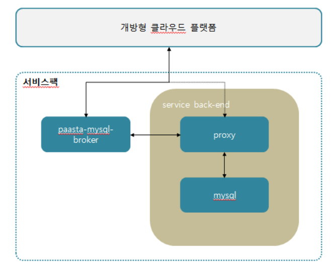

* 설치할때 cloud config에서 사용하는 VM\_Tpye명과 스펙

| VM\_Type | 스펙 |
| :--- | :--- |
| minimal | 1vCPU / 1GB RAM / 8GB Disk |

* 각 Instance의 Resource Pool과 스펙

| 구분 | Resource Pool | 스펙 |
| :--- | :--- | :--- |
| mysql-broker | minimal | 1vCPU / 1GB RAM / 8GB Disk |
| proxy | minimal | 1vCPU / 1GB RAM / 8GB Disk |
| mysql | minimal | 1vCPU / 1GB RAM / 8GB Disk +8GB\(영구적 Disk\) |
| arbitrator | minimal | 1vCPU / 1GB RAM / 8GB Disk |

#### 1.4. 참고자료

[**http://bosh.io/docs**](http://bosh.io/docs)  
[**http://docs.cloudfoundry.org/**](http://docs.cloudfoundry.org/)

### 2. MySQL 서비스 설치

#### 2.1. Prerequisite

본 설치 가이드는 Linux 환경에서 설치하는 것을 기준으로 하였다. 서비스 설치를 위해서는 BOSH 2.0과 PaaS-TA 5.0 이상, PaaS-TA 포털이 설치되어 있어야 한다.

#### 2.2. Stemcell 확인

Stemcell 목록을 확인하여 서비스 설치에 필요한 Stemcell이 업로드 되어 있는 것을 확인한다. \(PaaS-TA 5.5.1 과 동일 stemcell 사용\)

> $ bosh -e micro-bosh stemcells

```text
Using environment '10.0.1.6' as client 'admin'

Name                                     Version  OS             CPI  CID  
bosh-aws-xen-hvm-ubuntu-xenial-go_agent  621.94*  ubuntu-xenial  -    ami-0297ff649e8eea21b  

(*) Currently deployed

1 stemcells

Succeeded
```

#### 2.3. Deployment 다운로드

서비스 설치에 필요한 Deployment를 Git Repository에서 받아 서비스 설치 작업 경로로 위치시킨다.

* Service Deployment Git Repository URL : [https://github.com/PaaS-TA/service-deployment/tree/v5.0.6](https://github.com/PaaS-TA/service-deployment/tree/v5.0.6)

```text
# Deployment 다운로드 파일 위치 경로 생성 및 설치 경로 이동
$ mkdir -p ~/workspace/paasta-5.5.1/deployment
$ cd ~/workspace/paasta-5.5.1/deployment

# Deployment 파일 다운로드
$ git clone https://github.com/PaaS-TA/service-deployment.git -b v5.0.6
```

#### 2.4. Deployment 파일 수정

BOSH Deployment manifest는 Components 요소 및 배포의 속성을 정의한 YAML 파일이다. Deployment 파일에서 사용하는 network, vm\_type, disk\_type 등은 Cloud config를 활용하고, 활용 방법은 BOSH 2.0 가이드를 참고한다.

* Cloud config 설정 내용을 확인한다.   

> $ bosh -e micro-bosh cloud-config

```text
Using environment '10.0.1.6' as client 'admin'

azs:
- cloud_properties:
    availability_zone: ap-northeast-2a
  name: z1
- cloud_properties:
    availability_zone: ap-northeast-2a
  name: z2

... ((생략)) ...

disk_types:
- disk_size: 1024
  name: default
- disk_size: 1024
  name: 1GB

... ((생략)) ...

networks:
- name: default
  subnets:
  - az: z1
    cloud_properties:
      security_groups: paasta-security-group
      subnet: subnet-00000000000000000
    dns:
    - 8.8.8.8
    gateway: 10.0.1.1
    range: 10.0.1.0/24
    reserved:
    - 10.0.1.2 - 10.0.1.9
    static:
    - 10.0.1.10 - 10.0.1.120

... ((생략)) ...

vm_types:
- cloud_properties:
    ephemeral_disk:
      size: 3000
      type: gp2
    instance_type: t2.small
  name: minimal
- cloud_properties:
    ephemeral_disk:
      size: 10000
      type: gp2
    instance_type: t2.small
  name: small

... ((생략)) ...

Succeeded
```

* Deployment YAML에서 사용하는 변수 파일을 서버 환경에 맞게 수정한다.

> $ vi ~/workspace/paasta-5.5.1/deployment/service-deployment/mysql/vars.yml
>
> \`\`\`
>
> ## STEMCELL
>
> stemcell\_os: "ubuntu-xenial" \# stemcell os stemcell\_version: "621.94" \# stemcell version

## NETWORK

private\_networks\_name: "default" \# private network name

## MYSQL

mysql\_azs: \[z4\] \# mysql azs mysql\_instances: 1 \# mysql instances \(N\) mysql\_vm\_type: "small" \# mysql vm type mysql\_persistent\_disk\_type: "8GB" \# mysql persistent disk type mysql\_port: 13306 \# mysql port \(e.g. 13306\) -- Do Not Use "3306" mysql\_admin\_password: "" \# mysql admin password \(e.g. "admin!Service"\)

## ARBITRATOR

arbitrator\_azs: \[z4\] \# arbitrator azs arbitrator\_instances: 1 \# arbitrator instances \(1\) arbitrator\_vm\_type: "small" \# arbitrator vm type

## PROXY

proxy\_azs: \[z4\] \# proxy azs proxy\_instances: 1 \# proxy instances \(1\) proxy\_vm\_type: "small" \# proxy vm type proxy\_mysql\_port: 13307 \# proxy mysql port \(e.g. 13307\) -- Do Not Use "3306"

## MYSQL\_BROKER

mysql\_broker\_azs: \[z4\] \# mysql broker azs mysql\_broker\_instances: 1 \# mysql broker instances \(1\) mysql\_broker\_vm\_type: "small" \# mysql broker vm type

```text
### <div id="2.5"/> 2.5. 서비스 설치

- 서버 환경에 맞추어 Deploy 스크립트 파일의 VARIABLES 설정을 수정하고, Option file을 추가할지 선택한다.  
     (선택) -o operations/use-compiled-releases.yml (ubuntu-xenial/621.94로 컴파일 된 릴리즈 사용)  


> $ vi ~/workspace/paasta-5.5.1/deployment/service-deployment/mysql/deploy.sh
```

## !/bin/bash

## VARIABLES

COMMON\_VARS\_PATH="" \# common\_vars.yml File Path \(e.g. ../../common/common\_vars.yml\) BOSH\_ENVIRONMENT="${BOSH\_ENVIRONMENT}" \# bosh director alias name \(PaaS-TA에서 제공되는 create-bosh-login.sh 미 사용시 bosh envs에서 이름을 확인하여 입력\)

## DEPLOY

bosh -e ${BOSH\_ENVIRONMENT} -n -d mysql deploy --no-redact mysql.yml  -l ${COMMON\_VARS\_PATH}  -l vars.yml

```text
- 서비스를 설치한다.
```

$ cd ~/workspace/paasta-5.5.1/deployment/service-deployment/mysql  
$ sh ./deploy.sh

```text
### <div id="2.6"/> 2.6. 서비스 설치 - 다운로드 된 PaaS-TA Release 파일 이용 방식

- 서비스 설치에 필요한 릴리즈 파일을 다운로드 받아 Local machine의 서비스 설치 작업 경로로 위치시킨다.  

  - 설치 릴리즈 파일 다운로드 : [paasta-mysql-2.0.1.tgz](http://45.248.73.44/index.php/s/iAbN8WkGMRGrm2p/download)
```

## 릴리즈 다운로드 파일 위치 경로 생성

$ mkdir -p ~/workspace/paasta-5.5.1/release/service

## 릴리즈 파일 다운로드 및 파일 경로 확인

$ ls ~/workspace/paasta-5.5.1/release/service paasta-mysql-2.0.1.tgz

```text
- 서버 환경에 맞추어 Deploy 스크립트 파일의 VARIABLES 설정을 수정하고 Option file 및 변수를 추가한다.  
     (추가) -o operations/use-offline-releases.yml (미리 다운받은 offline 릴리즈 사용)  
     (추가) -v releases_dir="<RELEASE_DIRECTORY>"  

> $ vi ~/workspace/paasta-5.5.1/deployment/service-deployment/mysql/deploy.sh
```

## !/bin/bash

## VARIABLES

COMMON\_VARS\_PATH="" \# common\_vars.yml File Path \(e.g. ../../common/common\_vars.yml\) BOSH\_ENVIRONMENT="${BOSH\_ENVIRONMENT}" \# bosh director alias name \(PaaS-TA에서 제공되는 create-bosh-login.sh 미 사용시 bosh envs에서 이름을 확인하여 입력\)

## DEPLOY

bosh -e ${BOSH\_ENVIRONMENT} -n -d mysql deploy --no-redact mysql.yml  -l ${COMMON\_VARS\_PATH}  -l vars.yml  -v releases\_dir="/home/ubuntu/workspace/paasta-5.5.1/release"

```text
- 서비스를 설치한다.
```

$ cd ~/workspace/paasta-5.5.1/deployment/service-deployment/mysql  
$ sh ./deploy.sh

```text
### <div id="2.7"/> 2.7. 서비스 설치 확인

설치 완료된 서비스를 확인한다.  

> $ bosh -e micro-bosh -d mysql vms
```

Using environment '10.0.1.6' as client 'admin'

Task 4525. Done

Deployment 'mysql'

Instance Process State AZ IPs VM CID VM Type Active  
arbitrator/2e190b67-e2b7-4e2d-a72d-872c2019c963 running z5 10.30.107.165 vm-214663a8-fcbc-4ae4-9aae-92027b9725a9 minimal true  
mysql-broker/05c44b41-0fc1-41c0-b814-d79558850480 running z5 10.30.107.167 vm-7c3edc00-3074-4e98-9c89-9e9ba83b47e4 minimal true  
mysql/fe6943ed-c0c1-4a99-8f4c-d209e165898a running z5 10.30.107.164 vm-81ecdc43-03d2-44f5-9b89-c6cdaa443d8b minimal true  
mysql/ea075ae6-6326-478b-a1ba-7fbb0b5b0bf5 running z5 10.30.107.166 vm-bee33ffa-3f65-456c-9250-1e74c7c97f64 minimal true  
proxy/5b883a78-eb43-417f-98a2-d44c13c29ed4 running z5 10.30.107.168 vm-e447eb75-1119-451f-adc9-71b0a6ef1a6a minimal true

5 vms

Succeeded

```text
## <div id='3'> 3. MySQL 연동 Sample Web App 설명  

본 Sample App은 MySQL의 서비스를 Provision한 상태에서 PaaS-TA에 배포하면 MySQL서비스와 bind되어 사용할 수 있다.  

### <div id='3.1'> 3.1. MySQL 서비스 브로커 등록  
Mysql 서비스팩 배포가 완료 되었으면 Application에서 서비스 팩을 사용하기 위해서 먼저 MySQL 서비스 브로커를 등록해 주어야 한다.  
서비스 브로커 등록시 PaaS-TA에서 서비스브로커를 등록할 수 있는 사용자로 로그인이 되어 있어야 한다.

##### 서비스 브로커 목록을 확인한다.

>`$ cf service-brokers`
```

Getting service brokers as admin...

name url No service brokers found

```text
##### MySQL 서비스 브로커를 등록한다.

>`$ cf create-service-broker {서비스팩 이름} {서비스팩 사용자ID} {서비스팩 사용자비밀번호} http://{서비스팩 URL(IP)}`

  서비스팩 이름 : 서비스 팩 관리를 위해 PaaS-TA에서 보여지는 명칭이다. 서비스 Marketplace에서는 각각의 API 서비스 명이 보여지니 여기서 명칭은 서비스팩 리스트의 명칭이다.  
  서비스팩 사용자ID / 비밀번호 : 서비스팩에 접근할 수 있는 사용자 ID로, 서비스팩도 하나의 API 서버이기 때문에 아무나 접근을 허용할 수 없어 접근이 가능한 ID/비밀번호를 입력한다.  
  서비스팩 URL : 서비스팩이 제공하는 API를 사용할 수 있는 URL을 입력한다.  

>`$ cf create-service-broker mysql-service-broker admin cloudfoundry http://10.30.107.167:8080`
```

cf create-service-broker mysql-service-broker admin cloudfoundry [http://10.30.107.167:8080](http://10.30.107.167:8080) Creating service broker mysql-service-broker as admin... OK

```text
##### 등록된 MySQL 서비스 브로커를 확인한다.

>`$ cf service-brokers`
```

$ cf service-brokers Getting service brokers as admin...

name url mysql-service-broker [http://10.30.107.167:8080](http://10.30.107.167:8080)

```text
##### 접근 가능한 서비스 목록을 확인한다.

>`$ cf service-access`
```

$ cf service-access Getting service access as admin... broker: mysql-service-broker service plan access orgs Mysql-DB Mysql-Plan1-10con none Mysql-DB Mysql-Plan2-100con none

```text
>서비스 브로커 생성시 디폴트로 접근을 허용하지 않는다.

##### 특정 조직에 해당 서비스 접근 허용을 할당하고 접근 서비스 목록을 다시 확인한다. (전체 조직)

>`$ cf enable-service-access Mysql-DB`  
>`$ cf service-access`
```

$ cf enable-service-access Mysql-DB Enabling access to all plans of service Mysql-DB for all orgs as admin... OK

$ cf service-access Getting service access as admin... broker: mysql-service-broker service plan access orgs Mysql-DB Mysql-Plan1-10con all Mysql-DB Mysql-Plan2-100con all

```text
### <div id='3.2'> 3.2. Sample Web App 구조  

Sample App은 PaaS-TA에 App으로 배포되며 App구동시 Bind 된 MySQL 서비스 연결 정보로 접속하여 초기 데이터를 생성하게 된다.    
브라우져를 통해 App에 접속 후 "MYSQL 데이터 가져오기"를 통해 초기 생성된 데이터를 조회 할 수 있다.  

Sample App 구조는 다음과 같다.  

| 이름 | 설명  
| ---- | ------------  
| manifest.yml | PaaS-TA에 app 배포시 필요한 설정을 저장하는 파일  
| mysql-sample-app.war | mysql sample app war 파일  

- Sample App 다운로드
> $ wget -O mysql-sample-app.zip http://45.248.73.44/index.php/s/nKQAM3SiRdEdZTf/download  
> $ unzip mysql-sample-app.zip  
> $ cd mysql-sample-app  

>`$ ls -all`
```

$ ls -all  
drwxr-xr-x 1 demo 197121 0 Nov 20 20:14 ./ drwxr-xr-x 1 demo 197121 0 Nov 20 19:40 ../ -rw-r--r-- 1 demo 197121 523 Nov 20 20:05 manifest.yml -rw-r--r-- 1 demo 197121 38043286 Nov 20 19:46 mysql-sample-app.war

```text
### <div id='3.3'> 3.3. PaaS-TA에서 서비스 신청  
Sample App에서 MySQL 서비스를 사용하기 위해서는 서비스 신청(Provision)을 해야 한다.  

*참고: 서비스 신청시 PaaS-TA에서 서비스를 신청 할 수 있는 사용자로 로그인이 되어 있어야 한다.  

##### 먼저 PaaS-TA Marketplace에서 서비스가 있는지 확인을 한다.  

>`$ cf marketplace`
```

$ cf marketplace Getting services from marketplace in org demo / space dev as demo... OK

service plans description Mysql-DB Mysql-Plan1-10con, Mysql-Plan2-100con\* A simple mysql implementation

TIP: Use 'cf marketplace -s SERVICE' to view descriptions of individual plans of a given service.

```text
##### Marketplace에서 원하는 서비스가 있으면 서비스 신청(Provision)을 한다.  

>`$ cf create-service {서비스명} {서비스플랜} {내서비스명}`  

>서비스명 : Mysql-DB로 Marketplace에서 보여지는 서비스 명칭이다.  
>서비스플랜 : 서비스에 대한 정책으로 plans에 있는 정보 중 하나를 선택한다. MySQL 서비스는 10 connection, 100 connection 를 지원한다.  
>내 서비스명 : 내 서비스에서 보여지는 명칭이다. 이 명칭을 기준으로 환경설정정보를 가져온다.  

>`$ cf create-service Mysql-DB Mysql-Plan2-100con mysql-service-instance`
```

$ cf create-service Mysql-DB Mysql-Plan2-100con mysql-service-instance Creating service instance mysql-service-instance in org demo / space dev as demo... OK

Attention: The plan `Mysql-Plan2-100con` of service `Mysql-DB` is not free. The instance `mysql-service-instance` will incur a cost. Contact your administrator if you think this is in error.

```text
##### 생성된 MySQL 서비스 인스턴스를 확인한다.  

>`$ cf services`
```

$ cf services Getting services in org demo / space dev as demo... OK

name service plan bound apps last operation mysql-service-instance Mysql-DB Mysql-Plan2-100con create succeeded

```text
### <div id='3.4'> 3.4. Sample Web App 배포 및 MySQL바인드 확인   
서비스 신청이 완료되었으면 Sample Web App 에서는 생성된 서비스 인스턴스를 Bind 하여 App에서 MySQL 서비스를 이용한다.  
*참고: 서비스 Bind 신청시 PaaS-TA에서 서비스 Bind신청 할 수 있는 사용자로 로그인이 되어 있어야 한다.  

##### Sample App 디렉토리로 이동하여 manifest 파일을 확인한다.  

>`$ cd mysql-sample-app`  
>`$ vi manifest.yml`  

```yml
---
applications:
- name: mysql-sample-app                     # 배포할 App 이름
  memory: 1024M                              # 배포시 메모리 사이즈
  instances: 1                               # 배포 인스턴스 수
  buildpack: java_buildpack
  path: ./mysql-sample-app.war               # 배포하는 App 파일 PATH
  services:
  - mysql-service-instance
  env:
    mysql_datasource_driver-class-name: com.mysql.cj.jdbc.Driver
    mysql_datasource_jdbc-url: jdbc:\${vcap.services.mysql-service-instance.credentials.uri}
    mysql_datasource_username: \${vcap.services.mysql-service-instance.credentials.username}
    mysql_datasource_password: \${vcap.services.mysql-service-instance.credentials.password}
```

**App을 배포한다.**

```text
$ cf push
Using manifest file D:\mysql-sample-app\manifest.yml

Updating app mysql-sample-app in org demo / space dev as demo...
OK

Uploading mysql-sample-app...
Uploading app files from: C:\Users\demo\AppData\Local\Temp\unzipped-app577458739
Uploading 32M, 177 files
Done uploading
OK
Binding service mysql-service-instance to app mysql-sample-app in org demo / space dev as demo...
OK

Starting app mysql-sample-app in org demo / space dev as demo...
Downloading java_buildpack...
Downloaded java_buildpack
Cell 26b27641-f601-4ec5-9b3c-28a0d3517573 creating container for instance 36836a8a-94d7-4096-a916-f547bd472058
Cell 26b27641-f601-4ec5-9b3c-28a0d3517573 successfully created container for instance 36836a8a-94d7-4096-a916-f547bd472058
Downloading app package...
Downloaded app package (33M)
-----> Java Buildpack v4.19.1 | https://github.com/cloudfoundry/java-buildpack.git#3f4eee2
-----> Downloading Jvmkill Agent 1.16.0_RELEASE from https://java-buildpack.cloudfoundry.org/jvmkill/bionic/x86_64/jvmkill-1.16.0-RELEASE.so (5.1s)
-----> Downloading Open Jdk JRE 1.8.0_212 from https://java-buildpack.cloudfoundry.org/openjdk/bionic/x86_64/openjdk-jre-1.8.0_212-bionic.tar.gz (0.9s)
       Expanding Open Jdk JRE to .java-buildpack/open_jdk_jre (1.3s)
       JVM DNS caching disabled in lieu of BOSH DNS caching
-----> Downloading Open JDK Like Memory Calculator 3.13.0_RELEASE from https://java-buildpack.cloudfoundry.org/memory-calculator/bionic/x86_64/memory-calculator-3.13.0-RELEASE.tar.gz (0.1s)
       Loaded Classes: 15660, Threads: 250
-----> Downloading Client Certificate Mapper 1.8.0_RELEASE from https://java-buildpack.cloudfoundry.org/client-certificate-mapper/client-certificate-mapper-1.8.0-RELEASE.jar (0.1s)
-----> Downloading Container Customizer 2.6.0_RELEASE from https://java-buildpack.cloudfoundry.org/container-customizer/container-customizer-2.6.0-RELEASE.jar (0.1s)
-----> Downloading Container Security Provider 1.16.0_RELEASE from https://java-buildpack.cloudfoundry.org/container-security-provider/container-security-provider-1.16.0-RELEASE.jar (5.1s)
-----> Downloading Spring Auto Reconfiguration 2.7.0_RELEASE from https://java-buildpack.cloudfoundry.org/auto-reconfiguration/auto-reconfiguration-2.7.0-RELEASE.jar (0.1s)
Exit status 0
Uploading droplet, build artifacts cache...
Uploading droplet...
Uploading build artifacts cache...
Uploaded build artifacts cache (43.3M)
Uploaded droplet (76.4M)
Uploading complete
Cell 26b27641-f601-4ec5-9b3c-28a0d3517573 stopping instance 36836a8a-94d7-4096-a916-f547bd472058
Cell 26b27641-f601-4ec5-9b3c-28a0d3517573 destroying container for instance 36836a8a-94d7-4096-a916-f547bd472058
Cell 26b27641-f601-4ec5-9b3c-28a0d3517573 successfully destroyed container for instance 36836a8a-94d7-4096-a916-f547bd472058

0 of 1 instances running, 1 starting
0 of 1 instances running, 1 starting
0 of 1 instances running, 1 starting
1 of 1 instances running

App started


OK

App mysql-sample-app was started using this command `JAVA_OPTS="-agentpath:$PWD/.java-buildpack/open_jdk_jre/bin/jvmkill-1.16.0_RELEASE=printHeapHistogram=1 -Djava.io.tmpdir=$TMPDIR -XX:ActiveProcessorCount=$(nproc) -Djava.ext.dirs=$PWD/.java-buildpack/container_security_provider:$PWD/.java-buildpack/open_jdk_jre/lib/ext -Djava.security.properties=$PWD/.java-buildpack/java_security/java.security $JAVA_OPTS" && CALCULATED_MEMORY=$($PWD/.java-buildpack/open_jdk_jre/bin/java-buildpack-memory-calculator-3.13.0_RELEASE -totMemory=$MEMORY_LIMIT -loadedClasses=16963 -poolType=metaspace -stackThreads=250 -vmOptions="$JAVA_OPTS") && echo JVM Memory Configuration: $CALCULATED_MEMORY && JAVA_OPTS="$JAVA_OPTS $CALCULATED_MEMORY" && MALLOC_ARENA_MAX=2 SERVER_PORT=$PORT eval exec $PWD/.java-buildpack/open_jdk_jre/bin/java $JAVA_OPTS -cp $PWD/. org.springframework.boot.loader.WarLauncher`

Showing health and status for app mysql-sample-app in org demo / space dev as demo...
OK

requested state: started
instances: 1/1
usage: 1G x 1 instances
urls: mysql-sample-app.115.68.47.178.xip.io
last uploaded: Wed Nov 20 11:05:39 UTC 2019
stack: cflinuxfs3
buildpack: java_buildpack

     state     since                    cpu      memory         disk           details
#0   running   2019-11-20 08:07:15 PM   200.1%   165.4M of 1G   147.3M of 1G
```

> \(참고\) App구동시 Mysql 서비스 접속 에러로 App 구동이 안될 경우 보안 그룹을 추가한다.

**rule.json 화일을 만들고 아래와 같이 내용을 넣는다.**

> `$ vi rule.json`  
> destination ips : mysql 인스턴스 ips.
>
> ```javascript
> [
>   {
>     "protocol": "tcp",
>     "destination": "10.30.107.168",
>     "ports": "13307"
>   }
> ]
> ```

**보안 그룹을 생성한다.**

> `$ cf create-security-group p-mysql rule.json`
>
> 

**모든 App에 Mysql 서비스를 사용할수 있도록 생성한 보안 그룹을 적용한 후, App을 리부팅 한다.**

> `$ cf bind-staging-security-group p-mysql` `$ cf bind-running-security-group p-mysql`  
> `$ cf restart mysql-sample-app`  
> 
>
> \`\`\`  
> $ cf restart mysql-sample-app  
> Stopping app mysql-sample-app in org demo / space dev as demo... OK

Starting app mysql-sample-app in org demo / space dev as demo...

0 of 1 instances running, 1 starting 0 of 1 instances running, 1 starting 0 of 1 instances running, 1 starting 0 of 1 instances running, 1 starting 0 of 1 instances running, 1 starting 1 of 1 instances running

App started

OK

App mysql-sample-app was started using this command `JAVA_OPTS="-agentpath:$PWD/.java-buildpack/open_jdk_jre/bin/jvmkill-1.16.0_RELEASE=printHeapHistogram=1 -Djava.io.tmpdir=$TMPDIR -XX:ActiveProcessorCount=$(nproc) -Djava.ext.dirs=$PWD/.java-buildpack/container_security_provider:$PWD/.java-buildpack/open_jdk_jre/lib/ext -Djava.security.properties=$PWD/.java-buildpack/java_security/java.security $JAVA_OPTS" && CALCULATED_MEMORY=$($PWD/.java-buildpack/open_jdk_jre/bin/java-buildpack-memory-calculator-3.13.0_RELEASE -totMemory=$MEMORY_LIMIT -loadedClasses=16963 -poolType=metaspace -stackThreads=250 -vmOptions="$JAVA_OPTS") && echo JVM Memory Configuration: $CALCULATED_MEMORY && JAVA_OPTS="$JAVA_OPTS $CALCULATED_MEMORY" && MALLOC_ARENA_MAX=2 SERVER_PORT=$PORT eval exec $PWD/.java-buildpack/open_jdk_jre/bin/java $JAVA_OPTS -cp $PWD/. org.springframework.boot.loader.WarLauncher`

Showing health and status for app mysql-sample-app in org demo / space dev as demo... OK

requested state: started instances: 1/1 usage: 1G x 1 instances urls: mysql-sample-app.115.68.47.178.xip.io last uploaded: Wed Nov 20 11:05:39 UTC 2019 stack: cflinuxfs3 buildpack: java\_buildpack

```text
 state     since                    cpu      memory         disk           details
```

## 0   running   2019-11-20 08:33:16 PM   297.9%   229.4M of 1G   147.3M of 1G

\`\`\`

**App이 정상적으로 MySQL 서비스를 사용하는지 확인한다.**

> 브라우져에서 확인  
> 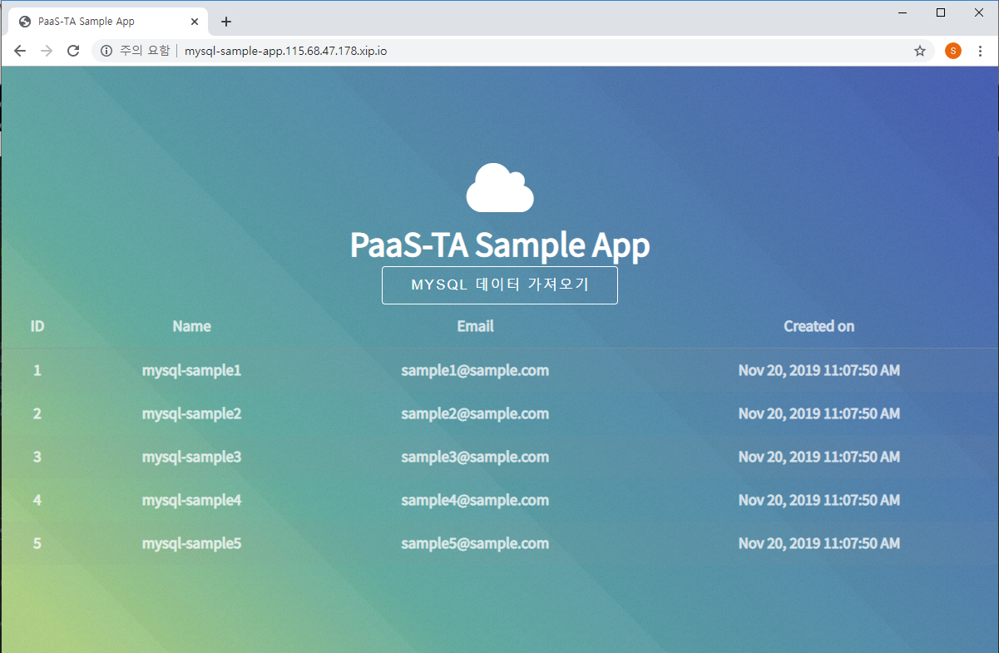

### 4. MySQL Client 툴 접속

Application에 바인딩 된 MySQL 서비스 연결정보는 Private IP로 구성되어 있기 때문에 MySQL Client 툴에서 직접 연결할수 없다. 따라서 MySQL Client 툴에서 SSH 터널, Proxy 터널 등을 제공하는 툴을 사용해서 연결하여야 한다. 본 가이드는 SSH 터널을 이용하여 연결 하는 방법을 제공하며 MySQL Client 툴로써는 오픈 소스인 HeidiSQL로 가이드한다. HeidiSQL 에서 접속하기 위해서 먼저 SSH 터널링 할수 있는 VM 인스턴스를 생성해야한다. 이 인스턴스는 SSH로 접속이 가능해야 하고 접속 후 Open PaaS 에 설치한 서비스팩에 Private IP 와 해당 포트로 접근이 가능하도록 시큐리티 그룹을 구성해야 한다. 이 부분은 vSphere관리자 및 OpenPaaS 운영자에게 문의하여 구성한다.

#### 4.1. HeidiSQL 설치 및 연결

HeidiSQL 프로그램은 무료로 사용할 수 있는 오픈소스 소프트웨어이다.

**HeidiSQL을 다운로드 하기 위해 아래 URL로 이동하여 설치파일을 다운로드 한다.**

> [http://www.heidisql.com/download.php](http://www.heidisql.com/download.php)
>
> 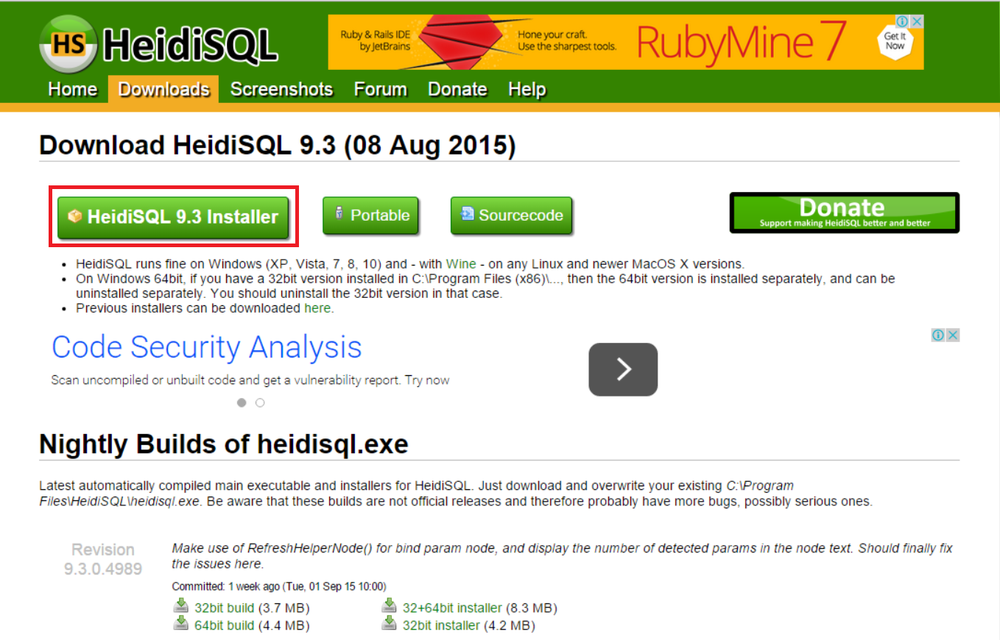

**다운로드한 설치파일을 실행한다.**

> 

**HeidSQL 설치를 위한 안내사항이다. Next 버튼을 클릭한다.**

> 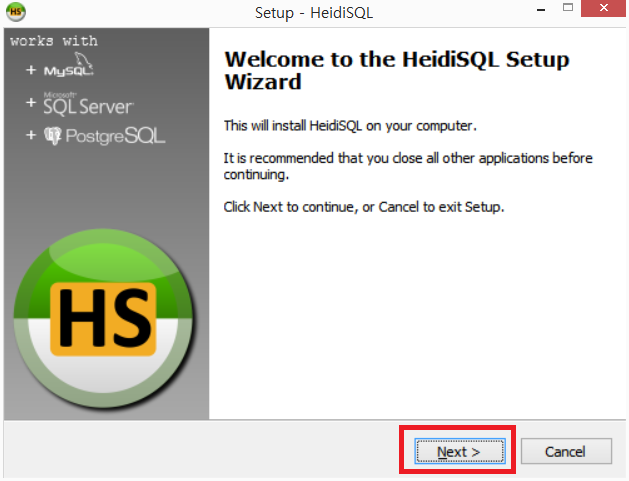

**프로그램 라이선스에 관련된 내용이다. 동의\(I accept the agreement\)에 체크 후 Next 버튼을 클릭한다.**

> 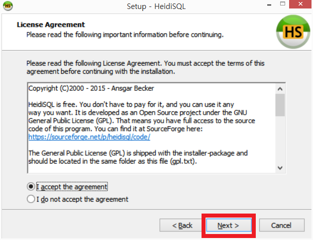

**HeidiSQL을 설치할 경로를 설정 후 Next 버튼을 클릭한다.**

> 별도의 경로 설정이 필요 없을 경우 default로 C드라이브 Program Files 폴더에 설치가 된다.
>
> 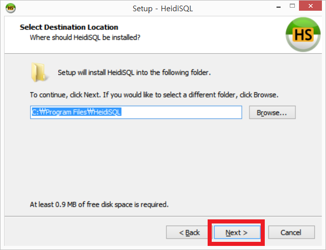

**설치 완료 후 시작메뉴에 HeidiSQL 바로가기 아이콘의 이름을 설정하는 과정이다.**

> Next 버튼을 클릭하여 다음 과정을 진행한다.
>
> 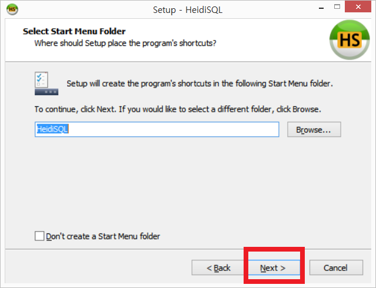

**체크박스가 4개가 있다. 아래의 경우를 고려하여 체크 및 해제를 한다.**

&gt; 바탕화면에 바로가기 아이콘을 생성할 경우  
sql확장자를 HeidiSQL 프로그램으로 실행할 경우  
heidisql 공식 홈페이지를 통해 자동으로 update check를 할 경우  
heidisql 공식 홈페이지로 자동으로 버전을 전송할 경우

> 체크박스에 체크 설정/해제를 완료했다면 Next 버튼을 클릭한다.
>
> 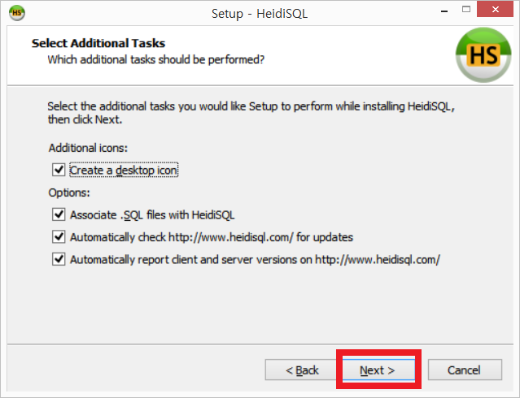

**설치를 위한 모든 설정이 한번에 출력된다. 확인 후 Install 버튼을 클릭하여 설치를 진행한다.**

> 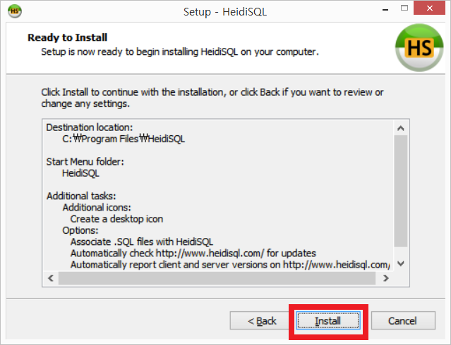

**Finish 버튼 클릭으로 설치를 완료한다.**

> 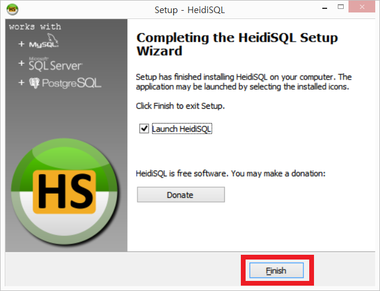

**HeidiSQL을 실행했을 때 처음 뜨는 화면이다. 이 화면에서 Server에 접속하기 위한 profile을 설정/저장하여 접속할 수 있다. 신규 버튼을 클릭한다.**

> 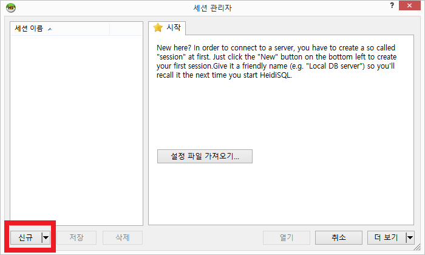

**어떤 Server에 접속하기 위한 Connection 정보인지 별칭을 입력한다.**

> 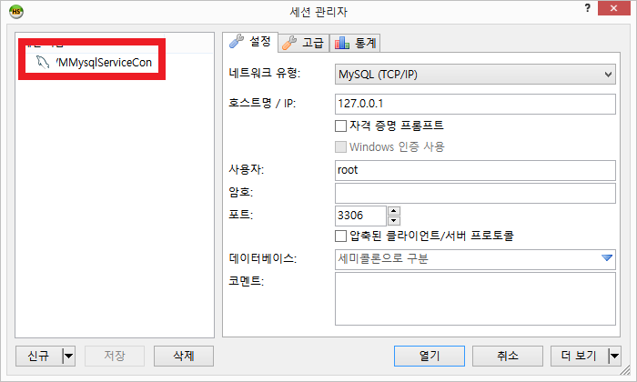

**네트워크 유형의 목록에서 MySQL\(SSH tunel\)을 선택한다.**

> 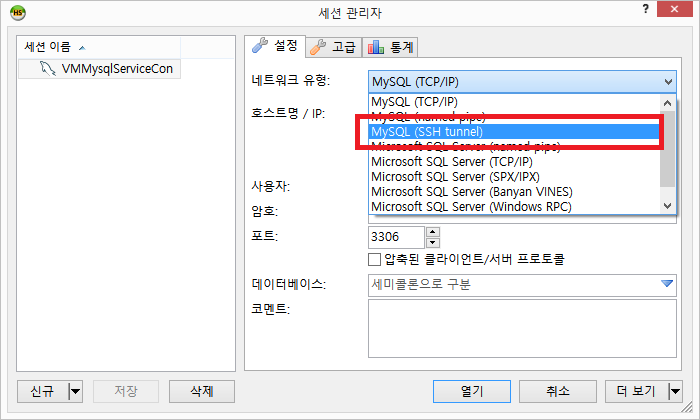

**아래 붉은색 영역에 접속하려는 서버 정보를 모두 입력한다.**

> 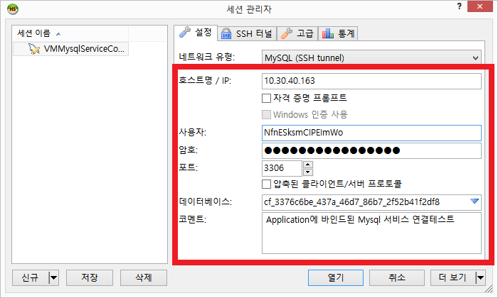
>
> 서버 정보는 Application에 바인드되어 있는 서버 정보를 입력한다. cf env  명령어로 이용하여 확인한다.
>
> **예\)** $cf env hello-spring-mysql
>
> 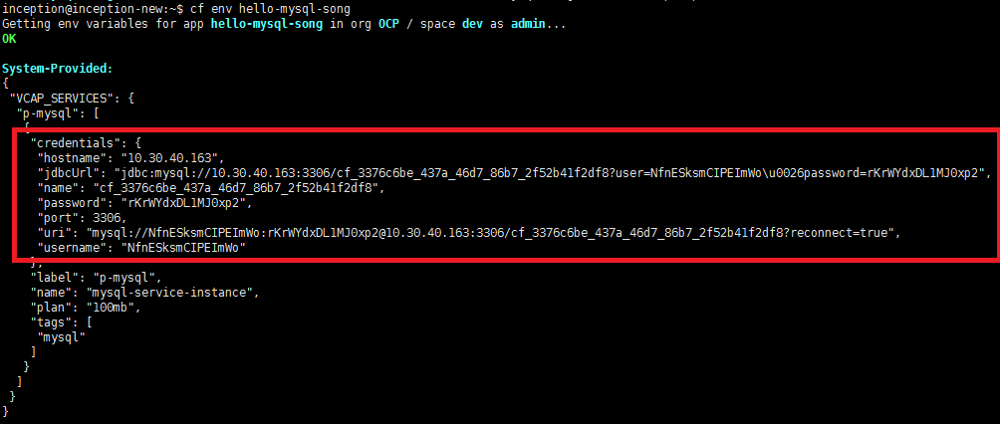

**- SSH 터널 탭을 클릭하고 OpenPaaS 운영 관리자에게 제공받은 SSH 터널링 가능한 서버 정보를 입력한다. plink.exe 위치 입력은 Putty에서 제공하는 plink.exe 실행 위치를 넣어주고 만일 해당 파일이 없을 경우 plink.exe 내려받기 링크를 클릭하여 다운받는다. 로컬 포트 정보는 임의로 넣고 열기 버튼을 클릭하면 Mysql 데이터베이스에 접속한다.**

> \(참고\) 만일 개인 키로 접속이 가능한 경우에는 openstack용 Open PaaS Mysql 서비스팩 설치 가이드를 참고한다.
>
> 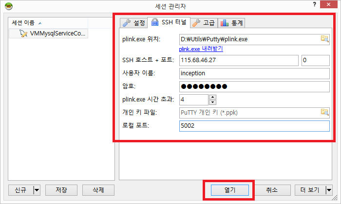

**접속이 완료되면 좌측에 스키마 정보가 나타난다. 하지만 초기설정은 테이블, 뷰, 프로시져, 함수, 트리거, 이벤트 등 모두 섞여 있어서 한눈에 구분하기가 힘들어서 접속한 DB 별칭에 마우스 오른쪽 클릭 후 "트리 방식 옵션" - "객체를 유형별로 묶기"를 클릭하면 아래 화면과 같이 각 유형별로 구분이된다.**

> 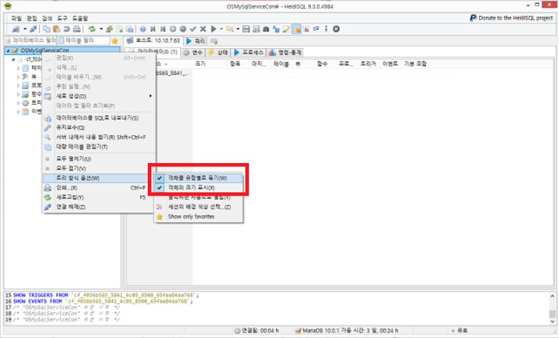

**우측 화면에 쿼리 탭을 클릭하여 Query문을 작성한 후 실행 버튼\(삼각형\)을 클릭한다.**

> 쿼리문에 이상이 없다면 정상적으로 결과를 얻을 수 있을 것이다.
>
> 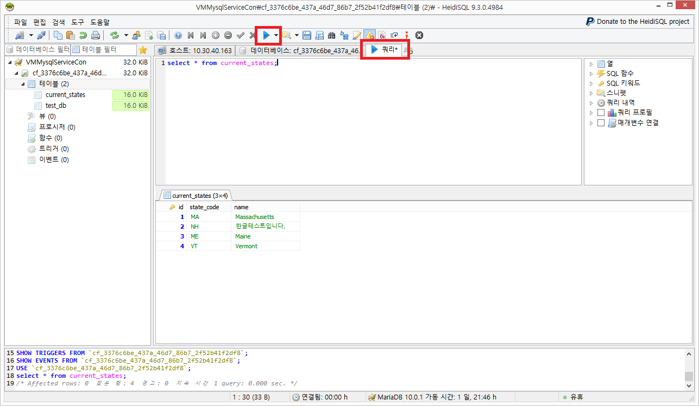

