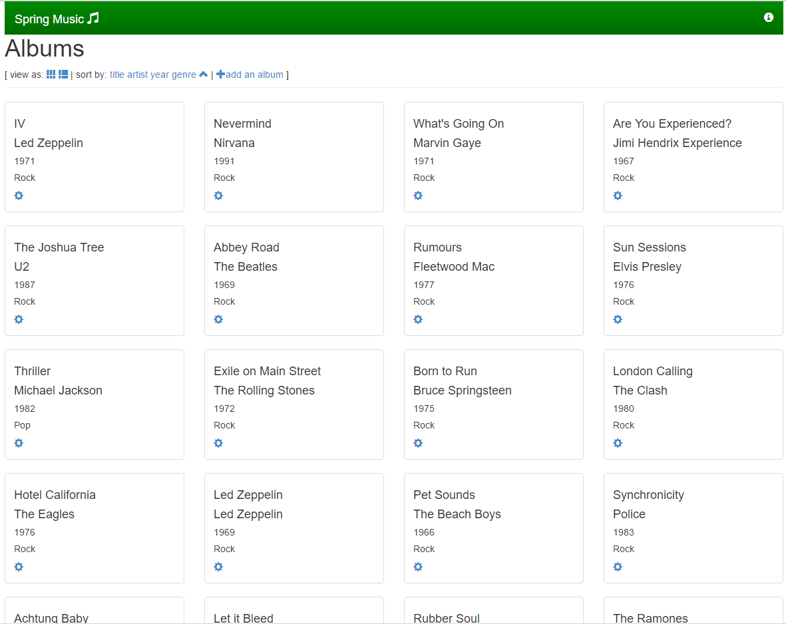

# PAAS-TA\_PINPOINT\_SERVICE\_INSTALL\_GUIDE\_V1.0

### Table of Contents

1. [문서 개요](paas-ta_pinpoint_service_install_guide_v1.0.md#1) 1.1. [목적](paas-ta_pinpoint_service_install_guide_v1.0.md#1.1) 1.2. [범위](paas-ta_pinpoint_service_install_guide_v1.0.md#1.2) 1.3. [시스템 구성도](paas-ta_pinpoint_service_install_guide_v1.0.md#1.3) 1.4. [참고자료](paas-ta_pinpoint_service_install_guide_v1.0.md#1.4)
2. [Pinpoint 서비스 설치](paas-ta_pinpoint_service_install_guide_v1.0.md#2) 2.1. [Prerequisite](paas-ta_pinpoint_service_install_guide_v1.0.md#2.1) 2.2. [Stemcell 확인](paas-ta_pinpoint_service_install_guide_v1.0.md#2.2) 2.3. [Deployment 다운로드](paas-ta_pinpoint_service_install_guide_v1.0.md#2.3) 2.4. [Deployment 파일 수정](paas-ta_pinpoint_service_install_guide_v1.0.md#2.4) 2.5. [서비스 설치](paas-ta_pinpoint_service_install_guide_v1.0.md#2.5) 2.6. [서비스 설치 - 다운로드 된 PaaS-TA Release 파일 이용 방식](paas-ta_pinpoint_service_install_guide_v1.0.md#2.6) 2.7. [서비스 설치 확인](paas-ta_pinpoint_service_install_guide_v1.0.md#2.7)
3. [Sample Web App 연동 Pinpoint 연동](paas-ta_pinpoint_service_install_guide_v1.0.md#3) 3.1. [Pinpoint 서비스 브로커 등록](paas-ta_pinpoint_service_install_guide_v1.0.md#3.1) 3.2. [Sample Web App 구조](paas-ta_pinpoint_service_install_guide_v1.0.md#3.2) 3.3. [PaaS-TA에서 서비스 신청](paas-ta_pinpoint_service_install_guide_v1.0.md#3.3) 3.4. [Sample Web App에 서비스 바인드 신청 및 App 확인](paas-ta_pinpoint_service_install_guide_v1.0.md#3.4)

### 1. 문서 개요

#### 1.1. 목적

본 문서\(Pinpoint 서비스팩 설치 가이드\)는 전자정부표준프레임워크 기반의 PaaS-TA에서 제공되는 서비스팩인 Pinpoint 서비스팩을 Bosh2.0을 이용하여 설치 하는 방법과 PaaS-TA의 SaaS 형태로 제공하는 Application 에서 Pinpoint 서비스를 사용하는 방법을 기술하였다. PaaS-TA 3.5 버전부터는 Bosh2.0 기반으로 deploy를 진행하며 기존 Bosh1.0 기반으로 설치를 원할경우에는 PaaS-TA 3.1 이하 버전의 문서를 참고한다.

#### 1.2. 범위

설치 범위는 Pinpoint 서비스팩을 검증하기 위한 기본 설치를 기준으로 작성하였다.

#### 1.3. 시스템 구성도

본 문서의 설치된 시스템 구성도이다. Pinpoint Server, HBase의 HBase Master2, HBase Slave2, Collector 2, Pinpoint 서비스 브로커, WebUI3로 최소사항을 구성하였다.


| 구분 | Resource Pool | 스펙 |
| :--- | :--- | :--- |
| Collector/0 | pinpoint\_medium | 2vCPU / 2GB RAM / 8GB Disk |
| Collector/1 | pinpoint\_medium | 2vCPU / 2GB RAM / 8GB Disk |
| h\_master/0 | pinpoint\_medium | 2vCPU / 2GB RAM / 8GB Disk |
| h\_secondary | pinpoint\_ small | 1vCPU / 1GB RAM / 4GB Disk |
| h\_slave/0 | services-small | 1vCPU / 1GB RAM / 4GB Disk |
| h\_slave/1 | services-small | 1vCPU / 1GB RAM / 4GB Disk |
| haproxy\_webui/0 | services-small | 1vCPU / 1GB RAM / 4GB Disk |
| pinpoint\_broker/0services-small | 1vCPU / 1GB RAM / 4GB Disk |  |
| webui/0 | services-small | 1vCPU / 1GB RAM / 4GB Disk |
| webui/1 | services-small | 1vCPU / 1GB RAM / 4GB Disk |

#### 1.4. 참고자료

[**http://bosh.io/docs**](http://bosh.io/docs)  
 [**http://docs.cloudfoundry.org/**](http://docs.cloudfoundry.org/)

### 2. Pinpoint 서비스 설치

#### 2.1. Prerequisite

본 설치 가이드는 Linux 환경에서 설치하는 것을 기준으로 하였다. 서비스 설치를 위해서는 BOSH 2.0과 PaaS-TA 5.0 이상, PaaS-TA 포털이 설치되어 있어야 한다.

* bosh runtime-config를 확인하여 bosh-dns include deployments 에 pinpoint가 있는지 확인한다.  

  ※ bosh-dns include deployments에 pinpoint가 없다면 ~/workspace/paasta-5.5.1/deployment/paasta-deployment/bosh/runtime-configs 의 dns.yml 을 열어서 pinpoint를 추가하고, bosh runtime-config를 업데이트 해준다.    

> $ bosh -e micro-bosh runtime-config
>
> \`\`\` Using environment '10.0.1.6' as client 'admin'

addons:

* include:

    deployments:

  * paasta
  * pinpoint
  * pinpoint-monitoring

    stemcell:

  * os: ubuntu-trusty
  * os: ubuntu-xenial

    jobs:

    * name: bosh-dns

      properties:

      api:

      client:

        tls: "\(\(/dns\_api\_client\_tls\)\)"

      server:

        tls: "\(\(/dns\_api\_server\_tls\)\)"

      cache:

      enabled: true

      health:

      client:

        tls: "\(\(/dns\_healthcheck\_client\_tls\)\)"

      enabled: true

      server:

        tls: "\(\(/dns\_healthcheck\_server\_tls\)\)"

      release: bosh-dns

      name: bosh-dns

      ...\(생략\)...

Succeeded

```text
### <div id="2.2"/> 2.2. Stemcell 확인

Stemcell 목록을 확인하여 서비스 설치에 필요한 Stemcell이 업로드 되어 있는 것을 확인한다.  (PaaS-TA 5.5.1 과 동일 stemcell 사용)

> $ bosh -e micro-bosh stemcells
```

Using environment '10.0.1.6' as client 'admin'

Name Version OS CPI CID  
bosh-aws-xen-hvm-ubuntu-xenial-go\_agent 621.94\* ubuntu-xenial - ami-0297ff649e8eea21b

\(\*\) Currently deployed

1 stemcells

Succeeded

```text
### <div id="2.3"/> 2.3. Deployment 다운로드  

서비스 설치에 필요한 Deployment를 Git Repository에서 받아 서비스 설치 작업 경로로 위치시킨다.  

- Service Deployment Git Repository URL : https://github.com/PaaS-TA/service-deployment/tree/v5.0.6
```

## Deployment 다운로드 파일 위치 경로 생성 및 설치 경로 이동

$ mkdir -p ~/workspace/paasta-5.5.1/deployment $ cd ~/workspace/paasta-5.5.1/deployment

## Deployment 파일 다운로드

$ git clone [https://github.com/PaaS-TA/service-deployment.git](https://github.com/PaaS-TA/service-deployment.git) -b v5.0.6

```text
### <div id="2.4"/> 2.4. Deployment 파일 수정

BOSH Deployment manifest는 Components 요소 및 배포의 속성을 정의한 YAML 파일이다.
Deployment 파일에서 사용하는 network, vm_type, disk_type 등은 Cloud config를 활용하고, 활용 방법은 BOSH 2.0 가이드를 참고한다.   

- Cloud config 설정 내용을 확인한다.   

> $ bosh -e micro-bosh cloud-config
```

Using environment '10.0.1.6' as client 'admin'

azs:

* cloud\_properties:

    availability\_zone: ap-northeast-2a

  name: z1

* cloud\_properties:

    availability\_zone: ap-northeast-2a

  name: z2

... \(\(생략\)\) ...

disk\_types:

* disk\_size: 1024

  name: default

* disk\_size: 1024

  name: 1GB

... \(\(생략\)\) ...

networks:

* name: default

  subnets:

  * az: z1

    cloud\_properties:

      security\_groups: paasta-security-group

      subnet: subnet-00000000000000000

    dns:

    * 8.8.8.8

      gateway: 10.0.1.1

      range: 10.0.1.0/24

      reserved:

    * 10.0.1.2 - 10.0.1.9

      static:

    * 10.0.1.10 - 10.0.1.120

... \(\(생략\)\) ...

vm\_types:

* cloud\_properties:

    ephemeral\_disk:

  ```text
  size: 3000
  type: gp2
  ```

    instance\_type: t2.small

  name: minimal

* cloud\_properties:

    ephemeral\_disk:

  ```text
  size: 10000
  type: gp2
  ```

    instance\_type: t2.small

  name: small

... \(\(생략\)\) ...

Succeeded

```text
- Deployment YAML에서 사용하는 변수 파일을 서버 환경에 맞게 수정한다.

> $ vi ~/workspace/paasta-5.5.1/deployment/service-deployment/pinpoint/vars.yml
```

## STEMCELL

stemcell\_os: "ubuntu-xenial" \# stemcell os stemcell\_version: "621.94" \# stemcell version

## NETWORK

private\_networks\_name: "default" \# private network name public\_networks\_name: "vip" \# public network name

## H\_MASTER

master\_azs: \[z3\] \# h\_master azs master\_instances: 1 \# h\_master instances \(default : 1\) master\_vm\_type: "large" \# h\_master vm type master\_persistent\_disk\_type: "30GB" \# h\_master persistent disk type master\_pem\_ssh: false \# h\_master pem ssh \(default : false\) master\_replication: 1 \# h\_master replication \(default : 1\) master\_tcp\_listen\_port: 29994 \# h\_master tcp listen port \(default : 29994\)

## COLLECTOR

collector\_azs: \[z3\] \# collector azs collector\_instances: 1 \# collector instances \(default : 1\) collector\_vm\_type: "large" \# collector vm type collector\_persistent\_disk\_type: "30GB" \# collector persistent disk type

collector\_tcp\_port: 29994 \# collector tcp listen port \(default : 29994\) collector\_stat\_port: 29995 \# collector stat port \(default : 29995\) collector\_span\_port: 29996 \# collector span port \(default : 29996\)

## PINPOINT\_WEB

pinpoint\_azs: \[z3\] \# pinpoint azs pinpoint\_instances: 1 \# pinpoint instances \(default : 1\) pinpoint\_vm\_type: "large" \# pinpoint vm type pinpoint\_persistent\_disk\_type: "30GB" \# pinpoint persistent disk type

## BROKER

broker\_azs: \[z3\] \# broker azs broker\_instances: 1 \# broker instances \(default : 1\) broker\_vm\_type: "large" \# broker vm type broker\_persistent\_disk\_type: "30GB" \# broker persistent disk type

## HAPROXY\_WEBUI

webui\_azs: \[z7\] \# webui azs webui\_instances: 1 \# webui instances \(default : 1\) webui\_vm\_type: "large" \# webui vm type webui\_persistent\_disk\_type: "30GB" \# webui persistent disk type webui\_haproxy\_public\_ip: "" \# webui haproxy's public IP

## PROPERTIES

resource\_tracker\_port: 8025 \# resource tracker port \(default : 8025\) scheduler\_port: 8030 \# scheduler port \(default : 8030\) resourcemanager\_port: 8040 \# resourcemanager port \(default : 8040\)

```text
### <div id="2.5"/> 2.5. 서비스 설치

- 서버 환경에 맞추어 Deploy 스크립트 파일의 VARIABLES 설정을 수정하고, Option file을 추가할지 선택한다.  
     (선택) -o operations/use-compiled-releases.yml (ubuntu-xenial/621.94로 컴파일 된 릴리즈 사용) 

> $ vi ~/workspace/paasta-5.5.1/deployment/service-deployment/pinpoint/deploy.sh
```

## !/bin/bash

## VARIABLES

COMMON\_VARS\_PATH="" \# common\_vars.yml File Path \(e.g. ../../common/common\_vars.yml\) CURRENT\_IAAS="${CURRENT\_IAAS}" \# IaaS Information \(PaaS-TA에서 제공되는 create-bosh-login.sh 미 사용시 aws/azure/gcp/openstack/vsphere 입력\) BOSH\_ENVIRONMENT="${BOSH\_ENVIRONMENT}" \# bosh director alias name \(PaaS-TA에서 제공되는 create-bosh-login.sh 미 사용시 bosh envs에서 이름을 확인하여 입력\)

## DEPLOY

bosh -e ${BOSH\_ENVIRONMENT} -n -d pinpoint deploy --no-redact pinpoint.yml  -o operations/${CURRENT\_IAAS}-network.yml  -l ${COMMON\_VARS\_PATH}  -l vars.yml  -l operations/pem.yml

```text
- 서비스를 설치한다.
```

$ cd ~/workspace/paasta-5.5.1/deployment/service-deployment/pinpoint  
$ sh ./deploy.sh

```text
### <div id="2.6"/> 2.6. 서비스 설치 - 다운로드 된 PaaS-TA Release 파일 이용 방식

- 서비스 설치에 필요한 릴리즈 파일을 다운로드 받아 Local machine의 서비스 설치 작업 경로로 위치시킨다.  

  - 설치 릴리즈 파일 다운로드 : [paasta-pinpoint-release.tgz](http://45.248.73.44/index.php/s/SJ6SoLksWEc3ckJ/download)
```

## 릴리즈 다운로드 파일 위치 경로 생성

$ mkdir -p ~/workspace/paasta-5.5.1/release/service

## 릴리즈 파일 다운로드 및 파일 경로 확인

$ ls ~/workspace/paasta-5.5.1/release/service paasta-pinpoint-release.tgz

```text
- 서버 환경에 맞추어 Deploy 스크립트 파일의 VARIABLES 설정을 수정하고 Option file 및 변수를 추가한다.  
     (추가) -o operations/use-offline-releases.yml (미리 다운받은 offline 릴리즈 사용)  
     (추가) -v releases_dir="<RELEASE_DIRECTORY>"  

> $ vi ~/workspace/paasta-5.5.1/deployment/service-deployment/pinpoint/deploy.sh
```

## !/bin/bash

## VARIABLES

COMMON\_VARS\_PATH="" \# common\_vars.yml File Path \(e.g. ../../common/common\_vars.yml\) CURRENT\_IAAS="${CURRENT\_IAAS}" \# IaaS Information \(PaaS-TA에서 제공되는 create-bosh-login.sh 미 사용시 aws/azure/gcp/openstack/vsphere 입력\) BOSH\_ENVIRONMENT="${BOSH\_ENVIRONMENT}" \# bosh director alias name \(PaaS-TA에서 제공되는 create-bosh-login.sh 미 사용시 bosh envs에서 이름을 확인하여 입력\)

## DEPLOY

bosh -e ${BOSH\_ENVIRONMENT} -n -d pinpoint deploy --no-redact pinpoint.yml  -o operations/${CURRENT\_IAAS}-network.yml  -l ${COMMON\_VARS\_PATH}  -l vars.yml  -l operations/pem.yml  -v releases\_dir="/home/ubuntu/workspace/paasta-5.5.1/release"

```text
- 서비스를 설치한다.
```

$ cd ~/workspace/paasta-5.5.1/deployment/service-deployment/pinpoint  
$ sh ./deploy.sh

```text
### <div id="2.7"/> 2.7. 서비스 설치 확인

설치 완료된 서비스를 확인한다.  

> $ bosh -e micro-bosh -d pinpoint vms
```

Using environment '10.0.1.6' as client 'admin'

Task 5006. Done

Deployment 'pinpoint'

Instance Process State AZ IPs VM CID VM Type Active collector/5f10f9cf-67ed-4c08-8c14-99d7f7a818c2 running z5 10.30.107.145 vm-1714d225-85fa-4236-94db-7ed26baa52b3 minimal true h\_master/723a34d6-0756-41e2-b11e-1530596cbb09 running z5 10.30.107.175 vm-037e021b-3dba-4ea3-961c-6bd259d25c4b minimal true haproxy\_webui/22999f9c-0798-43a5-b93b-bc5d44c4d210 running z5 10.30.107.178 vm-294e229c-aa89-4a5c-9960-4009579bbf54 minimal true xxx.xx.xx.xx3 pinpoint\_broker/7a9d8423-c5f9-4e3c-be16-42e9215f8268 running z5 10.30.107.182 vm-1b9b0891-8a02-45af-8b0c-ca21bf56e64e minimal true webui/30f7c9cf-ab03-4f78-a9bf-96c5148a9ec1 running z5 10.30.107.180 vm-62d5e876-2ab4-4327-ba54-2f74b53e3da9 minimal true

5 vms

Succeeded

```text
##  <div id='3'> 3. Sample Web App 연동 Pinpoint 연동

본 Sample Web App은 개방형 클라우드 플랫폼에 배포되며 Pinpoint의 서비스를 Provision과 Bind를 한 상태에서 사용이 가능하다.

### <div id='3.1'> 3.1. Pinpoint 서비스 브로커 등록

Pinpoint 서비스팩 배포가 완료 되었으면 Application에서 서비스 팩을 사용하기 위해서 먼저 Pinpoint 서비스 브로커를 등록해 주어야 한다.

서비스 브로커 등록시 PaaS-TA에서 서비스브로커를 등록 할 수 있는 사용자로 로그인이 되어 있어야 한다.

-   서비스 브로커 목록을 확인한다.
```

$ cf service-brokers

```text

```

Getting service brokers as admin...

name url No service brokers found

```text
-   Pinpoint 서비스 브로커를 등록한다.
```

$ cf create-service-broker {서비스브로커 이름} {서비스브로커 사용자ID} {서비스브로커 사용자비밀번호} [http://{서비스브로커](http://{서비스브로커) URL\(IP\)}

```text

```

서비스브로커 이름 : 서비스브로커 관리를 위해 PaaS-TA에서 보여지는 명칭이다. 서비스 Marketplace에서는 각각의 API 서비스 명이 보여지니 여기서 명칭은 서비스브로커 명칭이다.

서비스브로커 사용자ID / 비밀번호 : 서비스팩에 접근할 수 있는 사용자 ID입니다. 서비스브로커도 하나의 API 서버이기 때문에 아무나 접근을 허용할 수 없어 접근이 가능한 ID/비밀번호를 입력한다.

서비스브로커 URL : 서비스브로커가 제공하는 API를 사용할 수 있는 URL을 입력한다.

```text

```

$ cf create-service-broker pinpoint-service-broker admin cloudfoundry http://:8080

```text

```

Creating service broker pinpoint-service-broker as admin... OK

```text
-   등록된 Pinpoint 서비스 브로커를 확인한다.
```

$ cf service-brokers

```text

```

Getting service brokers as admin... name url pinpoint-service-broker [http://URL\(IP\):8080](http://URL%28IP%29:8080)

```text
-   접근 가능한 서비스 목록을 확인한다.
```

$ cf service-access

```text

```

Getting service access as admin... broker: Pinpoint-service-broker service plan access orgs Pinpoint Pinpoint\_standard none

```text
서비스 브로커 생성시 디폴트로 접근을 허용하지 않는다.

-   특정 조직에 해당 서비스 접근 허용을 할당하고 접근 서비스 목록을 다시 확인한다. (전체 조직)
```

$ cf enable-service-access Pinpoint

```text

```

Enabling access to all plans of service Pinpoint for all orgs as admin... OK

```text
서비스 접근 허용을 확인한다.
```

$ cf service-access

```text

```

Getting service access as admin... broker: Pinpoint-service-broker service plan access orgs Pinpoint Pinpoint\_standard all

```text
### <div id='3.2'> 3.2. Sample Web App 구조

Sample Web App은 PaaS-TA에 App으로 배포가 된다. 배포된 App에 Pinpoint 서비스 Bind 를 통하여 초기 데이터를 생성하게 된다. 바인드 완료 후 연결 url을 통하여 브라우저로 해당 App에 대한 Pinpoint 서비스 모니터링을 할 수 있다.

-   Spring-music App을 이용하여 Pinpoint 모니터링을 테스트 하였다.
-   앱을 다운로드 후 –b 옵션을 주어 buildpack을 지정하여 push 해 놓는다.
```

$ cf push -b java\_buildpack\_pinpoint --no-start

```text

```

Using manifest file /home/ubuntu/workspace/bd\_test/spring-music/manifest.yml

Creating app spring-music-pinpoint in org org / space space as admin... OK

Creating route spring-music-pinpoint.monitoring.open-paas.com... OK

Binding spring-music-pinpoint.monitoring.open-paas.com to spring-music-pinpoint... OK

Uploading spring-music-pinpoint... Uploading app files from: /tmp/unzipped-app175965484 Uploading 21.2M, 126 files Done uploading OK

```text

```

$ cf apps

```text

```

Getting apps in org org / space space as admin... OK

name requested state instances memory disk urls php-demo started 1/1 256M 1G php-demo.monitoring.open-paas.com spring-music stopped 0/1 512M 1G spring-music.monitoring.open-paas.com spring-music-pinpoint stopped 0/1 512M 1G spring-music-pinpoint.monitoring.open-paas.com

```text
### <div id='3.3'> 3.3. PaaS-TA에서 서비스 신청

Sample Web App에서 Pinpoint 서비스를 사용하기 위해서는 서비스 신청(Provision)을 해야 한다.

\*참고: 서비스 신청시 PaaS-TA에서 서비스를 신청 할 수 있는
사용자로 로그인이 되어 있어야 한다.

-   먼저 PaaS-TA Marketplace에서 서비스가 있는지 확인을 한다.
```

$ cf marketplace

```text

```

Getting services from marketplace in org org / space space as admin... OK

service plans description Pinpoint Pinpoint\_standard A simple pinpoint implementation

```text
-   Marketplace에서 원하는 서비스가 있으면 서비스 신청(Provision)을 하여 서비스 인스턴스를 생성한다.
```

$ cf create-service {서비스명} {서비스플랜} {내서비스명}

```text

```

서비스명 : p-Pinpoint로 Marketplace에서 보여지는 서비스 명칭이다. 서비스플랜 : 서비스에 대한 정책으로 plans에 있는 정보 중 하나를 선택한다. Pinpoint 서비스는 10 connection, 100 connection 를 지원한다. 내서비스명 : 내 서비스에서 보여지는 명칭이다. 이 명칭을 기준으로 환경설정정보를 가져온다.

```text

```

$ cf create-service Pinpoint Pinpoint\_standard PS1

```text

```

Creating service instance PS1 in org org / space space as admin... OK

```text
-   생성된 Pinpoint 서비스 인스턴스를 확인한다.
```

$ cf services

```text

```

Getting services in org org / space space as admin... OK

name service plan bound apps last PS1 Pinpoint Pinpoint\_standard create succeeded pinpoint-service-broker

```text
### <div id='3.4'> 3.4. Sample Web App에 서비스 바인드 신청 및 App 확인

서비스 신청이 완료되었으면 Sample Web App 에서는 생성된 서비스 인스턴스를 Bind 하여 App에서 Pinpoint 서비스를 이용한다.

\*참고: 서비스 Bind 신청시 PaaS-TA 플랫폼에서 서비스 Bind신청 할 수 있는 사용자로 로그인이 되어 있어야 한다.

-   Sample Web App에서 생성한 서비스 인스턴스 바인드 신청을 한다.

- 서비스 인스턴스 확인
```

$ cf s

```text

```

Getting services in org org / space space as admin... OK

name service plan bound apps last PS1 Pinpoint Pinpoint\_standard create my\_rabbitmq\_service p-rabbitmq standard create succeeded rabbitmq-service-broker

```text
- 서비스 바인드
```:q!

$ cf bind-service spring-music-pinpoint PS1 -c '{"application_name":"spring-music"}'
```

```text
Binding service PS1 to app spring-music-pinpoint in org org / space space as admin...
OK
TIP: Use 'cf restage spring-music-pinpoint' to ensure your env variable changes take effect
```

**cf cli 리눅스 버전 :**

```text
cf bind-service <application이름> PS1 -c ‘{"application_name\":"<application이름>"}
```

**cf cli window 버전 :**

```text
cf bind-service <application이름> PS1 -c "{\"application_name\":\"<application이름>\"}"
```

* 바인드가 적용되기 위해서 App을 restage한다.

```text
$ cf restage spring-music-pinpoint
```

```text
Restaging app spring-music-pinpoint in org org / space space as admin...
Downloading binary_buildpack...
Downloading go_buildpack...
Downloading staticfile_buildpack...
Downloading java_buildpack...
Downloading ruby_buildpack...
Downloading nodejs_buildpack...
Downloading python_buildpack...
Downloading php_buildpack...
Downloaded python_buildpack
Downloaded binary_buildpack
Downloaded go_buildpack
Downloaded java_buildpack
Downloaded ruby_buildpack
Downloaded nodejs_buildpack
Downloaded staticfile_buildpack
Downloaded php_buildpack
Creating container
Successfully created container
Downloading app package...
Downloaded app package (24.5M)
Downloading build artifacts cache...
Downloaded build artifacts cache (54.1M)
Staging...
-----> Java Buildpack Version: v3.7.1 | https://github.com/cloudfoundry/java-buildpack.git#78c3d0a
-----> Downloading Open Jdk JRE 1.8.0_91-unlimited-crypto from https://java-buildpack.cloudfoundry.org/openjdk/trusty/x86_64/openjdk-1.8.0_91-unlimited-crypto.tar.gz (found in cache)
     Expanding Open Jdk JRE to .java-buildpack/open_jdk_jre (1.6s)
-----> Downloading Open JDK Like Memory Calculator 2.0.2_RELEASE from https://java-buildpack.cloudfoundry.org/memory-calculator/trusty/x86_64/memory-calculator-2.0.2_RELEASE.tar.gz (found in cache)
     Memory Settings: -XX:MaxMetaspaceSize=64M -Xss995K -Xmx382293K -Xms382293K -XX:MetaspaceSize=64M
-----> Downloading Spring Auto Reconfiguration 1.10.0_RELEASE from https://java-buildpack.cloudfoundry.org/auto-reconfiguration/auto-reconfiguration-1.10.0_RELEASE.jar (found in cache)
-----> Downloading Tomcat Instance 8.0.39 from https://java-buildpack.cloudfoundry.org/tomcat/tomcat-8.0.39.tar.gz (found in cache)
     Expanding Tomcat Instance to .java-buildpack/tomcat (0.1s)
-----> Downloading Tomcat Lifecycle Support 2.5.0_RELEASE from https://java-buildpack.cloudfoundry.org/tomcat-lifecycle-support/tomcat-lifecycle-support-2.5.0_RELEASE.jar (found in cache)
-----> Downloading Tomcat Logging Support 2.5.0_RELEASE from https://java-buildpack.cloudfoundry.org/tomcat-logging-support/tomcat-logging-support-2.5.0_RELEASE.jar (found in cache)
-----> Downloading Tomcat Access Logging Support 2.5.0_RELEASE from https://java-buildpack.cloudfoundry.org/tomcat-access-logging-support/tomcat-access-logging-support-2.5.0_RELEASE.jar (found in cache)
Exit status 0
Staging complete
Uploading droplet, build artifacts cache...
Uploading droplet...
Uploading build artifacts cache...
Uploaded build artifacts cache (54.1M)
Uploaded droplet (77.3M)
Uploading complete

0 of 1 instances running, 1 starting
0 of 1 instances running, 1 starting
0 of 1 instances running, 1 starting
1 of 1 instances running

App started


OK
```

* App이 정상적으로 Pinpoint 서비스를 사용하는지 확인한다.



* 환경변수 확인

```text
$ cf env spring-music-pinpoint
```

```text
Getting env variables for app spring-music-pinpoint in org org / space space as admin...
OK

System-Provided:
{
"VCAP_SERVICES": {
"Pinpoint": [
 {
  "credentials": {
   "application_name": "spring-music",
   "collector_host": "10.244.2.30",
   "collector_span_port": 29996,
   "collector_stat_port": 29995,
   "collector_tcp_port": 29994
  },
  "label": "Pinpoint",
  "name": "PS1",
  "plan": "Pinpoint_standard",
  "provider": null,
  "syslog_drain_url": null,
  "tags": [
   "pinpoint"
  ],
  "volume_mounts": []
 }
]
}
}

{
"VCAP_APPLICATION": {
"application_id": "b010e6e9-5431-4198-81f8-7d6ba9c14f40",
"application_name": "spring-music-pinpoint",
"application_uris": [
 "spring-music-pinpoint.monitoring.open-paas.com"
],
"application_version": "9a600116-97bd-45da-a33e-3b0d5592b1d0",
"limits": {
 "disk": 1024,
 "fds": 16384,
 "mem": 512
},
"name": "spring-music-pinpoint",
"space_id": "bc70b951-d870-49ca-b57d-5c7137060e5e",
"space_name": "space",
"uris": [
 "spring-music-pinpoint.monitoring.open-paas.com"
],
"users": null,
"version": "9a600116-97bd-45da-a33e-3b0d5592b1d0"
}
}

No user-defined env variables have been set

No running env variables have been set

No staging env variables have been set
```

* App 정상 구동 확인

  ```text
  $ curl http://<URL(IP)>/#/main/spring-music-pinpoint@TOMCAT
  ```

