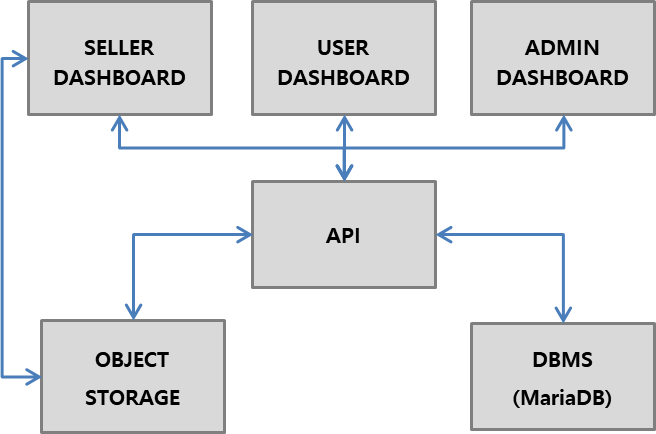
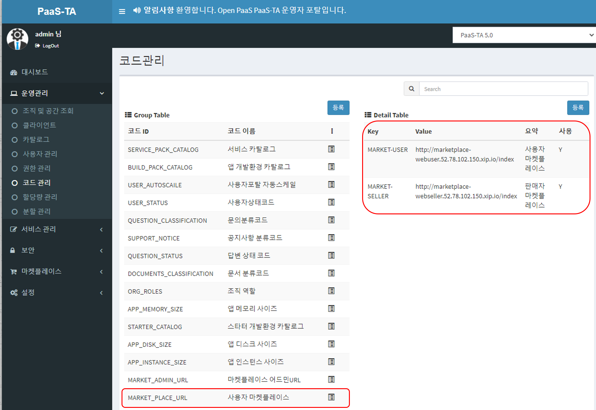
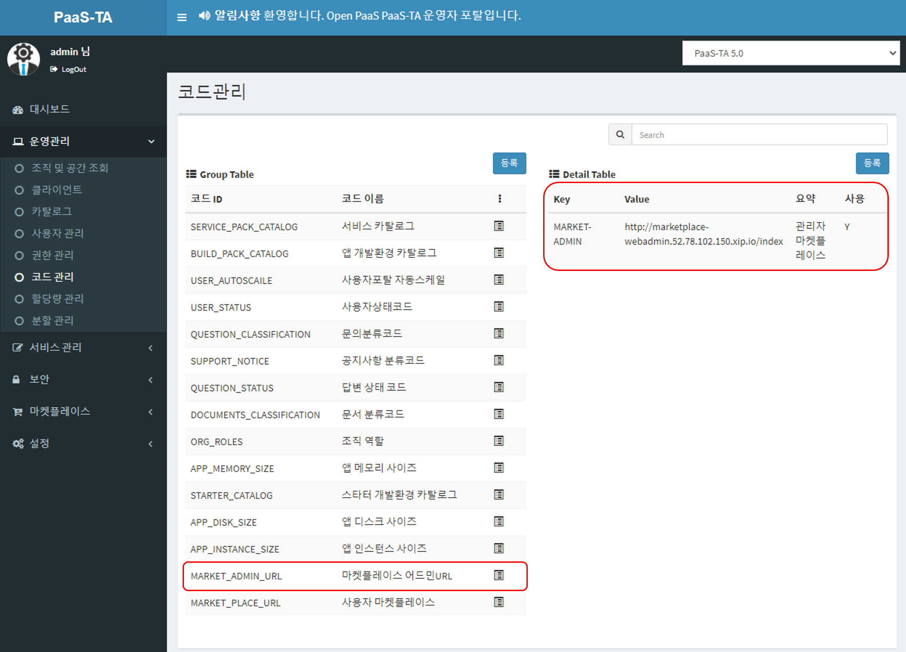

# PAAS-TA\_MARKETPLACE\_INSTALL\_GUIDE\_V1.0

### Table of Contents

[1. 문서 개요](paas-ta_marketplace_install_guide_v1.0.md#1)

* [1.1. 목적](paas-ta_marketplace_install_guide_v1.0.md#11)
* [1.2. 범위](paas-ta_marketplace_install_guide_v1.0.md#12)
* [1.3. 시스템 구성도](paas-ta_marketplace_install_guide_v1.0.md#13)

[2. 마켓플레이스 배포](paas-ta_marketplace_install_guide_v1.0.md#2)

* [2.1. 설치 전 준비사항](paas-ta_marketplace_install_guide_v1.0.md#21)
* [2.1.1. App 파일 및 Manifest 파일 다운로드](paas-ta_marketplace_install_guide_v1.0.md#211)
* [2.2. 마켓플레이스 Manifest 파일 수정 및 App 배포](paas-ta_marketplace_install_guide_v1.0.md#22)
* [2.2.1. CF 공간 설정 및 백엔드 서비스 설정](paas-ta_marketplace_install_guide_v1.0.md#221)
* [2.2.2. manifest 파일 설정](paas-ta_marketplace_install_guide_v1.0.md#222)
* [2.2.3. 마켓플레이스 App 배포](paas-ta_marketplace_install_guide_v1.0.md#223)
* [2.3. 마켓플레이스 UAA Client Id 등록](paas-ta_marketplace_install_guide_v1.0.md#23)
* [2.4. 마켓플레이스 서비스 관리](paas-ta_marketplace_install_guide_v1.0.md#24)

## Deprecated

**※ 본 문서는 PaaS-TA 5.1 이하의 버전까지 지원한다.**

## 1. 문서 개요

#### 1.1. 목적

본 문서\(마켓플레이스 설치 가이드\)는 개방형 PaaS 플랫폼 고도화 및 개발자 지원 환경 기반의 Open PaaS에서 마켓플레이스를 설치하는 방법을 기술하였다.

#### 1.2. 범위

설치 범위는 마켓플레이스 기본 설치를 기준으로 작성하였다.

#### 1.3. 시스템 구성도

본 문서의 설치된 시스템 구성도이다. 마켓플레이스 Server, DB, Object Storage 로 최소사항을 구성하였다.



## 2. 마켓플레이스 배포

#### 2.1. 설치 전 준비사항

본 설치 가이드는 Linux 환경에서 설치하는 것을 기준으로 하였다. 마켓플레이스를 설치하기 위해서는 BOSH 2.0과 PaaS-TA 5.0 이상, PaaS-TA 포털이 설치되어 있어야 한다.

**마켓플레이스 설치에 필요한 Object Storage\(Swift\) 및 DB 정보를 설정하기 위해서는 paasta-marketplace-env-release가 필수적으로 설치되어 있어야 한다.**

> [**PaaS-TA Marketplace Environment 설치**](paas-ta_marketplace_environment_install_guide_v1.0.md)

**2.1.1. App 파일 및 Manifest 파일 다운로드**

마켓플레이스 설치에 필요한 App 파일 및 Manifest 파일을 다운로드 받아 서비스 설치 작업 경로로 위치시킨다.

* 설치 파일 다운로드 위치 : [https://paas-ta.kr/download/package](https://paas-ta.kr/download/package)  
* 설치 작업 경로 및 디렉토리 \(파일\) 구성  

  \`\`\`  

  **설치 작업 경로**

  $ {HOME}/workspace/paasta-5.5/release/service/marketplace  

#### marketplace 설치 디렉토리 \(파일\)를 다운로드한다

$ wget --content-disposition [http://45.248.73.44/index.php/s/wCtqT3RL5N5pqSm/download](http://45.248.73.44/index.php/s/wCtqT3RL5N5pqSm/download)

#### 설치 디렉토리 \(파일\) 구성

marketplace ├── marketplace-api  
│ ├── manifest.yml  
│ └── marketplace-api.jar  
├── marketplace-webadmin  
│ ├── manifest.yml  
│ └── marketplace-web-admin.war  
├── marketplace-webseller  
│ ├── manifest.yml  
│ └── marketplace-web-seller.war  
└── marketplace-webuser  
├── manifest.yml  
└── marketplace-web-user.war

```text
### <div id='22'/> 2.2. 마켓플레이스 Manifest 파일 수정 및 App 배포
### <div id='221'/> 2.2.1. CF 공간 설정 및 백엔드 서비스 설정

마켓플레이스는 파스-타에 애플리케이션으로 서비스가 배포된다. 마켓플레이스 서비스 배포 및 마켓플레이스의 상품 배포를 위한 조직과 공간 설정 진행을 위해 조직과 공간을 생성하고 설정할 수 있는 권한을 가진 관리자 계정으로 로그인 되어 있어야 한다.

1) 마켓플레이스 배포를 위한 조직 및 공간을 생성하고 설정을 진행한다.
```

#### 마켓플래이스 배포를 위한 조직 및 공간 생성 및 설정

$ cf create-quota marketplace\_quota -m 100G -i -1 -s -1 -r -1 --reserved-route-ports -1 --allow-paid-service-plans $ cf create-org marketplace -q marketplace\_quota $ cf create-space system -o marketplace

```text
2) 마켓플레이스의 상품 배포를 위한 조직 및 공간을 생성하고 설정을 진행한다.
```

#### 마켓플래이스 상품 배포를 위한 조직 및 공간 생성 및 설정

$ cf create-org marketplace-org -q marketplace\_quota $ cf create-space marketplace-space -o marketplace-org

```text
3) 생성한 조직과 공간, 쿼타에 대한 GUID 를 확인한다.
```

#### 조직 GUID 확인

$ cf org marketplace-org --guid

#### 공간 GUID 확인

$ cf space marketplace-space --guid

#### 쿼타 GUID 확인 \("marketplace\_quota"에 해당하는 GUID 확인\)

$ cf curl "/v2/quota\_definitions"

#### 도메인 GUID 확인

$ cf curl "/v2/domains"

```text
4) 마켓플레이스에 필요한 Object Storage(Swift) 및 DB 환경 정보를 확인한다.

  - 위 2.1 설치 전 준비사항에서 사전 설치한 마켓플레이스 환경 정보를 확인하여 Object Storage(Swift) 및 DB 정보를 추출한다.  
    ++ [PaaS-TA Marketplace Environment 설치](./PAAS-TA_MARKETPLACE_ENVIRONMENT_INSTALL_GUIDE_V1.0.md)
```

### 마켓플레이스에 필요한 Object Storage\(Swift\) 및 DB 접속 URL 확인

$ bosh -e micro-bosh -d marketplace vms Deployment 'marketplace'

Instance Process State AZ IPs VM CID VM Type Active binary\_storage/66e5bf20-da8d-42b4-a325-fba5f6e326e8 running z2 10.174.1.56 vm-a81d9fe1-e9e8-4729-9786-bbb5f1518234 medium true mariadb/01ce2b6f-1038-468d-92f8-f68f72f7ea77 running z2 10.174.1.57 vm-ce5deeed-ba4e-49d1-b6ab-1f07c779e776 small true

==========================================================================================

### DB 접속 Port / Password 및 Object Storage\(Swift\) 접속 정보 확인:: service-deployment/marketplace/vars.yml

$ cat service-deployment/marketplace/vars.yml

## OBJECT\_STORAGE

object\_storage\_public\_static\_ips: "" \# object storage : public IP object\_storage\_auth\_port: "" \# object storage : keystone port \(e.g. 15001\) -- Do Not Use "5000" object\_storage\_username: "paasta-marketplace" \# object storage : username \(e.g. "paasta-marketplace"\) object\_storage\_password: "paasta" \# object storage : password \(e.g. "paasta"\) object\_storage\_tenantname: "paasta-marketplace" \# object storage : tenantname \(e.g. "paasta-marketplace"\) object\_storage\_email: "email@email.com" \# object storage : email \(e.g. "paasta@paasta.com"\) object\_storage\_container: "marketplace-container" \# object storage : swift container \(e.g. marketplace-container\)

## MARIA DB

mariadb\_port: "" \# mariadb : port \(e.g. 13306\) -- Do Not Use "3306"

## mariadb\_admin\_password: ""               \# mariadb : admin password \(e.g. admin@1234\)

```text
### <div id='222'/> 2.2.2. manifest 파일 설정
- 마켓플레이스 manifest는 Components 요소 및 배포의 속성을 정의한 YAML 파일이다. manifest 파일에는 어떤 name, memory, instance, host, path, buildpack, env 등을 사용 할 것인지 정의가 되어 있다.

  1) marketplace-api 의 manifest 파일을 환경에 맞게 수정한다.
```

$ cd ${HOME}/workspace/paasta-5.5/release/service/marketplace/marketplace-api $ vi manifest.yml

applications:

* name: marketplace-api memory: 2G disk\_quota: 2G instances: 1 buildpacks:

  * java\_buildpack path: ./marketplace-api.jar env: server\_port: 8777 spring\_application\_name: marketplace-api spring\_security\_username: admin spring\_security\_password: openpaasta spring\_datasource\_driver-class-name: com.mysql.cj.jdbc.Driver spring\_datasource\_url: jdbc:mysql://:/marketplace?characterEncoding=utf8&autoReconnect=true&serverTimezone=Asia/Seoul  
    spring\_datasource\_username: root spring\_datasource\_password:  spring\_jpa\_database: mysql spring\_jpa\_hibernate\_ddl-auto: update spring\_jpa\_hibernate\_use-new-id-generator-mappings: false spring\_jpa\_show-sql: true spring\_jpa\_database-platform: org.hibernate.dialect.MySQL5InnoDBDialect spring\_jpa\_properties\_hibernate\_jdbc: Asia/Seoul spring\_jackson\_serialization\_fail-on-empty-beans: false spring\_jackson\_default-property-inclusion: NON\_NULL spring\_servlet\_multipart\_max-file-size: 100MB spring\_servlet\_multipart\_max-request-size: 100MB

    cloudfoundry\_cc\_api\_url: [https://api](https://api). cloudfoundry\_cc\_api\_uaaUrl: [https://uaa](https://uaa). cloudfoundry\_cc\_api\_sslSkipValidation: true cloudfoundry\_cc\_api\_proxyUrl: "" cloudfoundry\_cc\_api\_host: "." cloudfoundry\_user\_admin\_username: admin cloudfoundry\_user\_admin\_password: 'admin' cloudfoundry\_user\_uaaClient\_clientId: admin cloudfoundry\_user\_uaaClient\_clientSecret: admin-secret cloudfoundry\_user\_uaaClient\_adminClientId: admin cloudfoundry\_user\_uaaClient\_adminClientSecret: admin-secret cloudfoundry\_user\_uaaClient\_loginClientId: admin cloudfoundry\_user\_uaaClient\_loginClientSecret: admin-secret cloudfoundry\_user\_uaaClient\_skipSSLValidation: true cloudfoundry\_authorization: cf-Authorization

    market\_org\_name: "marketplace-org" market\_org\_guid: "" market\_space\_name: "marketplace-space" market\_space\_guid: "" market\_domain\_guid: "&lt;도메인 GUID&gt;" market\_quota\_guid: "" market\_naming-type: "Auto"

    objectStorage\_swift\_tenantName:  objectStorage\_swift\_username:  objectStorage\_swift\_password:  objectStorage\_swift\_authUrl: http://:/v2.0/tokens objectStorage\_swift\_authMethod: keystone objectStorage\_swift\_preferredRegion: Public objectStorage\_swift\_container: 

    provisioning\_pool-size: 3 provisioning\_try-count: 7 provisioning\_timeout: 3600000 provisioning\_ready-fixed-rate: 10000 provisioning\_ready-initial-delay: 3000 provisioning\_progress-fixed-rate: 10000 provisioning\_progress-initial-delay: 5000 provisioning\_timeout-fixed-rate: 30000 provisioning\_timeout-initial-delay: 1700

    deprovisioning\_pool-size: 3 deprovisioning\_try-count: 7 deprovisioning\_timeout: 3600000 deprovisioning\_ready-fixed-rate: 10000 deprovisioning\_ready-initial-delay: 7000 deprovisioning\_progress-fixed-rate: 10000 deprovisioning\_progress-initial-delay: 13000 deprovisioning\_timeout-fixed-rate: 30000 deprovisioning\_timeout-initial-delay: 1700

    task\_execution\_restrict-to-same-host: false

    java\_opts: '-XX:MaxMetaspaceSize=256000K -Xss349K -Xms1G -XX:MetaspaceSize=256000K -Xmx1G'

  ```text
  <br>

  2) marketplace-webadmin 의 manifest 파일을 환경에 맞게 수정한다.
  ```

  $ cd ${HOME}/workspace/paasta-5.5/release/service/marketplace/marketplace-webadmin $ vi manifest.yml

applications:

* name: marketplace-webadmin memory: 1G instances: 1 buildpacks:

  * java\_buildpack path: ./marketplace-web-admin.war env: server\_port: 8778 spring\_application\_name: marketplace-webadmin spring\_servlet\_multipart\_max-file-size: 1024MB spring\_servlet\_multipart\_max-request-size: 1024MB spring\_session\_store-type: jdbc spring\_session\_jdbc\_initialize-schema: always spring\_session\_jdbc\_schema: classpath:org/springframework/session/jdbc/schema-mysql.sql spring\_mvc\_static-path-pattern: /static/\*\* spring\_datasource\_driver-class-name: com.mysql.cj.jdbc.Driver spring\_datasource\_url: jdbc:mysql://:/marketplace\_admin?characterEncoding=utf8&autoReconnect=true spring\_datasource\_username: root spring\_datasource\_password: 

    marketplace\_api\_url: [http://marketplace-api](http://marketplace-api). \# 'marketplace-api' App 의 urls marketplace\_registration: cf marketplace\_client-id: marketclient marketplace\_client-secret: clientsecret marketplace\_redirect-uri: [http://marketplace-webadmin](http://marketplace-webadmin)./login/oauth2/code/cf marketplace\_uaa-logout-url: [https://uaa](https://uaa)./logout.do marketplace\_uaa-logout-rediredct-url: [http://marketplace-webadmin](http://marketplace-webadmin)./main

    marketplace\_authorization-uri: [https://uaa](https://uaa)./oauth/authorize marketplace\_token-uri: [https://uaa](https://uaa)./oauth/token marketplace\_user-info-uri: [https://uaa](https://uaa)./userinfo marketplace\_jwk-set-uri: [https://uaa](https://uaa)./token\_keys cloudfoundry\_cc\_api\_host: "."

    \`\`\`   

  3\) marketplace-webseller 의 manifest 파일을 환경에 맞게 수정한다.

  \`\`\` $ cd ${HOME}/workspace/paasta-5.5/release/service/marketplace/marketplace-webseller $ vi manifest.yml

applications:

* name: marketplace-webseller memory: 1G instances: 1 buildpacks:

  * java\_buildpack path: ./marketplace-web-seller.war env: server\_port: 8780 spring\_application\_name: marketplace-webseller spring\_servlet\_multipart\_max-file-size: 1024MB spring\_servlet\_multipart\_max-request-size: 1024MB spring\_session\_store-type: jdbc spring\_session\_jdbc\_initialize-schema: always spring\_session\_jdbc\_schema: classpath:org/springframework/session/jdbc/schema-mysql.sql spring\_mvc\_static-path-pattern: /static/\*\* spring\_thymeleaf\_cache: false spring\_datasource\_driver-class-name: com.mysql.cj.jdbc.Driver spring\_datasource\_url: jdbc:mysql://:/marketplace\_seller?characterEncoding=utf8&autoReconnect=true spring\_datasource\_username: root spring\_datasource\_password: 

    marketplace\_api\_url: [http://marketplace-api](http://marketplace-api). \# 'marketplace-api' App 의 urls marketplace\_registration: cf marketplace\_client-id: marketclient marketplace\_client-secret: clientsecret marketplace\_redirect-uri: [http://marketplace-webseller](http://marketplace-webseller)./login/oauth2/code/cf marketplace\_uaa-logout-url: [https://uaa](https://uaa)./logout.do marketplace\_uaa-logout-rediredct-url: [http://marketplace-webseller](http://marketplace-webseller)./main marketplace\_authorization-uri: [https://uaa](https://uaa)./oauth/authorize marketplace\_token-uri: [https://uaa](https://uaa)./oauth/token marketplace\_user-info-uri: [https://uaa](https://uaa)./userinfo marketplace\_jwk-set-uri: [https://uaa](https://uaa)./token\_keys

    **파일 업로드 Swift**

    objectStorage\_swift\_tenantName:  objectStorage\_swift\_username:  objectStorage\_swift\_password:  objectStorage\_swift\_authUrl: http://:/v2.0/tokens objectStorage\_swift\_authMethod: keystone objectStorage\_swift\_preferredRegion: Public objectStorage\_swift\_container: 

    \`\`\`   

  4\) marketplace-webuser 의 manifest 파일을 환경에 맞게 수정한다.

  \`\`\` $ cd ${HOME}/workspace/paasta-5.5/release/service/marketplace/marketplace-webuser $ vi manifest.yml

applications:

* name: marketplace-webuser memory: 2G instances: 1 buildpacks:
  * java\_buildpack path: ./marketplace-web-user.war env: server\_port: 8779 spring\_application\_name: marketplace-webuser spring\_servlet\_multipart\_max-file-size: 1024MB spring\_servlet\_multipart\_max-request-size: 1024MB spring\_session\_store-type: jdbc spring\_session\_jdbc\_initialize-schema: always spring\_session\_jdbc\_schema: classpath:org/springframework/session/jdbc/schema-mysql.sql spring\_mvc\_static-path-pattern: /static/\*\* spring\_datasource\_driver-class-name: com.mysql.cj.jdbc.Driver spring\_datasource\_url: jdbc:mysql://:/marketplace\_user?characterEncoding=utf8&autoReconnect=true spring\_datasource\_username: root spring\_datasource\_password: 

    marketplace\_api\_url: [http://marketplace-api](http://marketplace-api). \# 'marketplace-api' App 의 urls marketplace\_registration: cf marketplace\_client-id: marketclient marketplace\_client-secret: clientsecret marketplace\_redirect-uri: [http://marketplace-webuser](http://marketplace-webuser)./login/oauth2/code/cf marketplace\_uaa-logout-url: [https://uaa](https://uaa)./logout.do marketplace\_uaa-logout-rediredct-url: [http://marketplace-webuser](http://marketplace-webuser)./main

    marketplace\_authorization-uri: [https://uaa](https://uaa)./oauth/authorize marketplace\_token-uri: [https://uaa](https://uaa)./oauth/token marketplace\_user-info-uri: [https://uaa](https://uaa)./userinfo marketplace\_jwk-set-uri: [https://uaa](https://uaa)./token\_keys

    \`\`\`   

#### 2.2.3. 마켓플레이스 App 배포

* 마켓플레이스 배포용 조직 및 공간으로 target을 설정한다.

  ```text
  $ cf target -o marketplace -s system
  ```

* 마켓플레이스 API \(marketplace-api\) 배포

  > 마켓플레이스 API는 공통적으로 사용되는 App으로 가장 먼저 배포한다.

  \`\`\` $ cd ${HOME}/workspace/paasta-5.5/release/service/marketplace/marketplace-api $ cf push marketplace-api -f manifest.yml

  Pushing from manifest to org marketplace / space system as admin... Using manifest file /home/ubuntu/workspace/paasta-5.5/release/service/marketplace/marketplace-api/manifest.yml Getting app info... Creating app with these attributes...

* name:         marketplace-api

  path:         /home/ubuntu/workspace/paasta-5.5/release/service/marketplace/marketplace-api/marketplace-api.jar

  buildpacks:

* java\_buildpack
* disk quota:   2G
* instances:    1
* memory:       2G

  env:

* cloudfoundry\_authorization
* cloudfoundry\_cc\_api\_host
* cloudfoundry\_cc\_api\_proxyUrl
* cloudfoundry\_cc\_api\_sslSkipValidation
* cloudfoundry\_cc\_api\_uaaUrl
* cloudfoundry\_cc\_api\_url

  ... \(\(생략\)\) ...

  Creating app marketplace-api... Mapping routes... Comparing local files to remote cache... Packaging files to upload... Uploading files... 951.66 KiB / 951.66 KiB \[======================================================\] 100.00% 1s

  Waiting for API to complete processing files...

  Staging app and tracing logs... Downloading java\_buildpack... Downloaded java\_buildpack

  ... \(\(생략\)\) ...

  Waiting for app to start...

  name: marketplace-api requested state: started routes: marketplace-api. last uploaded: Tue 24 Dec 06:42:41 UTC 2019 stack: cflinuxfs3 buildpacks: java\_buildpack

  type: web instances: 1/1 memory usage: 2048M start command: JAVA\_OPTS="-agentpath:$PWD/.java-buildpack/open\_jdk\_jre/bin/jvmkill-1.16.0\_RELEASE=printHeapHistogram=1 -Djava.io.tmpdir=$TMPDIR -XX:ActiveProcessorCount=$\(nproc\) -javaagent:$PWD/BOOT-INF/lib/aspectjweaver-1.9.2.jar -Djava.ext.dirs=$PWD/.java-buildpack/container\_security\_provider:$PWD/.java-buildpack/open\_jdk\_jre/lib/ext -Djava.security.properties=$PWD/.java-buildpack/java\_security/java.security $JAVA\_OPTS" && CALCULATED\_MEMORY=$\($PWD/.java-buildpack/open\_jdk\_jre/bin/java-buildpack-memory-calculator-3.13.0\_RELEASE -totMemory=$MEMORY\_LIMIT -loadedClasses=22691 -poolType=metaspace -stackThreads=250 -vmOptions="$JAVA\_OPTS"\) && echo JVM Memory Configuration: $CALCULATED\_MEMORY && JAVA\_OPTS="$JAVA\_OPTS $CALCULATED\_MEMORY" && MALLOC\_ARENA\_MAX=2 SERVER\_PORT=$PORT eval exec $PWD/.java-buildpack/open\_jdk\_jre/bin/java $JAVA\_OPTS -cp $PWD/. org.springframework.boot.loader.JarLauncher state since cpu memory disk details

  **0   running   2019-12-24T06:43:09Z   304.5%   823.5M of 2G   170.5M of 2G**

  \`\`\`

* 마켓플레이스 Web Admin \(marketplace-webadmin\) 배포

  \`\`\` $ cd ${HOME}/workspace/paasta-5.5/release/service/marketplace/marketplace-webadmin $ cf push marketplace-webadmin -f manifest.yml

  Pushing from manifest to org marketplace / space system as admin... Using manifest file /home/ubuntu/workspace/release/service/marketplace/marketplace-webadmin/manifest.yml Getting app info... Creating app with these attributes...

* name:         marketplace-webadmin

  path:         /home/ubuntu/workspace/release/service/marketplace/marketplace-webadmin/marketplace-web-admin.war

  buildpacks:

* java\_buildpack
* instances:    1
* memory:       1G

  env:

* cloudfoundry\_cc\_api\_host
* marketplace\_api\_url
* marketplace\_authorization-uri
* marketplace\_client-id

  ... \(\(생략\)\) ...

  Creating app marketplace-webadmin... Mapping routes... Comparing local files to remote cache... Packaging files to upload... Uploading files... 1.67 MiB / 1.67 MiB \[==========================================================\] 100.00% 1s

  Waiting for API to complete processing files...

  Staging app and tracing logs... Downloading java\_buildpack... Downloaded java\_buildpack

  ... \(\(생략\)\) ...

  Waiting for app to start...

  name: marketplace-webadmin requested state: started routes: marketplace-webadmin. last uploaded: Tue 24 Dec 06:50:05 UTC 2019 stack: cflinuxfs3 buildpacks: java\_buildpack

  type: web instances: 1/1 memory usage: 1024M start command: JAVA\_OPTS="-agentpath:$PWD/.java-buildpack/open\_jdk\_jre/bin/jvmkill-1.16.0\_RELEASE=printHeapHistogram=1 -Djava.io.tmpdir=$TMPDIR -XX:ActiveProcessorCount=$\(nproc\) -Djava.ext.dirs=$PWD/.java-buildpack/container\_security\_provider:$PWD/.java-buildpack/open\_jdk\_jre/lib/ext -Djava.security.properties=$PWD/.java-buildpack/java\_security/java.security $JAVA\_OPTS" && CALCULATED\_MEMORY=$\($PWD/.java-buildpack/open\_jdk\_jre/bin/java-buildpack-memory-calculator-3.13.0\_RELEASE -totMemory=$MEMORY\_LIMIT -loadedClasses=21980 -poolType=metaspace -stackThreads=250 -vmOptions="$JAVA\_OPTS"\) && echo JVM Memory Configuration: $CALCULATED\_MEMORY && JAVA\_OPTS="$JAVA\_OPTS $CALCULATED\_MEMORY" && MALLOC\_ARENA\_MAX=2 SERVER\_PORT=$PORT eval exec $PWD/.java-buildpack/open\_jdk\_jre/bin/java $JAVA\_OPTS -cp $PWD/. org.springframework.boot.loader.WarLauncher state since cpu memory disk details

  **0   running   2019-12-24T06:50:23Z   0.0%   151.7M of 1G   222.7M of 1G**

  \`\`\`

* 마켓플레이스 Web Seller \(marketplace-webseller\) 배포

  \`\`\` $ cd ${HOME}/workspace/paasta-5.5/release/service/marketplace/marketplace-webseller $ cf push marketplace-webseller -f manifest.yml

  Pushing from manifest to org marketplace / space system as admin... Using manifest file /home/ubuntu/workspace/paasta-5.5/release/service/marketplace/marketplace-webseller/manifest.yml Getting app info... Creating app with these attributes...

* name:         marketplace-webseller

  path:         /home/ubuntu/workspace/paasta-5.5/release/service/marketplace/marketplace-webseller/marketplace-web-seller.war

  buildpacks:

* java\_buildpack
* instances:    1
* memory:       1G

  env:

* marketplace\_api\_url
* marketplace\_authorization-uri
* marketplace\_client-id

  ... \(\(생략\)\) ...

  Creating app marketplace-webseller... Mapping routes... Comparing local files to remote cache... Packaging files to upload... Uploading files... 1.71 MiB / 1.71 MiB \[==========================================================\] 100.00% 1s

  Waiting for API to complete processing files...

  Staging app and tracing logs... Downloading java\_buildpack... Downloaded java\_buildpack

  ... \(\(생략\)\) ...

  Waiting for app to start...

  name: marketplace-webseller requested state: started routes: marketplace-webseller. last uploaded: Tue 24 Dec 06:56:23 UTC 2019 stack: cflinuxfs3 buildpacks: java\_buildpack

  type: web instances: 1/1 memory usage: 1024M start command: JAVA\_OPTS="-agentpath:$PWD/.java-buildpack/open\_jdk\_jre/bin/jvmkill-1.16.0\_RELEASE=printHeapHistogram=1 -Djava.io.tmpdir=$TMPDIR -XX:ActiveProcessorCount=$\(nproc\) -Djava.ext.dirs=$PWD/.java-buildpack/container\_security\_provider:$PWD/.java-buildpack/open\_jdk\_jre/lib/ext -Djava.security.properties=$PWD/.java-buildpack/java\_security/java.security $JAVA\_OPTS" && CALCULATED\_MEMORY=$\($PWD/.java-buildpack/open\_jdk\_jre/bin/java-buildpack-memory-calculator-3.13.0\_RELEASE -totMemory=$MEMORY\_LIMIT -loadedClasses=22334 -poolType=metaspace -stackThreads=250 -vmOptions="$JAVA\_OPTS"\) && echo JVM Memory Configuration: $CALCULATED\_MEMORY && JAVA\_OPTS="$JAVA\_OPTS $CALCULATED\_MEMORY" && MALLOC\_ARENA\_MAX=2 SERVER\_PORT=$PORT eval exec $PWD/.java-buildpack/open\_jdk\_jre/bin/java $JAVA\_OPTS -cp $PWD/. org.springframework.boot.loader.WarLauncher state since cpu memory disk details

  **0   running   2019-12-24T06:56:44Z   0.0%   43M of 1G   228.3M of 1G**

  \`\`\`

* 마켓플레이스 Web User \(marketplace-webuser\) 배포

  \`\`\` $ cd ${HOME}/workspace/paasta-5.5/release/service/marketplace/marketplace-webuser $ cf push marketplace-webuser -f manifest.yml

  Pushing from manifest to org marketplace / space system as admin... Using manifest file /home/ubuntu/workspace/paasta-5.5/release/service/marketplace/marketplace-webuser/manifest.yml Getting app info... Creating app with these attributes...

* name:         marketplace-webuser

  path:         /home/ubuntu/workspace/paasta-5.5/release/service/marketplace/marketplace-webuser/marketplace-web-user.war

  buildpacks:

* java\_buildpack
* instances:    1
* memory:       2G

  env:

* marketplace\_api\_url
* marketplace\_authorization-uri
* marketplace\_client-id

  ... \(\(생략\)\) ...

  Creating app marketplace-webuser... Mapping routes... Comparing local files to remote cache... Packaging files to upload... Uploading files... 1.60 MiB / 1.60 MiB \[==========================================================\] 100.00% 1s

  Waiting for API to complete processing files...

  Staging app and tracing logs... Downloading java\_buildpack... Downloaded java\_buildpack

  ... \(\(생략\)\) ...

  Waiting for app to start...

  name: marketplace-webuser requested state: started routes: marketplace-webuser. last uploaded: Tue 24 Dec 07:01:08 UTC 2019 stack: cflinuxfs3 buildpacks: java\_buildpack

  type: web instances: 1/1 memory usage: 2048M start command: JAVA\_OPTS="-agentpath:$PWD/.java-buildpack/open\_jdk\_jre/bin/jvmkill-1.16.0\_RELEASE=printHeapHistogram=1 -Djava.io.tmpdir=$TMPDIR -XX:ActiveProcessorCount=$\(nproc\) -Djava.ext.dirs=$PWD/.java-buildpack/container\_security\_provider:$PWD/.java-buildpack/open\_jdk\_jre/lib/ext -Djava.security.properties=$PWD/.java-buildpack/java\_security/java.security $JAVA\_OPTS" && CALCULATED\_MEMORY=$\($PWD/.java-buildpack/open\_jdk\_jre/bin/java-buildpack-memory-calculator-3.13.0\_RELEASE -totMemory=$MEMORY\_LIMIT -loadedClasses=21979 -poolType=metaspace -stackThreads=250 -vmOptions="$JAVA\_OPTS"\) && echo JVM Memory Configuration: $CALCULATED\_MEMORY && JAVA\_OPTS="$JAVA\_OPTS $CALCULATED\_MEMORY" && MALLOC\_ARENA\_MAX=2 SERVER\_PORT=$PORT eval exec $PWD/.java-buildpack/open\_jdk\_jre/bin/java $JAVA\_OPTS -cp $PWD/. org.springframework.boot.loader.WarLauncher state since cpu memory disk details

  **0   running   2019-12-24T07:01:29Z   0.0%   212.9M of 2G   220.1M of 1G**

  \`\`\`   

* 배포된 마켓플레이스 App을 확인한다.

  ```text
  $ cf apps
  Getting apps in org marketplace / space system as admin...
  OK

  name                    requested state   instances   memory   disk   urls
  marketplace-api         started           1/1         2G       2G     marketplace-api.<DOMAIN>
  marketplace-webadmin    started           1/1         1G       1G     marketplace-webadmin.<DOMAIN>
  marketplace-webuser     started           1/1         2G       1G     marketplace-webuser.<DOMAIN>
  marketplace-webseller   started           1/1         1G       1G     marketplace-webseller.<DOMAIN>
  ```

#### 2.3. 마켓플레이스 UAA Client Id 등록

UAA 계정 등록 절차에 대한 순서를 확인한다.

* uaac server의 endpoint를 설정한다.

  ```text
  $ uaac target

  Target: https://uaa.<DOMAIN>
  Context: admin, from client admin
  ```

* URL을 변경하고 싶을 경우 아래와 같이 입력하여 변경 가능하다.   


  ```text
  uaac target https://uaa.<DOMAIN>
  ```

* UAAC 로그인을 한다.

  ```text
  $ uaac token client get
  Client ID: ****************
  Client secret: ****************

  Successfully fetched token via client credentials grant.
  Target: https://uaa.<DOMAIN>
  Context: admin, from client admin
  ```

* Marketplace 서비스 계정 생성을 한다. \(계정이 이미 있는 경우 다음 항목을 참조한다.\)

> $ uaac client add marketclient -s {클라이언트 비밀번호} --redirect\_uri {마켓플레이스 서비스 대시보드 URI} --scope {퍼미션 범위} --authorized\_grant\_types {권한 타입} --authorities={권한 퍼미션} --autoapprove={자동승인권한}
>
> * 클라이언트 비밀번호 : uaac 클라이언트 비밀번호를 입력한다.
> * 마켓플레이스 서비스 대시보드 URI : 성공적으로 리다이렉션 할 마켓플레이스 서비스 대시보드 URI를 입력한다.
> * 퍼미션 범위: 클라이언트가 사용자를 대신하여 얻을 수있는 허용 범위 목록을 입력한다.
> * 권한 타입 : 서비스팩이 제공하는 API를 사용할 수 있는 권한 목록을 입력한다.
> * 권한 퍼미션 : 클라이언트에 부여 된 권한 목록을 입력한다.
> * 자동승인권한: 사용자 승인이 필요하지 않은 권한 목록을 입력한다.

```text
  $ uaac client add marketclient -s clientsecret --redirect_uri "http://marketplace-webseller.<DOMAIN> http://marketplace-webseller.<DOMAIN>/main http://marketplace-webuser.<DOMAIN> http://marketplace-webuser.<DOMAIN>/main http://marketplace-webadmin.<DOMAIN> http://marketplace-webadmin.<DOMAIN>/main" --scope "cloud_controller_service_permissions.read , openid , cloud_controller.read , cloud_controller.write , cloud_controller.admin" --authorized_grant_types "authorization_code , client_credentials , refresh_token" --authorities="uaa.resource" --autoapprove="openid , cloud_controller_service_permissions.read"
```

* Marketplace 서비스 계정 정보를 수정한다. \(이미 uaac client가 등록되어 있는 경우\)

> $ uaac client update marketclient --redirect\_uri={마켓플레이스 서비스 대시보드 URI}
>
> * 마켓플레이스 서비스 대시보드 URI : 성공적으로 리다이렉션 할 마켓플레이스 서비스 대시보드 URI를 입력한다.

```text
  $ uaac client update marketclient --redirect_uri="http://marketplace-webseller.<DOMAIN> http://marketplace-webseller.<DOMAIN>/main http://marketplace-webuser.<DOMAIN> http://marketplace-webuser.<DOMAIN>/main http://marketplace-webadmin.<DOMAIN> http://marketplace-webadmin.<DOMAIN>/main"
```

#### 2.4. 마켓플레이스 서비스 관리

PaaS-TA 운영자 포탈을 통해 마켓플레이스 서비스를 등록 및 공개하면, PaaS-TA 운영자/사용자 포탈을 통해 진입 하여 사용할 수 있다.

* PaaS-TA 운영자 포탈에 접속후 "운영관리 &gt; 코드관리" 메뉴로 이동하여 마켓플레이스 서비스 접근 URL을 등록한다.

  > * Group Table   
  >   * 코드 ID : MARKET\_PLACE\_URL   
  >   * 코드 이름 : 마켓플레이스 URL   
  >     * Group Table &gt; "MARKET\_PLACE\_URL" 의 Detail Table   
  >   * Key : MARKET-USER   
  >   * Value : [http://marketplace-webuser.\[DOMAIN\]/index](http://marketplace-webuser.[DOMAIN]/index)   
  >   * 요약 : 사용자 마켓플레이스   
  >   * 사용 : Y   
  >   * Key : MARKET-SELLER   
  >   * Value : [http://marketplace-webseller.\[DOMAIN\]/index](http://marketplace-webseller.[DOMAIN]/index)   
  >   * 요약 : 판매자 마켓플레이스   
  >   * **사용 : Y**
  > * Group Table   
  >   * 코드 ID : MARKET\_ADMIN\_URL   
  >   * 코드 이름 : 마켓플레이스 어드민 URL   
  > * Group Table &gt; "MARKET\_ADMIN\_URL" 의 Detail Table   
  >   * Key : MARKET-ADMIN   
  >   * Value : [http://marketplace-webadmin.\[DOMAIN\]/index](http://marketplace-webadmin.[DOMAIN]/index)   
  >   * 요약 : 관리자 마켓플레이스   
  >   * 사용 : Y

  


