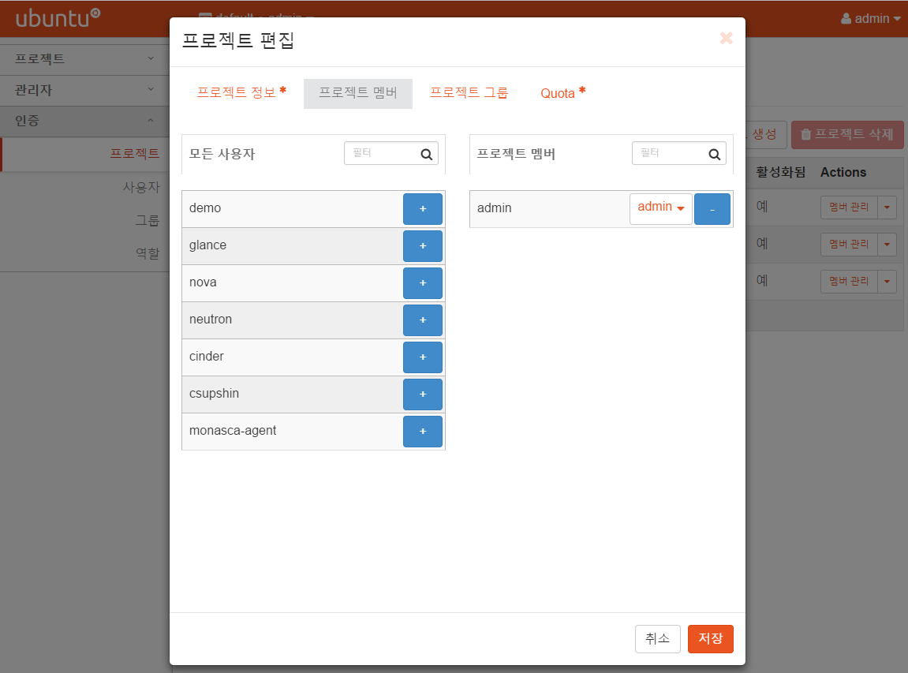
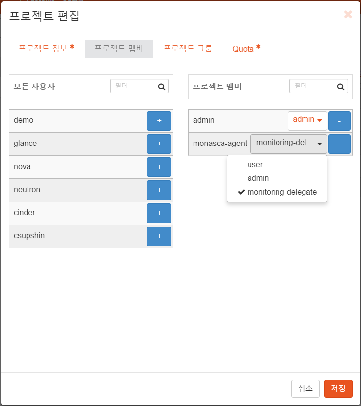

# monasca-server

## Monasca Server 설치 가이드

1. [개요](monasca-server.md#1.)
   * [문서 목적](monasca-server.md#1.1.)
   * [범위](monasca-server.md#1.2.)
   * [참고자료](monasca-server.md#1.3.)
2. [Pre-Requisite\(전제조건\)](monasca-server.md#2.)
3. [docker 설치](monasca-server.md#3.)
4. [Monasca-Docker 설치](monasca-server.md#4.)
5. [Elasticserarch 서버 설치](monasca-server.md#5.)
6. [logstash 설치](monasca-server.md#6.)
7. [Reference : Cross-Project\(Tenant\) 사용자 추가 및 권한 부여](monasca-server.md#7.)

## 1.  개요

## 1.1.  문서 목적

본 문서\(설치가이드\)는, IaaS\(Infrastructure as a Service\) 중 하나인 Openstack 기반의 Cloud 서비스 상태 및 자원 정보, 그리고 VM Instance의 시스템 정보를 수집 및 관리하고, 사전에 정의한 Alarm 규칙에 따라 실시간으로 모니터링하여 관리자에게 관련 정보를 제공하기 위한 서버를 설치하는데 그 목적이 있다.

## 1.2.  범위

본 문서의 범위는 Openstack 모니터링을 위한 오픈소스인 Monasca 제품군의 설치 및 관련 S/W\(Kafka, Zookeeper, InfluxDB, MariaDB\) 설치하기 위한 내용으로 한정되어 있다.

## 1.3.  참고자료

[https://wiki.openstack.org/wiki/Monasca](https://wiki.openstack.org/wiki/Monasca) [http://kafka.apache.org/quickstart](http://kafka.apache.org/quickstart) \(version: 2.9.2\) [https://zookeeper.apache.org/doc/r3.3.4/zookeeperStarted.html](https://zookeeper.apache.org/doc/r3.3.4/zookeeperStarted.html) [https://docs.influxdata.com/influxdb/v1.5/introduction/installation/](https://docs.influxdata.com/influxdb/v1.5/introduction/installation/) [https://mariadb.org/mariadb-10-2-7-now-available/](https://mariadb.org/mariadb-10-2-7-now-available/) [https://github.com/monasca/monasca-docker](https://github.com/monasca/monasca-docker)

## 2.  Pre-Requisite\(전제조건\)

* Monasca Server를 설치하기 위해서는 Bare Metal 서버 또는 Openstack 에서 생성한 Instance\(Ubuntu 기준, Flavor - x1.large 이상\)가 준비되어 있어야 한다.
* Openstack Cross-tenant 설정이 되어 있어야 한다.

  
  Reference : Cross-Project\(Tenant\) 사용자 추가 및 권한 부여 \(openstack 기준\)

* Monasca Server 설치에 필요한 프로그램 리스트 및 버전은 아래 사항을 참조한다.
* Monasca Server 를 설치하기에 필요한 프로그램을 사전에 설치한다.
* 설치 환경은 Ubuntu 18.04 , OpenStack Stein 기준으로 작성하였다.

※ 설치 프로그램 리스트 및 버전 참조 \(순서\)  


* [repo](https://github.com/monasca/monasca-docker.git) branch 정책에 따라 버전이 변경될 수 있음. 
  * INFLUXDB\_VERSION=1.3.3-alpine
  * INFLUXDB\_INIT\_VERSION=1.0.1
  * MYSQL\_VERSION=5.7
  * MYSQL\_INIT\_VERSION=1.5.4
  * MEMCACHED\_VERSION=1.5.0-alpine
  * CADVISOR\_VERSION=v0.27.1
  * ZOOKEEPER\_VERSION=3.4

※ 설치 전 사전에 설치되어 있어야 하는 프로그램  


* install git

  ```text
  sudo apt-get update
  sudo apt-get install -y git
  ```

* install python

  ```text
  sudo apt-get install python-keystoneclient
  ```

## 3.  docker 설치

* Docker Key 등록

  ```text
  $ sudo apt update
  $ sudo apt install apt-transport-https ca-certificates curl software-properties-common
  $ curl -fsSL https://download.docker.com/linux/ubuntu/gpg | sudo apt-key add –
  ```

* Docker repository 정보 등록

  ```text
  $ sudo add-apt-repository "deb [arch=amd64] https://download.docker.com/linux/ubuntu bionic stable
  $ sudo apt update
  $ apt-cache policy docker-ce
  ```

* Docker 설치

  ```text
  $ sudo systemctl status docker
  ```

* Docker 설치 확인

  \`\`\` $ sudo apt install docker-ce

... docker.service - Docker Application Container Engine Loaded: loaded \(/lib/systemd/system/docker.service; enabled; vendor preset: enabled\) Active: active \(running\) since Mon 2019-06-17 01:40:41 UTC; 11s ago Docs: [https://docs.docker.com](https://docs.docker.com) Main PID: 3821 \(dockerd\) Tasks: 10 CGroup: /system.slice/docker.service └─3821 /usr/bin/dockerd -H fd:/ --containerd=/run/containerd/containerd.sock ...

```text
- Docker-Compose 설치
```

$ sudo apt install docker-compose

```text
# 4.  Monasca-Docker 설치  <div id='4.'/>
- Openstack Keyston network route open
```

$ sudo route add -net 172.31.30.0/24 gw 10.0.201.254

```text
- Monasa-Docker 설치파일 다운로드
```

$ mkdir workspace & cd workspace $ git clone [https://github.com/monasca/monasca-docker.git](https://github.com/monasca/monasca-docker.git)

```text
- Monasa-Docker docker-compose.yml 파일 변경
```

$ cd monasca-docker

### $ vi docker-compose.yml

... version: '3' services:

memcached: image: memcached:${MEMCACHED\_VERSION} environment: LOGSTASH\_FIELDS: "service=memcached"

influxdb: image: influxdb:${INFLUXDB\_VERSION} environment: LOGSTASH\_FIELDS: "service=influxdb" ports:

* "8086:8086"

  influxdb-init:

  image: monasca/influxdb-init:${INFLUXDB\_INIT\_VERSION}

  environment:

  LOGSTASH\_FIELDS: "service=influxdb-init"

  depends\_on:

* influxdb

  **cadvisor will allow host metrics to be collected, but requires significant**

  **access to the host system**

  **if this is not desired, the following can be commented out, and the CADVISOR**

  **environment variable should be set to "false" in the `agent-collector`**

  **block - however no metrics will be collected**

  cadvisor: image: google/cadvisor:${CADVISOR\_VERSION} environment: LOGSTASH\_FIELDS: "service=cadvisor" volumes:

* "/:/rootfs:ro"
* "/var/run:/var/run:rw"
* "/sys:/sys:ro"
* "/var/lib/docker:/var/lib/docker:ro"

  agent-forwarder: image: monasca/agent-forwarder:${MON\_AGENT\_FORWARDER\_VERSION} environment: NON\_LOCAL\_TRAFFIC: "true" LOGSTASH\_FIELDS: "service=monasca-agent-forwarder" OS\_AUTH\_URL: [http://{keystone](http://{keystone) api ip}:{keystone port}/v3 \# openstack keystone\(identity\) api ip, port OS\_USERNAME: admin \# openstack admin account OS\_PASSWORD: password \# openstack admin password OS\_PROJECT\_NAME: admin \# openstack admin project extra\_hosts:

* "monasca:192.168.0.103"       \# monasca-api host ip
* "control:192.168.56.103"      \# openstack control node host:ip
* "compute:192.168.56.102"      \# openstack compute node host:ip
* "compute2:192.168.56.101"     \# openstack compute node host:ip
* "compute3:192.168.56.104" \# openstack compute node host:ip

  agent-collector: image: monasca/agent-collector:${MON\_AGENT\_COLLECTOR\_VERSION} restart: on-failure environment: AGENT\_HOSTNAME: "docker-host" FORWARDER\_URL: "[http://agent-forwarder:17123](http://agent-forwarder:17123)" CADVISOR: "true" CADVISOR\_URL: "[http://cadvisor:8080/](http://cadvisor:8080/)" LOGSTASH\_FIELDS: "service=monasca-agent-collector" MONASCA\_MONITORING: "true" MONASCA\_LOG\_MONITORING: "false" OS\_AUTH\_URL: [http://{keystone](http://{keystone) api ip}:{keystone port}/v3 \# keystone\(identity\) api ip, port OS\_USERNAME: admin \# openstack admin account OS\_PASSWORD: password \# openstack admin password OS\_PROJECT\_NAME: admin \# openstack admin project cap\_add:

* FOWNER

  volumes:

* "/:/rootfs:ro"

  extra\_hosts:

* "control:192.168.56.103"      \# openstack control node host:ip
* "compute:192.168.56.102"      \# openstack compute node host:ip
* "compute2:192.168.56.101"     \# openstack compute node host:ip
* "compute3:192.168.56.104" \# openstack compute node host:ip

  alarms: image: monasca/alarms:${MON\_ALARMS\_VERSION} environment: LOGSTASH\_FIELDS: "service=monasca-alarms" OS\_AUTH\_URL: [http://{keystone](http://{keystone) api ip}:{keystone port}/v3 \# keystone\(identity\) api ip, port OS\_USERNAME: admin \# openstack admin account OS\_PASSWORD: password \# openstack admin password OS\_PROJECT\_NAME: admin \# openstack admin project depends\_on:

  **- keystone**

* monasca

  extra\_hosts:

* "control:192.168.56.103"      \# openstack control node host:ip
* "compute:192.168.56.102"      \# openstack compute node host:ip
* "compute2:192.168.56.101"     \# openstack compute node host:ip
* "compute3:192.168.56.104" \# openstack compute node host:ip

  zookeeper: image: zookeeper:${ZOOKEEPER\_VERSION} environment: LOGSTASH\_FIELDS: "service=zookeeper" restart: on-failure

  kafka: image: monasca/kafka:${MON\_KAFKA\_VERSION} environment: KAFKA\_DELETE\_TOPIC\_ENABLE: "true" LOGSTASH\_FIELDS: "service=kafka" restart: on-failure depends\_on:

* zookeeper

  kafka-watcher:

  image: monasca/kafka-watcher:${MON\_KAFKA\_WATCHER\_VERSION}

  environment:

  BOOT\_STRAP\_SERVERS: "kafka"

  PROMETHEUS\_ENDPOINT: "0.0.0.0:8080"

  LOGSTASH\_FIELDS: "service=kafka-watcher"

  depends\_on:

* kafka

  ports:

* "18080:8080"

  kafka-init:

  image: monasca/kafka-init:${MON\_KAFKA\_INIT\_VERSION}

  environment:

  ZOOKEEPER\_CONNECTION\_STRING: "zookeeper:2181"

  KAFKA\_TOPIC\_CONFIG: segment.ms=900000 \# 15m

  KAFKA\_CREATE\_TOPICS: "\

  metrics:64:1,\

  alarm-state-transitions:12:1,\

  alarm-notifications:12:1,\

  retry-notifications:3:1,\

  events:12:1,\

  kafka-health-check:1:1,\

  60-seconds-notifications:3:1"

  LOGSTASH\_FIELDS: "service=kafka-init"

  depends\_on:

* zookeeper

  mysql: image: mysql:${MYSQL\_VERSION} environment: MYSQL\_ROOT\_PASSWORD: secretmysql LOGSTASH\_FIELDS: "service=mysql" ports:

* "3306:3306"

  mysql-init:

  image: monasca/mysql-init:${MYSQL\_INIT\_VERSION}

  environment:

  MYSQL\_INIT\_DISABLE\_REMOTE\_ROOT: "false"

  MYSQL\_INIT\_RANDOM\_PASSWORD: "false"

  LOGSTASH\_FIELDS: "service=mysql-init"

## keystone 부분 주석 처리

## keystone:

## image: monasca/keystone:${MON\_KEYSTONE\_VERSION}

## environment:

## KEYSTONE\_HOST: keystone

## KEYSTONE\_PASSWORD: secretadmin

## KEYSTONE\_DATABASE\_BACKEND: mysql

## KEYSTONE\_MYSQL\_HOST: mysql

## KEYSTONE\_MYSQL\_USER: keystone

## KEYSTONE\_MYSQL\_PASSWORD: keystone

## KEYSTONE\_MYSQL\_DATABASE: keystone

## LOGSTASH\_FIELDS: "service=keystone"

## depends\_on:

## - mysql

## ports:

## - "5001:5000"

## - "35357:35357"

monasca-sidecar: image: timothyb89/monasca-sidecar:${MON\_SIDECAR\_VERSION} environment: LOGSTASH\_FIELDS: "service=monasca-sidecar"

monasca: image: monasca/api:${MON\_API\_VERSION} environment: SIDECAR\_URL: [http://monasca-sidecar:4888/v1/ingest](http://monasca-sidecar:4888/v1/ingest) LOGSTASH\_FIELDS: "service=monasca-api" KEYSTONE\_IDENTITY\_URI: [http://{keystone](http://{keystone) api ip}:{keystone port}/v3 \# keystone\(identity\) api ip, port KEYSTONE\_AUTH\_URI: [http://{keystone](http://{keystone) api ip}:{keystone port}/v3 \# keystone\(identity\) api ip, port KEYSTONE\_ADMIN\_USER: admin \# openstack admin account KEYSTONE\_ADMIN\_PASSWORD: password \# openstack admin password depends\_on:

* influxdb

  **- keystone**

* mysql
* zookeeper
* kafka
* monasca-sidecar
* memcached

  ports:

* "8070:8070"

  extra\_hosts:

* "control:192.168.56.103"      \# openstack control node host:ip
* "compute:192.168.56.102"      \# openstack compute node host:ip
* "compute2:192.168.56.101"     \# openstack compute node host:ip
* "compute3:192.168.56.104"     \# openstack compute node host:ip

  monasca-persister:

  image: monasca/persister:${MON\_PERSISTER\_VERSION}

  environment:

  LOGSTASH\_FIELDS: "service=monasca-persister"

  restart: on-failure

  depends\_on:

* monasca
* influxdb
* zookeeper
* kafka

  thresh: image: monasca/thresh:${MON\_THRESH\_VERSION} environment: NO\_STORM\_CLUSTER: "true" WORKER\_MAX\_HEAP\_MB: "256" LOGSTASH\_FIELDS: "service=monasca-thresh" depends\_on:

* zookeeper
* kafka

  monasca-notification: image: monasca/notification:${MON\_NOTIFICATION\_VERSION} environment: NF\_PLUGINS: "webhook" LOGSTASH\_FIELDS: "service=monasca-notification" STATSD\_HOST: monasca-statsd STATSD\_PORT: 8125 depends\_on:

* monasca
* zookeeper
* kafka
* mysql

  grafana: image: monasca/grafana:${MON\_GRAFANA\_VERSION} environment: GF\_AUTH\_BASIC\_ENABLED: "false" GF\_USERS\_ALLOW\_SIGN\_UP: "true" GF\_USERS\_ALLOW\_ORG\_CREATE: "true" GF\_AUTH\_KEYSTONE\_ENABLED: "true" GF\_AUTH\_KEYSTONE\_AUTH\_URL: [http://{KEYSTONE\_IP}:25000](http://{KEYSTONE_IP}:25000) GF\_AUTH\_KEYSTONE\_VERIFY\_SSL\_CERT: "false" GF\_AUTH\_KEYSTONE\_DEFAULT\_DOMAIN: "Default" LOGSTASH\_FIELDS: "service=grafana" ports:

* "3000:3000"

  depends\_on:

  **- keystone**

* monasca

  extra\_hosts:

* "control:192.168.56.103"      \# openstack control node host:ip
* "compute:192.168.56.102"      \# openstack compute node host:ip
* "compute2:192.168.56.101"     \# openstack compute node host:ip
* "compute3:192.168.56.104" \# openstack compute node host:ip

  grafana-init: image: monasca/grafana-init:${MON\_GRAFANA\_INIT\_VERSION} environment: LOGSTASH\_FIELDS: "service=grafana-init" depends\_on:

* grafana

  monasca-statsd: image: monasca/statsd:${MON\_STATSD\_VERSION} environment: FORWARDER\_URL: [http://agent-forwarder:17123](http://agent-forwarder:17123) LOG\_LEVEL: WARN ports:

* "8125/udp"

  ...

  \`\`\`

* Monasca-Docker Server 설치 및 시작

  ```text
  $ sudo docker-compose up -d
  ```

  

## 5. Elasticserarch 서버 설치

* dependencies 설치

  ```text
  $ sudo apt-get update
  $ sudo apt-get install openjdk-8-jdk
  ```

* Elasticsearch 설치

  \`\`\` $ wget [https://download.elastic.co/elasticsearch/release/org/elasticsearch/distribution/deb/elasticsearch/2.3.1/elasticsearch-2.3.1.deb](https://download.elastic.co/elasticsearch/release/org/elasticsearch/distribution/deb/elasticsearch/2.3.1/elasticsearch-2.3.1.deb) $ dpkg -i elasticsearch-2.3.1.deb

```text
- 사용자 그룹 추가 - Elasticsearch
```

$ sudo usermod -a -G elasticsearch “사용자 계정”

```text
- Elasticsearch configuration 파일 수정
```

### $ cd /etc/elasticsearch && sudo vi elasticsearch.yml

...

## Use a descriptive name for your cluster:

cluster.name: escluster1

...

## Use a descriptive name for the node:

node.name: node-1

## Lock the memory on startup:

bootstrap.mlockall: true

...

## Set the bind address to a specific IP \(IPv4 or IPv6\):

network.host: 0.0.0.0

## Set a custom port for HTTP:

http.port: 9200 ...

index.number\_of\_shards: 1 index.number\_of\_replicas: 0

```text
- Elasticsearch service 파일 수정
```

$ sudo vi /usr/lib/systemd/system/elasticsearch.service ...

## Specifies the maximum number of bytes of memory that may be locked into RAM

## Set to "infinity" if you use the 'bootstrap.memory\_lock: true' option

## in elasticsearch.yml and 'MAX\_LOCKED\_MEMORY=unlimited' in /etc/default/elasticsearch

LimitMEMLOCK=infinity ...

```text
- Elasticsearch default 파일 수정
```

$ sudo vi /etc/default/elasticsearch ...

## The maximum number of bytes of memory that may be locked into RAM

## Set to "unlimited" if you use the 'bootstrap.memory\_lock: true' option

## in elasticsearch.yml.

## When using Systemd, the LimitMEMLOCK property must be set

## in /usr/lib/systemd/system/elasticsearch.service

MAX\_LOCKED\_MEMORY=unlimited ...

```text
- Elasticsearch 서비스 시작
```

$ sudo service elasticsearch start

```text
- Elasticserarch 서버 가동 여부 확인
```

$ netstat -plntu \| grep 9200

```text


- mlockall 정보가 “enabled” 되었는지 확인
```

$ curl -XGET 'localhost:9200/\_nodes?filter\_path=\*\*.mlockall&pretty'

```text


# 6.  logstash 설치  <div id='6.'/>
- logstash repository 추가.
```

$ wget -qO - [https://artifacts.elastic.co/GPG-KEY-elasticsearch](https://artifacts.elastic.co/GPG-KEY-elasticsearch) \| sudo apt-key add - OK $ echo 'deb [http://packages.elastic.co/logstash/2.2/debian](http://packages.elastic.co/logstash/2.2/debian) stable main' \| sudo tee /etc/apt/sources.list.d/logstash-2.2.x.list deb [http://packages.elastic.co/logstash/2.2/debian](http://packages.elastic.co/logstash/2.2/debian) stable main

```text
- logstash 설치
```

$ apt-get update ... $ apt-get install -y logstash ...

```text
- /etc/hosts 파일 수정
```

### $ sudo vi /etc/hosts

... “private network ip” “hostname” ex\) 192.168.0.103 host logstash elasticsearch ...

```text
- SSL certificate 파일 생성
```

$ cd /etc/logstash $ sudo openssl req -subj /CN=”hostaname” -x509 -days 3650 -batch -nodes -newkey rsa:4096 -keyout logstash.key -out logstash.crt

```text
- filebeat-input.conf 파일 생성
```

$ cd /etc/logstash

### $ sudo vi conf.d/filebeat-input.conf

... input { beats { port =&gt; 5443 type =&gt; syslog ssl =&gt; true ssl\_certificate =&gt; "/etc/logstash/logstash.crt" ssl\_key =&gt; "/etc/logstash/logstash.key" } } ...

```text
- syslog-filter.conf 파일 생성
```

$ cd /etc/logstash

### $ sudo vi conf.d/syslog-filter.conf

... filter { if \[type\] == "syslog" { grok { match =&gt; { "message" =&gt; "%{SYSLOGTIMESTAMP:syslog\_timestamp} %{SYSLOGHOST:syslog\_hostname} %{DATA:syslog\_program}\(?:\[%{POSINT:syslog\_pid}\]\)?: %{GREEDYDATA:syslog\_message}" } add\_field =&gt; \[ "received\_at", "%{@timestamp}" \] add\_field =&gt; \[ "received\_from", "%{host}" \] } date { match =&gt; \[ "syslog\_timestamp", "yyyy-MM-dd HH:mm:ss.SSS" \] \# openstack의 log output에 따라 포멧 변경필요. } } }

...

```text
- output-elasticsearch.conf 파일 생성
```

$ cd /etc/logstash

### $ sudo vi conf.d/output-elasticsearch.conf

... output { elasticsearch { hosts =&gt; \["”your elastic ip”:9200"\] \# 설치된 환경의 IP 정보 hosts =&gt; "”your elastic ip”:9200" \# 설치된 환경의 IP 정보 manage\_template =&gt; false index =&gt; "%{\[@metadata\]\[beat\]}-%{+YYYY.MM.dd}" document\_type =&gt; "%{\[@metadata\]\[type\]}" } }  
...

```text
- logstash 서비스 시작
```

$ sudo service logstash start

```text
- logstash 서비스 확인
```

$ sudo service logstash start

```text


# 7. Reference : Cross-Project(Tenant) 사용자 추가 및 권한 부여  <div id='7.'/>
Openstack 기반으로 생성된 모든 Project(Tenant)의 정보를 하나의 계정으로 수집 및 조회하기 위해서는 Cross-Tenant 사용자를 생성하여, 각각의 Project(Tenant)마다 조회할 수 있도록 멤버로 등록한다.
Openstack Cli를 이용하여 Cross-Tenant 사용자를 생성한 후, Openstack Horizon 화면으로 통해 각각의 프로젝트 사용자 정보에 생성한 Cross-Tenant 사용자 및 권한을 부여한다.
1. Cross-Tenant 사용자 생성
```

```text
$ openstack user create --domain default --password-prompt monasca-agent
$ openstack role create monitoring-delegate
```

\`\`\`

1. Project 사용자 추가

   

   각각의 프로젝트 멤버관리에 추가한 Cross-Tenant 사용자 정보를 등록한다.

   

   

   추가한 Cross-Tenant 사용자를 선택 후, 생성한 Role을 지정한다.

