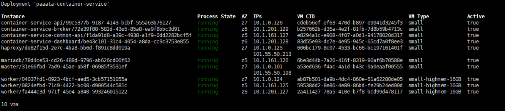
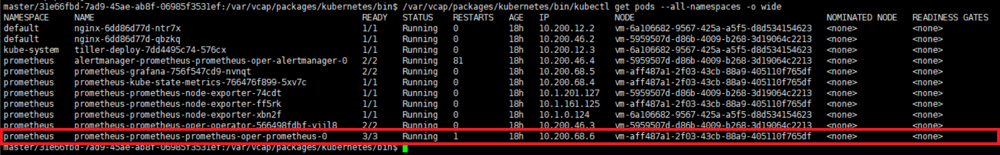
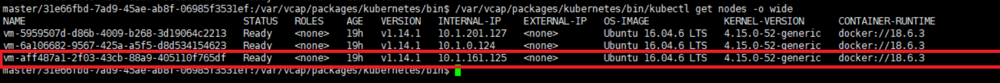
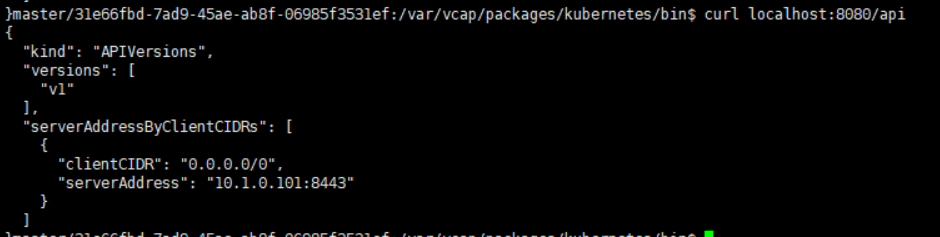
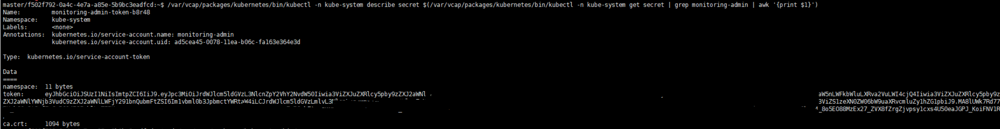

# PAAS-TA\_MONITORING\_CONTAINER\_SERVICE\_INSTALL

## Table of Contents

1. [개요](paas-ta_monitoring_container_service_install.md#1)  
2. [PaaS-TA Container service 설치](paas-ta_monitoring_container_service_install.md#2)  
3. [PaaS-TA Container service 설치 완료 확인](paas-ta_monitoring_container_service_install.md#3)  
4. [Kubernetes Prometheus Pods 정보 확인](paas-ta_monitoring_container_service_install.md#4)  
5. [prometheus-prometheus-prometheus-oper-prometheus-0 POD Node IP 확인](paas-ta_monitoring_container_service_install.md#5)  
6. [Kubernetes API URL\(serverAddress\) 확인](paas-ta_monitoring_container_service_install.md#6)  
7. [Kubernetes API Request 호출시 Header\(Authorization\) 인증을 위한 Token값 확인](paas-ta_monitoring_container_service_install.md#7)  

## 1. 개요

본 문서는 PaaS-TA Monitoring을 설치하기 앞서 PaaS-TA의 Container Log 수집을 위하여 BOSH 2.0을 이용하여 Container를 설치하고 Monitoring에 작성할 값을 확인하는 방법을 기술하였다.

## 2.    PaaS-TA Container service 설치

[PaaS-TA Container service 설치 가이드](../tools/paas-ta_container_service_install_guide_v2.0.md)

## 3.    PaaS-TA Container service 설치 완료 확인



## 4.    Kubernetes Prometheus Pods 정보 확인

```text
$  bosh -e {director_name} ssh -d paasta-container-service master
$  /var/vcap/packages/kubernetes/bin/kubectl get pods --all-namespaces -o wide
```



## 5.    prometheus-prometheus-prometheus-oper-prometheus-0 POD Node IP 확인

```text
$  /var/vcap/packages/kubernetes/bin/kubectl get nodes -o wide
```



### 6.    Kubernetes API URL\(serverAddress\) 확인

```text
$  curl localhost:8080/api
```



## 7.    Kubernetes API Request 호출시 Header\(Authorization\) 인증을 위한 Token값 확인

```text
$  /var/vcap/packages/kubernetes/bin/kubectl -n kube-system describe secret $(/var/vcap/packages/kubernetes/bin/kubectl -n kube-system get secret | grep monitoring-admin | awk '{print $1}')
```



