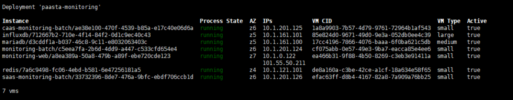
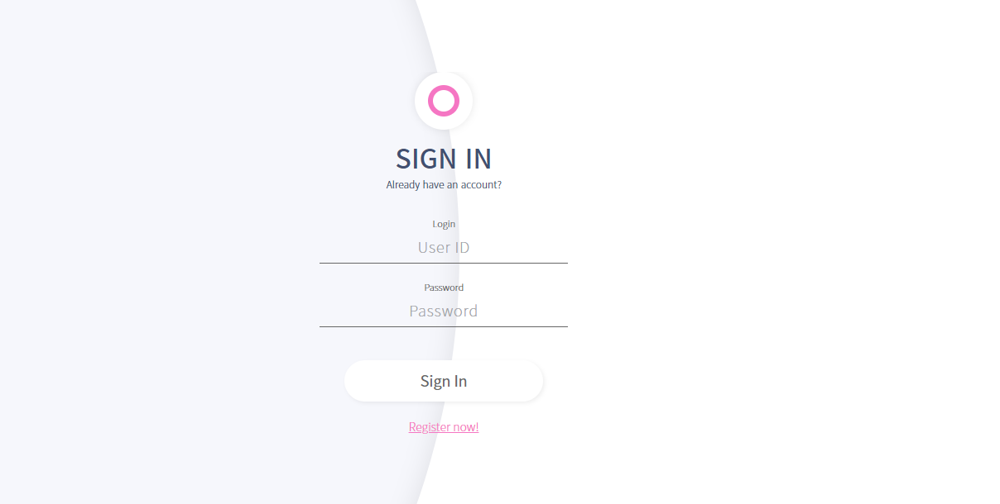
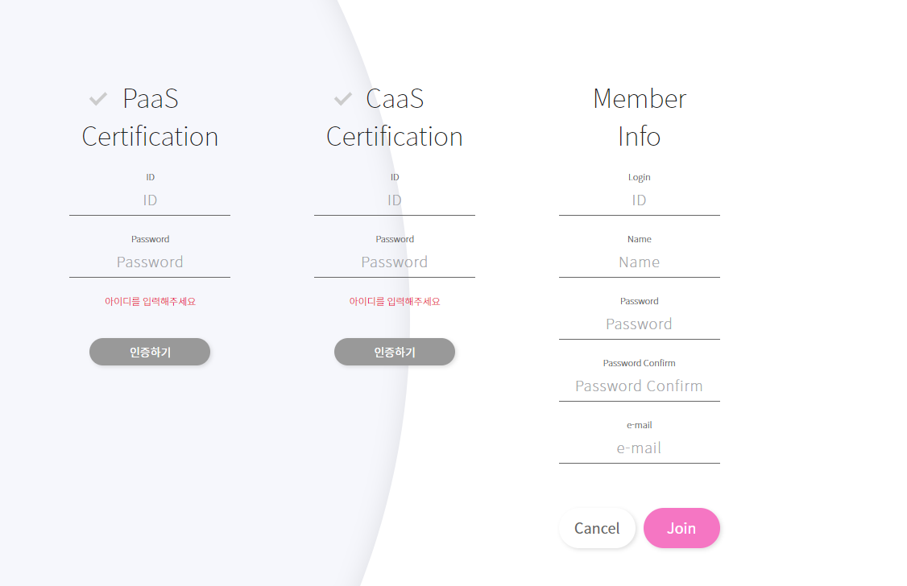
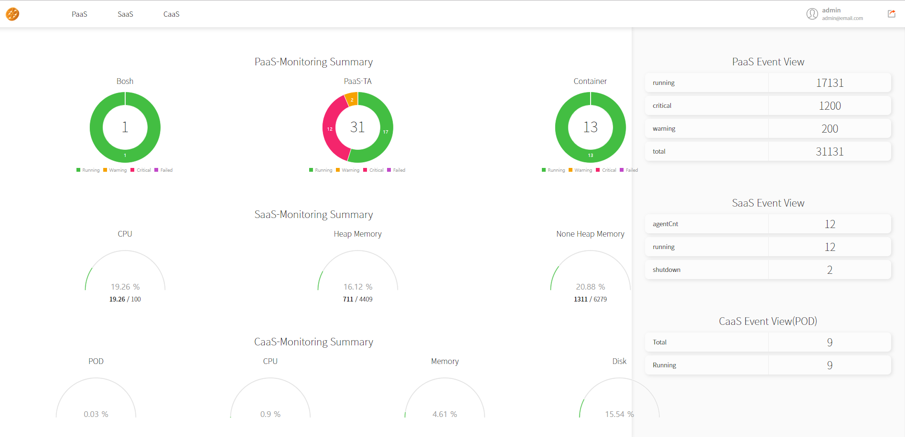

# PAAS-TA\_MONITORING\_PAAS-TA\_MONITORING\_INSTALL

### Table of Contents

1. [개요](paas-ta_monitoring_paas-ta_monitoring_install.md#1)  
2. [PaaS-TA Monitoring 설치](paas-ta_monitoring_paas-ta_monitoring_install.md#2)  
2.1. [Prerequisite](paas-ta_monitoring_paas-ta_monitoring_install.md#3)  
2.2. [설치 파일 다운로드](paas-ta_monitoring_paas-ta_monitoring_install.md#4)  
2.3. [PaaS-TA Monitoring 설치 환경설정](paas-ta_monitoring_paas-ta_monitoring_install.md#5)  
● [common\_vars.yml](paas-ta_monitoring_paas-ta_monitoring_install.md#6)  
● [paasta-monitoring-vars.yml](paas-ta_monitoring_paas-ta_monitoring_install.md#7)  
● [deploy-paasta-monitoring.sh](paas-ta_monitoring_paas-ta_monitoring_install.md#8)  
2.4. [PaaS-TA Monitoring 설치](paas-ta_monitoring_paas-ta_monitoring_install.md#9)  
2.5. [서비스 설치 확인](paas-ta_monitoring_paas-ta_monitoring_install.md#10)  
3. [PaaS-TA Monitoring Dashboard 접속](paas-ta_monitoring_paas-ta_monitoring_install.md#11)

### 1. 개요

본 문서\(PaaS-TA Monitoring 설치 가이드\)는 전자정부프레임워크 기반의 PaaS-TA 5.1 환경 기준으로 BOSH 2.0을 이용하여 PaaS-TA Monitoring 설치를 위한 가이드를 제공한다.

### 2. PaaS-TA Monitoring 설치

#### 2.1. Prerequisite

1. BOSH 설치가 되어있으며, BOSH Login이 되어 있어야 한다.
2. cloud-config와 runtime-config가 업데이트 되어있는지 확인한다.
3. Stemcell 목록을 확인하여 서비스 설치에 필요한 Stemcell\(ubuntu xenial 621.78\)이 업로드 되어 있는 것을 확인한다.
4. PaaS-TA 5.0이 설치되어 있어야 하며, BOSH와 PaaS-TA를 설치하는 과정에서 Monitoring 옵션을 포함하여 설치되어 있어야 한다.
5. PaaS\(logsearch\), IaaS\(Monasca\), SaaS\(PaaS-TA Pinpoint Monitoring\), CaaS\(PaaS-TA CaaS Service\)등 Monitoring을 하고 싶은 환경에 해당되는 서비스가 설치되어 있어야 한다. \(logsearch 설치 필수\)

> cloud-config 확인  
> $ bosh -e {director-name} cloud-config
>
> runtime-config 확인  
> $ bosh -e {director-name} runtime-config
>
> stemcell 확인  
> $ bosh -e {director-name} stemcells

#### 2.2. 설치 파일 다운로드

* PaaS-TA Monitoring을 설치하기 위한 deployment가 존재하지 않는다면 다운로드 받는다

  ```text
  $ cd ${HOME}/workspace/paasta-5.1/deployment
  $ git clone https://github.com/paas-ta/common.git –b v5.0.1
  $ git clone https://github.com/paas-ta/monitoring-deployment.git –b v5.5.0
  ```

  기본적으로 온라인 설치로 설정되어 있으나 오프라인 설치 시 release, stemcell 설치 파일 다운로드는 아래 다운로드 에서 받고 설치한다.

  \`\`\`

  아래 주소로 이동한다. 관련 release, stemcell 파일들을 받을 수 있다.

  [https://nextcloud.paas-ta.org/index.php/s/Z2zfK6RjYNE3CeT](https://nextcloud.paas-ta.org/index.php/s/Z2zfK6RjYNE3CeT)

위 주소 항목 중 아래 경로로 이동하면 paasta-monitoring 파일을 받을 수 있다 release &gt; paasta-monitoring &gt; paasta-monitoring-release-5.5.tgz

```text
### <div id='5'/>2.3. PaaS-TA Monitoring 설치 환경설정

${HOME}/workspace/paasta-5.1/deployment/monitoring-deployment/paasta-monitoring 이하 디렉터리에는 PaaS-TA Monitoring 설치를 위한 Shell Script 파일이 존재한다.

### <div id='6'/>● common_vars.yml
common 폴더에 있는 common_vars.yml PaaS-TA 및 각종 Service 설치시 적용하는 공통 변수 설정 파일이 존재한다.
PaaS-TA Monitoring을 설치할 때는 paasta_admin_username, paasta_admin_password, metric_url, monitoring_api_url, saas_monitoring_url 값을 변경 하여 설치 할 수 있다.
paasta_admin_username, paasta_admin_password는 PaaS-TA를 설치할 때의 변수값과 같은 값을 주어 설치를 한다
metric_url는 Monitoring 옵션을 포함한 BOSH와 PaaS-TA를 설치할 때의 변수값과 같은 값을 주어 설치를 한다.
saas_monitoring_url는 Pinpoint Monitoring을 설치할 때의 변수값과 같은 값을 주어 설치를 한다.
```

## BOSH

bosh\_url: "10.0.1.6" \# BOSH URL \('bosh env' 명령어를 통해 확인 가능\) bosh\_client\_admin\_id: "admin" \# BOSH Client Admin ID bosh\_client\_admin\_secret: "ert7na4jpewscztsxz48" \# BOSH Client Admin Secret

## PAAS-TA

system\_domain: "61.252.53.246.xip.io" \# Domain \(xip.io를 사용하는 경우 HAProxy Public IP와 동일\) paasta\_admin\_username: "admin" \# PaaS-TA Admin Username paasta\_admin\_password: "admin" \# PaaS-TA Admin Password uaa\_client\_admin\_secret: "admin-secret" \# UAAC Admin Client에 접근하기 위한 Secret 변수 uaa\_client\_portal\_secret: "clientsecret" \# UAAC Portal Client에 접근하기 위한 Secret 변수

## MONITORING

metric\_url: "10.0.161.101" \# Monitoring InfluxDB IP syslog\_address: "10.0.121.100" \# Logsearch의 ls-router IP syslog\_port: "2514" \# Logsearch의 ls-router Port syslog\_transport: "relp" \# Logsearch Protocol monitoring\_api\_url: "61.252.53.241" \# Monitoring-WEB의 Public IP saas\_monitoring\_url: "61.252.53.248" \# Pinpoint HAProxy WEBUI의 Public IP

```text
### <div id='7'/>● paasta-monitoring-vars.yml
```

## SERVICE VARIABLE

inception\_os\_user\_name: "ubuntu" mariadb\_ip: "10.0.161.100" \# MariaDB VM Private IP mariadb\_port: "3306" \# MariaDB Port mariadb\_username: "root" \# MariaDB Root 계정 Username mariadb\_password: "password" \# MariaDB Root 계정 Password director\_name: "micro-bosh" \# BOSH Director 명 resource\_url: "resource\_url" \# TBD paasta\_deploy\_name: "paasta" \# PaaS-TA Deployment 명 paasta\_cell\_prefix: "cell" \# PaaS-TA Cell 명 smtp\_url: "smtp.naver.com" \# SMTP Server URL smtp\_port: "587" \# SMTP Server Port mail\_sender: "aaa@naver.com" \# SMTP Server Admin ID mail\_password: "aaaa" \# SMTP Server Admin Password mail\_enable: "true" \# Alarm 발생시 Mail전송 여부 mail\_tls\_enable: "true" \# SMTP 서버 인증시 TLS모드인경우 true redis\_ip: "10.0.121.101" \# Redis Private IP redis\_password: "password" \# Redis 인증 Password utc\_time\_gap: "9" \# UTC Time Zone과 Client Time Zone과의 시간 차이 public\_network\_name: "vip" \# Monitoring-WEB Public Network Name system\_type: "PaaS,CaaS,SaaS" \# 모니터링 할 환경 선택 prometheus\_ip: "10.0.121.122" \# Kubernates의 prometheus-prometheus-prometheus-oper-prometheus-0 Pod의 Node IP kubernetes\_ip: "10.0.0.124" \# Kubernates의 서비스 API IP pinpoint\_was\_ip: "10.0.0.122" \# Pinpoint HAProxy WEBUI Private IP cassbroker\_ip: "52.141.6.113" \# CaaS 서비스 로그인 인증 처리를 위한 API IP kubernetes\_token: "eyJhbGciOiJSUzI1NiIsImtpZCI6IiJ9.eyJpc3MiOiJrdWJlcm5ldGVzL3NlcnZpY2VhY2NvdW50Iiwia3ViZXJuZXRlcy5pby9zZXJ2aWNlYWNjb3VudC9uYW1lc3BhY2UiOiJrdWJlLXN5c3RlbSIsImt1YmVybmV0ZXMuaW8vc2VydmljZWFjY291bnQvc2VjcmV0Lm5hbWUiOiJtb25pdG9yaW5nLWFkbWluLXRva2VuLWQ0OXc3Iiwia3ViZXJuZXRlcy5pby9zZXJ2aWNlYWNjb3VudC9zZXJ2aWNlLWFjY291bnQubmFtZSI6Im1vbml0b3JpbmctYWRtaW4iLCJrdWJlcm5ldGVzLmlvL3NlcnZpY2VhY2NvdW50L3NlcnZpY2UtYWNjb3VudC51aWQiOiI4MDkwNTU5Yy0wYzE2LTExZWEtYjZiYi0wMDIyNDgwNTk4NzciLCJzdWIiOiJzeXN0ZW06c2VydmljZWFjY291bnQ6a3ViZS1zeXN0ZW06bW9uaXRvcmluZy1hZG1pbiJ9.ZKPWJLo0LFXY9ZpW7nGlTBLJYDNL7MFB9X1i4JoEn8jPLsCQhG3lvzTjh7420lvoP5hWdV0SpsMMfZnV2WFFUWaQkYcnKhB2qsVX\_xOd45gm2IfI-f1QmxcAspoGY\_r8kC-vX9L4oTLA5sJTI5m\_RIiuckVGcVR0OeWB5NtUFz0-iCpQRfuy9LYH0NCEEopfDji-T0Pxta8S1n8YyxVwYKpZE0PvT9H9ZVNUUAt2Z\_l4B0akP6G3O6t53Xvp\_l8DXzxRFXTw3sHPvvea\_Uv3QbGcFkH-gNHBeG9-F8C8NMcSlCUeyAGfxZlpsdRFMB01Wh6RZzvUqeS8Kc-8Csp\_jw" \# Kubernetes 서비스 API Request 호출시 Header\(Authorization\) 인증을 위한 Token값

## STEMCELL

stemcell\_os: "ubuntu-xenial" \# Stemcell OS stemcell\_version: "621.78" \# Stemcell Version

## REDIS

redis\_azs: \["z4"\] \# Redis 가용 존 redis\_instances: 1 \# Redis 인스턴스 수 redis\_vm\_type: "small" \# Redis VM 종류 redis\_network: "default" \# Redis 네트워크

## SANITY-TEST

sanity\_tests\_azs: \["z4"\] \# Sanity-Test 가용 존 sanity\_tests\_instances: 1 \# Sanity-Test 인스턴스 수 sanity\_tests\_vm\_type: "small" \# Sanity-Test VM 종류 sanity\_tests\_network: "default" \# Sanity-Test 네트워크

## INFLUXDB

influxdb\_azs: \["z5"\] \# InfluxDB 가용 존 influxdb\_instances: 1 \# InfluxDB 인스턴스 수 influxdb\_vm\_type: "large" \# InfluxDB VM 종류 influxdb\_network: "default" \# InfluxDB 네트워크 influxdb\_persistent\_disk\_type: "10GB" \# InfluxDB 영구 Disk 종류

## MARIADB

mariadb\_azs: \["z5"\] \# MariaDB 가용 존 mariadb\_instances: 1 \# MariaDB 인스턴스 수 mariadb\_vm\_type: "medium" \# MariaDB VM 종류 mariadb\_network: "default" \# MariaDB 네트워크 mariadb\_persistent\_disk\_type: "5GB" \# MariaDB 영구 Disk 종류

## MONITORING-BATCH

monitoring\_batch\_azs: \["z6"\] \# Monitoring-Batch 가용 존 monitoring\_batch\_instances: 1 \# Monitoring-Batch 인스턴스 수 monitoring\_batch\_vm\_type: "small" \# Monitoring-Batch VM 종류 monitoring\_batch\_network: "default" \# Monitoring-Batch 네트워크

## CAAS-MONITORING-BATCH

caas\_monitoring\_batch\_azs: \["z6"\] \# CAAS-Monitoring-Batch 가용 존 caas\_monitoring\_batch\_instances: 1 \# CAAS-Monitoring-Batch 인스턴스 수 caas\_monitoring\_batch\_vm\_type: "small" \# CAAS-Monitoring-Batch VM 종류 caas\_monitoring\_batch\_network: "default" \# CAAS-Monitoring-Batch 네트워크

## SAAS-MONITORING-BATCH

saas\_monitoring\_batch\_azs: \["z6"\] \# SAAS-Monitoring-Batch 가용 존 saas\_monitoring\_batch\_instances: 1 \# SAAS-Monitoring-Batch 인스턴스 수 saas\_monitoring\_batch\_vm\_type: "small" \# SAAS-Monitoring-Batch VM 종류 saas\_monitoring\_batch\_network: "default" \# SAAS-Monitoring-Batch 네트워크

## MONITORING-WEB

monitoring\_web\_azs: \["z7"\] \# Monitoring-WEB 가용 존 monitoring\_web\_instances: 1 \# Monitoring-WEB 인스턴스 수 monitoring\_web\_vm\_type: "small" \# Monitoring-WEB VM 종류 monitoring\_web\_network: "default" \# Monitoring-WEB 네트워크

```text
#### <div id='8'/>●    deploy-paasta-monitoring.sh
```

bosh -e {director\_name} -n -d paasta-monitoring deploy paasta-monitoring.yml  -o use-public-network-openstack.yml  -o use-compiled-releases-paasta-monitoring.yml  -l paasta-monitoring-vars.yml  -l ../../common/common\_vars.yml

```text
### <div id='9'/>2.4. PaaS-TA Monitoring 설치

- 서버 환경에 맞추어 Deploy 스크립트 파일의 설정을 수정한다. 

> $ vi ${HOME}/workspace/paasta-5.1/deployment/monitoring-deployment/paasta-monitoring/deploy-paasta-monitoring.sh
```

bosh -e {director\_name} -n -d paasta-monitoring deploy paasta-monitoring.yml  -o use-public-network-openstack.yml  -l paasta-monitoring-vars.yml  -l ../../common/common\_vars.yml

```text
- PaaS-TA Monitoring 설치 Shell Script 파일 실행 (BOSH 로그인 필요)
```

$ cd ${HOME}/workspace/paasta-5.1/deployment/monitoring-deployment/paasta-monitoring $ sh deploy-paasta-monitoring.sh

```text
### <div id='10'/>2.5. PaaS-TA Monitoring 설치


PaaS-TA Monitoring이 설치 완료 되었음을 확인한다.
```

$ bosh –e {director\_name} vms

\`\`\` 

### 3. PaaS-TA Monitoring Dashboard 접속

[http://{monitoring\_api\_url}:8080/public/login.html](http://{monitoring_api_url}:8080/public/login.html) 에 접속하여 회원 가입 후 Main Dashboard에 접속한다.

Login 화면에서 회원 가입 버튼을 클릭한다.



member\_info에는 사용자가 사용할 ID/PWD를 입력하고 하단 paas-info에는 PaaS-TA admin 권한의 계정을 입력한다.  
PaaS-TA deploy시 입력한 admin/pwd를 입력해야 한다.  
입력후 \[인증수행\]를 실행후 Join버튼을 클릭하면 회원가입이 완료된다.



PaaS-TA Monitoring Main Dashboard 화면



