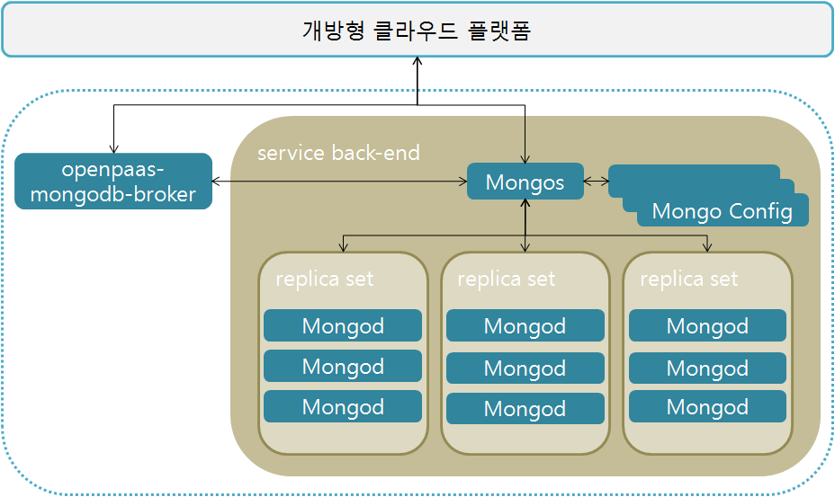

# PAAS-TA\_MONGODB\_SERVICE\_INSTALL\_GUIDE\_V1.0

### Table of Contents

1. [문서 개요](paas-ta_mongodb_service_install_guide_v1.0.md#1) 1.1. [목적](paas-ta_mongodb_service_install_guide_v1.0.md#1.1) 1.2. [범위](paas-ta_mongodb_service_install_guide_v1.0.md#1.2) 1.3. [시스템 구성도](paas-ta_mongodb_service_install_guide_v1.0.md#1.3) 1.4. [참고자료](paas-ta_mongodb_service_install_guide_v1.0.md#1.4)
2. [Mongodb 서비스 설치](paas-ta_mongodb_service_install_guide_v1.0.md#2) 2.1. [Prerequisite](paas-ta_mongodb_service_install_guide_v1.0.md#2.1) 2.2. [Stemcell 확인](paas-ta_mongodb_service_install_guide_v1.0.md#2.2) 2.3. [Deployment 다운로드](paas-ta_mongodb_service_install_guide_v1.0.md#2.3) 2.4. [Deployment 파일 수정](paas-ta_mongodb_service_install_guide_v1.0.md#2.4) 2.5. [서비스 설치](paas-ta_mongodb_service_install_guide_v1.0.md#2.5) 2.6. [서비스 설치 - 다운로드 된 PaaS-TA Release 파일 이용 방식](paas-ta_mongodb_service_install_guide_v1.0.md#2.6) 2.7. [서비스 설치 확인](paas-ta_mongodb_service_install_guide_v1.0.md#2.7)
3. [Mongodb 연동 Sample Web App 설명](paas-ta_mongodb_service_install_guide_v1.0.md#3) 3.1. [Mongodb 서비스 브로커 등록](paas-ta_mongodb_service_install_guide_v1.0.md#3.1) 3.2. [Sample App 구조](paas-ta_mongodb_service_install_guide_v1.0.md#3.2) 3.3. [PaaS-TA에서 서비스 신청](paas-ta_mongodb_service_install_guide_v1.0.md#3.3) 3.4. [Sample App에 서비스 바인드 신청 및 App 확인](paas-ta_mongodb_service_install_guide_v1.0.md#3.4)
4. [Mongodb Client 툴 접속](paas-ta_mongodb_service_install_guide_v1.0.md#4) 4.1. [MongoChef 설치 및 연결](paas-ta_mongodb_service_install_guide_v1.0.md#4.1)

### 1. 문서 개요

#### 1.1. 목적

본 문서\(Mongodb 서비스팩 설치 가이드\)는 전자정부표준프레임워크 기반의 PaaS-TA에서 제공되는 서비스팩인 Mongodb 서비스팩을 Bosh를 이용하여 설치 하는 방법과 PaaS-TA의 SaaS 형태로 제공하는 Application 에서 Mongodb 서비스를 사용하는 방법을 기술하였다. PaaS-TA 3.5 버전부터는 Bosh2.0 기반으로 deploy를 진행하며 기존 Bosh1.0 기반으로 설치를 원할경우에는 PaaS-TA 3.1 이하 버전의 문서를 참고한다.

#### 1.2. 범위

설치 범위는 Mongodb 서비스팩을 검증하기 위한 기본 설치를 기준으로 작성하였다.

#### 1.3. 시스템 구성도

본 문서의 설치된 시스템 구성도이다. Mongodb Server, Mongodb 서비스 브로커로 최소사항을 구성하였다.



| 구분 | 스펙 |
| :--- | :--- |
| PaaS-TA-mongodb-broker | 1vCPU / 1GB RAM / 8GB Disk |
| Mongos | 1vCPU / 1GB RAM / 8GB Disk |
| Mongo Config | 1vCPU / 1GB RAM / 8GB Disk+4GB\(영구적 Disk\) |
| Mongod | 1vCPU / 1GB RAM /8GB Disk+4GB\(영구적 Disk\) |

#### 1.4. 참고자료

[**http://bosh.io/docs**](http://bosh.io/docs)  
 [**http://docs.cloudfoundry.org/**](http://docs.cloudfoundry.org/)

### 2.  Mongodb 서비스 설치

#### 2.1. Prerequisite

본 설치 가이드는 Linux 환경에서 설치하는 것을 기준으로 하였다. 서비스 설치를 위해서는 BOSH 2.0과 PaaS-TA 5.0 이상, PaaS-TA 포털이 설치되어 있어야 한다.

#### 2.2. Stemcell 확인

Stemcell 목록을 확인하여 서비스 설치에 필요한 Stemcell이 업로드 되어 있는 것을 확인한다. \(PaaS-TA 5.5.1 과 동일 stemcell 사용\)

> $ bosh -e micro-bosh stemcells

```text
Using environment '10.0.1.6' as client 'admin'

Name                                     Version  OS             CPI  CID  
bosh-aws-xen-hvm-ubuntu-xenial-go_agent  621.94*  ubuntu-xenial  -    ami-0297ff649e8eea21b  

(*) Currently deployed

1 stemcells

Succeeded
```

#### 2.3. Deployment 다운로드

서비스 설치에 필요한 Deployment를 Git Repository에서 받아 서비스 설치 작업 경로로 위치시킨다.

* Service Deployment Git Repository URL : [https://github.com/PaaS-TA/service-deployment/tree/v5.0.6](https://github.com/PaaS-TA/service-deployment/tree/v5.0.6)

```text
# Deployment 다운로드 파일 위치 경로 생성 및 설치 경로 이동
$ mkdir -p ~/workspace/paasta-5.5.1/deployment
$ cd ~/workspace/paasta-5.5.1/deployment

# Deployment 파일 다운로드
$ git clone https://github.com/PaaS-TA/service-deployment.git -b v5.0.6

# common_vars.yml 파일 다운로드(common_vars.yml가 존재하지 않는다면 다운로드)
$ git clone https://github.com/PaaS-TA/common.git
```

#### 2.4. Deployment 파일 수정

BOSH Deployment manifest는 Components 요소 및 배포의 속성을 정의한 YAML 파일이다. Deployment 파일에서 사용하는 network, vm\_type, disk\_type 등은 Cloud config를 활용하고, 활용 방법은 BOSH 2.0 가이드를 참고한다.

* Cloud config 설정 내용을 확인한다.   

> $ bosh -e micro-bosh cloud-config

```text
Using environment '10.0.1.6' as client 'admin'

azs:
- cloud_properties:
    availability_zone: ap-northeast-2a
  name: z1
- cloud_properties:
    availability_zone: ap-northeast-2a
  name: z2

... ((생략)) ...

disk_types:
- disk_size: 1024
  name: default
- disk_size: 1024
  name: 1GB

... ((생략)) ...

networks:
- name: default
  subnets:
  - az: z1
    cloud_properties:
      security_groups: paasta-security-group
      subnet: subnet-00000000000000000
    dns:
    - 8.8.8.8
    gateway: 10.0.1.1
    range: 10.0.1.0/24
    reserved:
    - 10.0.1.2 - 10.0.1.9
    static:
    - 10.0.1.10 - 10.0.1.120

... ((생략)) ...

vm_types:
- cloud_properties:
    ephemeral_disk:
      size: 3000
      type: gp2
    instance_type: t2.small
  name: minimal
- cloud_properties:
    ephemeral_disk:
      size: 10000
      type: gp2
    instance_type: t2.small
  name: small

... ((생략)) ...

Succeeded
```

* common\_vars.yml을 서버 환경에 맞게 수정한다. 
* MongoDB에서 사용하는 변수는 system\_domain, paasta\_admin\_username, paasta\_admin\_password, paasta\_nats\_ip, paasta\_nats\_port, paasta\_nats\_user,    paasta\_nats\_password 이다.

> $ vi ~/workspace/paasta-5.5.1/deployment/common/common\_vars.yml
>
> \`\`\`
>
> ## BOSH INFO
>
> bosh\_ip: "10.0.1.6" \# BOSH IP bosh\_url: "[https://10.0.1.6](https://10.0.1.6)" \# BOSH URL \(e.g. "[https://00.000.0.0](https://00.000.0.0)"\) bosh\_client\_admin\_id: "admin" \# BOSH Client Admin ID bosh\_client\_admin\_secret: "ert7na4jpew48" \# BOSH Client Admin Secret\('echo $\(bosh int ~/workspace/paasta-5.5.1/deployment/paasta-deployment/bosh/{iaas}/creds.yml --path /admin\_password\)' 명령어를 통해 확인 가능\) bosh\_director\_port: 25555 \# BOSH director port bosh\_oauth\_port: 8443 \# BOSH oauth port bosh\_version: 271.2 \# BOSH version\('bosh env' 명령어를 통해 확인 가능, on-demand service용, e.g. "271.2"\)

## PAAS-TA INFO

system\_domain: "61.252.53.246.xip.io" \# Domain \(xip.io를 사용하는 경우 HAProxy Public IP와 동일\) paasta\_admin\_username: "admin" \# PaaS-TA Admin Username paasta\_admin\_password: "admin" \# PaaS-TA Admin Password paasta\_nats\_ip: "10.0.1.121" paasta\_nats\_port: 4222 paasta\_nats\_user: "nats" paasta\_nats\_password: "7EZB5ZkMLMqT73h2Jh3UsqO" \# PaaS-TA Nats Password \(CredHub 로그인후 'credhub get -n /micro-bosh/paasta/nats\_password' 명령어를 통해 확인 가능\) paasta\_nats\_private\_networks\_name: "default" \# PaaS-TA Nats 의 Network 이름 paasta\_database\_ips: "10.0.1.123" \# PaaS-TA Database IP \(e.g. "10.0.1.123"\) paasta\_database\_port: 5524 \# PaaS-TA Database Port \(e.g. 5524\(postgresql\)/13307\(mysql\)\) -- Do Not Use "3306"&"13306" in mysql paasta\_database\_type: "postgresql" \# PaaS-TA Database Type \(e.g. "postgresql" or "mysql"\) paasta\_database\_driver\_class: "org.postgresql.Driver" \# PaaS-TA Database driver-class \(e.g. "org.postgresql.Driver" or "com.mysql.jdbc.Driver"\) paasta\_cc\_db\_id: "cloud\_controller" \# CCDB ID \(e.g. "cloud\_controller"\) paasta\_cc\_db\_password: "cc\_admin" \# CCDB Password \(e.g. "cc\_admin"\) paasta\_uaa\_db\_id: "uaa" \# UAADB ID \(e.g. "uaa"\) paasta\_uaa\_db\_password: "uaa\_admin" \# UAADB Password \(e.g. "uaa\_admin"\) paasta\_api\_version: "v3"

## UAAC INFO

uaa\_client\_admin\_id: "admin" \# UAAC Admin Client Admin ID uaa\_client\_admin\_secret: "admin-secret" \# UAAC Admin Client에 접근하기 위한 Secret 변수 uaa\_client\_portal\_secret: "clientsecret" \# UAAC Portal Client에 접근하기 위한 Secret 변수

## Monitoring INFO

metric\_url: "10.0.161.101" \# Monitoring InfluxDB IP syslog\_address: "10.0.121.100" \# Logsearch의 ls-router IP syslog\_port: "2514" \# Logsearch의 ls-router Port syslog\_transport: "relp" \# Logsearch Protocol saas\_monitoring\_url: "61.252.53.248" \# Pinpoint HAProxy WEBUI의 Public IP monitoring\_api\_url: "61.252.53.241" \# Monitoring-WEB의 Public IP

#### Portal INFO

portal\_web\_user\_ip: "52.78.88.252" portal\_web\_user\_url: "[http://portal-web-user.52.78.88.252.xip.io](http://portal-web-user.52.78.88.252.xip.io)"

#### ETC INFO

abacus\_url: "[http://abacus.61.252.53.248.xip.io](http://abacus.61.252.53.248.xip.io)" \# abacus url \(e.g. "[http://abacus.xxx.xxx.xxx.xxx.xip.io](http://abacus.xxx.xxx.xxx.xxx.xip.io)"\)

```text
- Deployment YAML에서 사용하는 변수 파일을 서버 환경에 맞게 수정한다.

> $ vi ~/workspace/paasta-5.5.1/deployment/service-deployment/mongodb/vars.yml
```

## STEMCELL

stemcell\_os: "ubuntu-xenial" \# stemcell os stemcell\_version: "621.94" \# stemcell version

## NETWORK

private\_networks\_name: "default" \# private network name

## MONGODB\_REPL\_SET\_NAME

replSetName1: "op1" \# replica set1 name replSetName2: "op2" \# replica set2 name replSetName3: "op3" \# replica set3 name

## MONGODB\_SLAVE1

mongodb\_slave1\_azs: \[z3\] \# mongodb slave1 azs mongodb\_slave1\_instances: 2 \# mongodb slave1 instances mongodb\_slave1\_vm\_type: "medium" \# mongodb slave1 vm type mongodb\_slave1\_persistent\_disk\_type: "10GB" \# mongodb slave1 persistent disk type mongodb\_slave1\_static\_ips: "" \# mongodb slave1's private IPs \(e.g. \["10.0.81.11","10.0.81.12"\]\)

## MONGODB\_SLAVE2

mongodb\_slave2\_azs: \[z3\] \# mongodb slave2 azs mongodb\_slave2\_instances: 2 \# mongodb slave2 instances mongodb\_slave2\_vm\_type: "medium" \# mongodb slave2 vm type mongodb\_slave2\_persistent\_disk\_type: "10GB" \# mongodb slave2 persistent disk type mongodb\_slave2\_static\_ips: "" \# mongodb slave2's private IPs \(e.g. \["10.0.81.14","10.0.81.15"\]\)

## MONGODB\_SLAVE3

mongodb\_slave3\_azs: \[z3\] \# mongodb slave3 azs mongodb\_slave3\_instances: 2 \# mongodb slave3 instances mongodb\_slave3\_vm\_type: "medium" \# mongodb slave3 vm type mongodb\_slave3\_persistent\_disk\_type: "10GB" \# mongodb slave3 persistent disk type mongodb\_slave3\_static\_ips: "" \# mongodb slave3's private IPs \(e.g. \["10.0.81.17","10.0.81.18"\]\)

## MONGODB\_MASTER1

mongodb\_master1\_azs: \[z3\] \# mongodb master1 azs mongodb\_master1\_instances: 1 \# mongodb master1 instances mongodb\_master1\_vm\_type: "medium" \# mongodb master1 vm type mongodb\_master1\_persistent\_disk\_type: "10GB" \# mongodb master1 persistent disk type mongodb\_master1\_static\_ips: "" \# mongodb master1's private IP \(e.g. "10.0.81.10"\) mongodb\_master1\_replSet\_hosts: "" \# 첫번째 Host는 replicaSet1 의master1 ip, 차례대로 slave1 의 ips. \(e.g. \["10.0.81.10", "10.0.81.11","10.0.81.12"\]\)

## MONGODB\_MASTER2

mongodb\_master2\_azs: \[z3\] \# mongodb master2 azs mongodb\_master2\_instances: 1 \# mongodb master2 instances mongodb\_master2\_vm\_type: "medium" \# mongodb master2 vm type mongodb\_master2\_persistent\_disk\_type: "10GB" \# mongodb master2 persistent disk type mongodb\_master2\_static\_ips: "" \# mongodb master2's private IP \(e.g. "10.0.81.13"\) mongodb\_master2\_replSet\_hosts: "" \# 첫번째 Host는 replicaSet2 의master2 ip, 차례대로 slave2 의 ips. \(e.g. \["10.0.81.13", "10.0.81.14","10.0.81.15"\]\)

## MONGODB\_MASTER3

mongodb\_master3\_azs: \[z3\] \# mongodb master3 azs mongodb\_master3\_instances: 1 \# mongodb master3 instances mongodb\_master3\_vm\_type: "medium" \# mongodb master3 vm type mongodb\_master3\_persistent\_disk\_type: "10GB" \# mongodb master3 persistent disk type mongodb\_master3\_static\_ips: "" \# mongodb master3's private IP \(e.g. "10.0.81.16"\) mongodb\_master3\_replSet\_hosts: "" \# 첫번째 Host는 replicaSet3 의master3 ip, 차례대로 slave3 의 ips. \(e.g. \["10.0.81.16", "10.0.81.17","10.0.81.18"\]\)

## MONGODB\_CONFIG

mongodb\_config\_azs: \[z3\] \# mongodb config azs mongodb\_config\_instances: 3 \# mongodb config instances mongodb\_config\_vm\_type: "medium" \# mongodb config vm type mongodb\_config\_persistent\_disk\_type: "10GB" \# mongodb config persistent disk type mongodb\_config\_static\_ips: "" \# mongodb config's private IPs \(e.g. \["10.0.81.19", "10.0.81.20","10.0.81.21"\]\)

## MONGODB\_SHARD

mongodb\_shard\_azs: \[z3\] \# mongodb shard azs mongodb\_shard\_instances: 1 \# mongodb shard instances mongodb\_shard\_vm\_type: "medium" \# mongodb shard vm type mongodb\_shard\_static\_ips: "" \# mongodb shard's private IP \(e.g. "10.0.81.22"\)

## MONGODB\_BROKER

mongodb\_broker\_azs: \[z3\] \# mongodb broker azs mongodb\_broker\_instances: 1 \# mongodb broker instances mongodb\_broker\_vm\_type: "medium" \# mongodb broker vm type mongodb\_broker\_static\_ips: "" \# mongodb broker's private IP \(e.g. "10.0.81.23"\)

## BROKER\_REGISTRAR

broker\_registrar\_broker\_azs: \[z3\] \# broker registrar azs broker\_registrar\_broker\_instances: 1 \# broker registrar instances broker\_registrar\_broker\_vm\_type: "medium" \# broker registrar vm type

## BROKER\_DEREGISTRAR

broker\_deregistrar\_broker\_azs: \[z3\] \# broker deregistrar azs broker\_deregistrar\_broker\_instances: 1 \# broker deregistrar instances broker\_deregistrar\_broker\_vm\_type: "medium" \# broker deregistrar vm type

```text
'pem.yml' 은 MongoDB자체 pem을 등록해 쓰기 때문에 내용 수정하지 않는다.

### <div id="2.5"/> 2.5. 서비스 설치

- 서버 환경에 맞추어 Deploy 스크립트 파일의 VARIABLES 설정을 수정하고, Option file을 추가할지 선택한다.  
     (선택) -o operations/use-compiled-releases.yml (ubuntu-xenial/621.94로 컴파일 된 릴리즈 사용)  


> $ vi ~/workspace/paasta-5.5.1/deployment/service-deployment/mongodb/deploy.sh
```

## !/bin/bash

## VARIABLES

COMMON\_VARS\_PATH="" \# common\_vars.yml File Path \(e.g. ../../common/common\_vars.yml\) BOSH\_ENVIRONMENT="${BOSH\_ENVIRONMENT}" \# bosh director alias name \(PaaS-TA에서 제공되는 create-bosh-login.sh 미 사용시 bosh envs에서 이름을 확인하여 입력\)

## DEPLOY

bosh -e ${BOSH\_ENVIRONMENT} -n -d mongodb deploy --no-redact mongodb.yml  -l ${COMMON\_VARS\_PATH}  -l vars.yml  -l operations/pem.yml

```text
- 서비스를 설치한다.
```

$ cd ~/workspace/paasta-5.5.1/deployment/service-deployment/mongodb  
$ sh ./deploy.sh

```text
### <div id="2.6"/> 2.6. 서비스 설치 - 다운로드 된 PaaS-TA Release 파일 이용 방식

- 서비스 설치에 필요한 릴리즈 파일을 다운로드 받아 Local machine의 서비스 설치 작업 경로로 위치시킨다.  

  - 설치 릴리즈 파일 다운로드 : [paasta-mongodb-shard-2.0.1.tgz](http://45.248.73.44/index.php/s/7DyiWNWD2N8pT8J/download)
```

## 릴리즈 다운로드 파일 위치 경로 생성

$ mkdir -p ~/workspace/paasta-5.5.1/release/service

## 릴리즈 파일 다운로드 및 파일 경로 확인

$ ls ~/workspace/paasta-5.5.1/release/service paasta-mongodb-shard-2.0.1.tgz

```text
- 서버 환경에 맞추어 Deploy 스크립트 파일의 VARIABLES 설정을 수정하고 Option file 및 변수를 추가한다.  
     (추가) -o operations/use-offline-releases.yml (미리 다운받은 offline 릴리즈 사용)  
     (추가) -v releases_dir="<RELEASE_DIRECTORY>"  

> $ vi ~/workspace/paasta-5.5.1/deployment/service-deployment/mongodb/deploy.sh
```

## !/bin/bash

## VARIABLES

COMMON\_VARS\_PATH="" \# common\_vars.yml File Path \(e.g. ../../common/common\_vars.yml\) BOSH\_ENVIRONMENT="${BOSH\_ENVIRONMENT}" \# bosh director alias name \(PaaS-TA에서 제공되는 create-bosh-login.sh 미 사용시 bosh envs에서 이름을 확인하여 입력\)

## DEPLOY

bosh -e ${BOSH\_ENVIRONMENT} -n -d mongodb deploy --no-redact mongodb.yml  -l ${COMMON\_VARS\_PATH}  -l vars.yml  -l operations/pem.yml  -v releases\_dir="/home/ubuntu/workspace/paasta-5.5.1/release"

```text
- 서비스를 설치한다.
```

$ cd ~/workspace/paasta-5.5.1/deployment/service-deployment/mongodb  
$ sh ./deploy.sh

```text
### <div id="2.7"/> 2.7. 서비스 설치 확인

설치 완료된 서비스를 확인한다.  

> $ bosh -e micro-bosh -d mongodb vms
```

Using environment '10.0.1.6' as client 'admin'

Task 8176. Done

Deployment 'mongodb'

Instance Process State AZ IPs VM CID VM Type Active  
mongodb\_broker/0e8933f1-1b67-4486-b37a-2b104da1351a running z5 10.30.107.114 vm-e0bb79c6-6482-497a-b071-f7df4bf2a059 minimal true  
mongodb\_config/35ee66e6-9c25-44c2-85a4-e7c1d520641b running z5 10.30.107.111 vm-672ce5b9-4d8f-4b22-9745-43f7d9e39402 minimal true  
mongodb\_config/935aed3c-e7a4-4179-b397-68d0535bc1d9 running z5 10.30.107.112 vm-8069a84b-5a91-44ca-a5d8-cca37b5d8952 minimal true  
mongodb\_config/cc798fba-7840-46ea-9211-6b5646fc766f running z5 10.30.107.110 vm-5a7a9d16-8de4-4adf-b504-1364716decce minimal true  
mongodb\_master1/1e8b971e-c503-4ba6-bcba-ab28dd7dd797 running z5 10.30.107.101 vm-54b33ec2-582d-44ef-a4bf-6281acfbf81b minimal true  
mongodb\_master2/7a4460e4-a9b5-4d15-9508-adba3405f387 running z5 10.30.107.104 vm-a388a44e-4ab9-4340-9227-b12b7bd2c410 minimal true  
mongodb\_master3/88e1aa1c-fb1f-467d-a550-b6334fdfce8d running z5 10.30.107.107 vm-9c6aed35-69aa-4a7d-9b08-c5671e728e2a minimal true  
mongodb\_shard/1fd85812-c8d4-4ebd-98f5-c8cf637db9e5 running z5 10.30.107.113 vm-c2628ba8-feed-4401-b1c9-be1445722d34 minimal true  
mongodb\_slave1/2710c368-dbc2-4d72-a100-1fa37d73e2ec running z5 10.30.107.102 vm-048757cf-1c19-4c30-a3cd-2b0dd05c1554 minimal true  
mongodb\_slave1/bb6275f1-4ab5-4998-ba89-ef30c36c3f67 running z5 10.30.107.103 vm-6d0f52ef-a0b3-4c26-8e04-cb5cef30337d minimal true  
mongodb\_slave2/9671e09b-7ca1-4da2-af8a-88d20caeebfe running z5 10.30.107.106 vm-8a57713b-68df-4639-8ab3-3d12c01fd880 minimal true  
mongodb\_slave2/fed23144-9c18-42f6-9f99-213f7dc294ee running z5 10.30.107.105 vm-c58e860a-8b5e-43e1-abe9-c3043cbfb16d minimal true  
mongodb\_slave3/7cebf99b-5a79-4033-a4e8-86f8d476a709 running z5 10.30.107.108 vm-d34d8a3f-37fb-41a8-b995-6e8c7e8ff041 minimal true  
mongodb\_slave3/ab6d22fb-d436-4c1c-a423-9e9d82c4266a running z5 10.30.107.109 vm-ca14b629-4d00-4c96-8782-1cf7a174ce1e minimal true

14 vms

Succeeded

```text
## <div id='3'> 3. Mongodb 연동 Sample Web App 설명

본 Sample Web App은 PaaS-TA에 배포되며 Mongodb의 서비스를 Provision과 Bind를 한 상태에서 사용이 가능하다.

### <div id='3.1'> 3.1. Mongodb 서비스 브로커 등록

Mongodb 서비스팩 배포가 완료 되었으면 Application에서 서비스 팩을 사용하기 위해서 먼저 Mongodb 서비스 브로커를 등록해 주어야 한다.

서비스 브로커 등록시 개방형 클라우드 플랫폼에서 서비스브로커를 등록할 수 있는 사용자로 로그인이 되어있어야 한다.

##### 서비스 브로커 목록을 확인한다.

>`$ cf service-brokers`  

>![mongodb_image_06]

<br>

##### Mongodb 서비스 브로커를 등록한다.  

>`$ cf create-service-broker {서비스팩 이름} {서비스팩 사용자ID} {서비스팩 사용자비밀번호} http://{서비스팩 URL(IP)}`  

  **서비스팩 이름** : 서비스 팩 관리를 위해 PaaS-TA에서 보여지는 명칭이다. 서비스 Marketplace에서는 각각의 API 서비스 명이 보여지니 여기서 명칭은 서비스팩 리스트의 명칭이다.<br>
  **서비스팩 사용자ID** / 비밀번호 : 서비스팩에 접근할 수 있는 사용자 ID입니다. 서비스팩도 하나의 API 서버이기 때문에 아무나 접근을 허용할 수 없어 접근이 가능한 ID/비밀번호를 입력한다.<br>
  **서비스팩 URL** : 서비스팩이 제공하는 API를 사용할 수 있는 URL을 입력한다.

>`$ cf create-service-broker mongodb-shard-service-broker admin cloudfoundry http://10.30.107.114:8080`  

> ![mongodb_image_07]


##### 등록된 mongodb 서비스 브로커를 확인한다.

>`$ cf service-brokers`

> ![mongodb_image_08]


##### 접근 가능한 서비스 목록을 확인한다.

>`$ cf service-access`  

> ![mongodb_image_09]

>서비스 브로커 생성시 디폴트로 접근을 허용하지 않는다.


##### 특정 조직에 해당 서비스 접근 허용을 할당하고 접근 서비스 목록을 다시 확인한다. (전체 조직)

>`$ cf enable-service-access Mongo-DB` <br>
>`$ cf service-access`

> ![mongodb_image_10]

### <div id='3.2'> 3.2. Sample App 구조

Sample Web App은 PaaS-TA에 App으로 배포가 된다. App을 배포하여 구동시 Bind 된 Mongodb 서비스 연결정보로 접속하여 초기 데이터를 생성하게 된다. 배포 완료 후 정상적으로 App 이 구동되면 브라우저나 curl로 해당 App에 접속 하여 Mongodb 환경정보(서비스 연결 정보)와 초기 적재된 데이터를 보여준다.

Sample Web App 구조는 다음과 같다.

<table>
  <tr>
    <td>이름</td>
    <td>설명</td>
  </tr>
  <tr>
    <td>src</td>
    <td>Sample 소스디렉토리</td>
  </tr>
  <tr>
    <td>manifest</td>
    <td>PaaS-TA에 app 배포시 필요한 설정을 저장하는 파일</td>
  </tr>
  <tr>
    <td>build.gradle</td>
    <td>gradle project 설정 파일</td>
  </tr>
  <tr>
    <td>build</td>
    <td>gradle 빌드시 생성되는 디렉토리(war 파일, classes 폴더 등)</td>
  </tr>
</table>


##### PaaS-TA-Sample-Apps.zip 파일 압축을 풀고 Service 폴더안에 있는 Mongodb Sample Web App인 hello-spring-mongodb를 복사한다.

>`$ ls -all`

> ![mongodb_image_11]

<br>

### <div id='3.3'> 3.3. PaaS-TA에서 서비스 신청

Sample Web App에서 Mongodb 서비스를 사용하기 위해서는 서비스 신청(Provision)을 해야 한다.
*참고: 서비스 신청시 개방형 클라우드 플랫폼에서 서비스를 신청 할 수 있는 사용자로 로그인이 되어 있어야 한다.


##### 먼저 PaaS-TA Marketplace에서 서비스가 있는지 확인을 한다.

>`$ cf marketplace`

> ![mongodb_image_12]

<br>

##### Marketplace에서 원하는 서비스가 있으면 서비스 신청(Provision)을 한다.

>`$ cf create-service-broker {서비스팩 이름} {서비스팩 사용자ID} {서비스팩 사용자비밀번호} http://{서비스팩 URL(IP)}`

  **서비스팩 이름** : 서비스 팩 관리를 위해 PaaS-TA에서 보여지는 명칭이다. 서비스 Marketplace에서는 각각의 API 서비스 명이 보여지니 여기서 명칭은 서비스팩 리스트의 명칭이다.<br>
  **서비스팩 사용자ID** / 비밀번호 : 서비스팩에 접근할 수 있는 사용자 ID입니다. 서비스팩도 하나의 API 서버이기 때문에 아무나 접근을 허용할 수 없어 접근이 가능한 ID/비밀번호를 입력한다.<br>
  **서비스팩 URL** : 서비스팩이 제공하는 API를 사용할 수 있는 URL을 입력한다.

>`$ cf create-service Mongo-DB default-plan mongodb-service-instance`

>![mongodb_image_13]

<br>

##### 생성된 Mongodb 서비스 인스턴스를 확인한다.

>`$ cf services`

>![mongodb_image_14]

<br>

### <div id='3.4'> 3.4. Sample App에 서비스 바인드 신청 및 App 확인  

서비스 신청이 완료되었으면 Sample Web App 에서는 생성된 서비스 인스턴스를 Bind 하여 App에서 Mongodb 서비스를 이용한다.
*참고: 서비스 Bind 신청시 개방형 클라우드 플랫폼에서 서비스 Bind신청 할 수 있는 사용자로 로그인이 되어 있어야 한다.


##### Sample Web App 디렉토리로 이동하여 manifest 파일을 확인한다.
다운로드 :: http://45.248.73.44/index.php/s/x8Tg37WDFiL5ZDi/download
```

$ wget -O sample.zip [http://45.248.73.44/index.php/s/x8Tg37WDFiL5ZDi/download](http://45.248.73.44/index.php/s/x8Tg37WDFiL5ZDi/download) $ unzip sample.zip -d sample $ cd sample/Service/hello-spring-mongodb

```text
>`$ vi manifest.yml` <br>
```

applications:

* name: hello-spring-mysql       \#배포할 App 이름

  memory: 1G                \# 배포시 메모리 사이즈

  instances: 1                    \# 배포 인스턴스 수

  path: target/hello-spring-mysql-1.0.0-BUILD-SNAPSHOT.war      \#배포하는 App 파일 PATH

  \`\`\`

참고: target/hello-spring-mysql-1.0.0-BUILD-SNAPSHOT.war파일이 존재 하지 않을 경우 mvn 빌드를 수행 하면 파일이 생성된다.   


**--no-start 옵션으로 App을 배포한다.**

* -no-start: App 배포시 구동은 하지 않는다.

> `$ cf push --no-start`
>
> 

**배포된 Sample App을 확인하고 로그를 수행한다.**

> `$ cf apps`
>
> 

> `$ cf logs hello-spring-mongodb` **// cf logs {배포된 App명}**


**Sample Web App에서 생성한 서비스 인스턴스 바인드 신청을 한다.**

> `$ cf bind-service hello-spring-Mongodb mongodb-service-instance`
>
> 

**바인드가 적용되기 위해서 App을 재기동한다.**

> `$ cf restart hello-spring-mongodb`
>
> 

\(참고\) 바인드 후 App구동시 Mongodb 서비스 접속 에러로 App 구동이 안될 경우 보안 그룹을 추가한다.

**rule.json 파일을 만들고 아래와 같이 내용을 넣는다.**

> `$ vi rule.json`

```text
[
  {
    "protocol": "tcp",
    "destination": "10.20.0.153",
    "ports": "27017"
  }
]
```

**보안 그룹을 생성한다.**

> `$ cf create-security-group Mongo-DB rule.json`
>
> 

**모든 App에 Mongodb 서비스를 사용할 수 있도록 생성한 보안 그룹을 적용한다.**

> `$ cf bind-running-security-group Mongo-DB`
>
> 

* App을 리부팅 한다.

  ```text
  $ cf restart hello-spring-Mongodb
  ```

  

**App이 정상적으로 Mongodb 서비스를 사용하는지 확인한다.**

> curl 로 확인
>
> `$ curl hello-spring-Mongodb.115.68.46.30.xip.io`
>
> 

**브라우에서 확인**

> 

### 4.  Mongodb Client 툴 접속

Application에 바인딩된 Mongodb 서비스 연결정보는 Private IP로 구성되어 있기 때문에 Mongodb Client 툴에서 직접 연결할수 없다. 따라서 SSH 터널, Proxy 터널 등을 제공하는 Mongodb Client 툴을 사용해서 연결하여야 한다. 본 가이드는 SSH 터널을 이용하여 연결 하는 방법을 제공하며 Mongodb Client 툴로써는 MongoChef 로 가이드한다. MongoChef 에서 접속하기 위해서 먼저 SSH 터널링 할수 있는 VM 인스턴스를 생성해야한다. 이 인스턴스는 SSH로 접속이 가능해야 하고 접속 후 PaaS-TA에 설치한 서비스팩에 Private IP 와 해당 포트로 접근이 가능하도록 시큐리티 그룹을 구성해야 한다. 이 부분은 OpenStack관리자 및 PaaS-TA 운영자에게 문의하여 구성한다.

#### 4.1.  MongoChef 설치 & 연결

MongoChef 프로그램은 무료로 사용할 수 있는 소프트웨어이다.

**MongoChef을 다운로드 하기 위해 아래 URL로 이동하여 설치파일을 다운로드 한다.**

[**http://3t.io/mongochef/download/platform/**](http://3t.io/mongochef/download/platform/)

> 

**다운로드한 설치파일을 실행한다.**

> 

**MongoChef 설치를 위한 안내사항이다. Next 버튼을 클릭한다.**

> 

**프로그램 라이선스에 관련된 내용이다. 동의\(I accept the terms in the License Agreement\)에 체크 후 Next 버튼을 클릭한다.**

> 

**MongoChef 을 설치할 경로를 설정 후 Next 버튼을 클릭한다. 별도의 경로 설정이 필요 없을 경우 default로 C드라이브 Program Files 폴더에 설치가 된다.**

> 

**Install 버튼을 클릭하여 설치를 진행한다.**

> 

**Finish 버튼 클릭으로 설치를 완료한다.**

> 

**MongoChef를 실행했을 때 처음 뜨는 화면이다. 이 화면에서 Server에 접속하기 위한 profile을 설정/저장하여 접속할 수 있다. Connect버튼을 클릭한다.**

> 

**새로운 접속 정보를 작성하기 위해New Connection 버튼을 클릭한다.**

> 

**Server에 접속하기 위한 Connection 정보를 입력한다.**

> 

**서버 정보는 Application에 바인드되어 있는 서버 정보를 입력한다. cf env  명령어로 이용하여 확인한다.**

> `$ cf env hello-spring-mongodb`

> 

**Authentication탭으로 이동하여 mongodb 의 인증정보를 입력한다.**

> 

**SSH 터널 탭을 클릭하고 PaaS-TA 운영 관리자에게 제공받은 SSH 터널링 가능한 서버 정보를 입력한다.**

> 

**모든 정보를 입력했으면 Test Connection 버튼을 눌러 접속 테스트를 한다.**

> 

**모두 OK 결과가 나오면 정상적으로 접속이 된다는 것이다. OK 버튼을 누른다.**

**Save 버튼을 눌러 작성한 접속정보를 저장한다.**

> 

**방금 저장한 접속정보를 선택하고 Connect 버튼을 클릭하여 접속한다.**

> 

**접속이 완료되면 좌측에 스키마 정보가 나타난다. 컬럼을 더블클릭 해보면 우측에 적재되어있는 데이터가 출력된다.**

> 

**우측 화면에 쿼리 항목에 Query문을 작성한 후 실행 버튼\(삼각형\)을 클릭한다. Query문에 이상이 없다면 정상적으로 결과를 얻을 수 있을 것이다.**

> 

