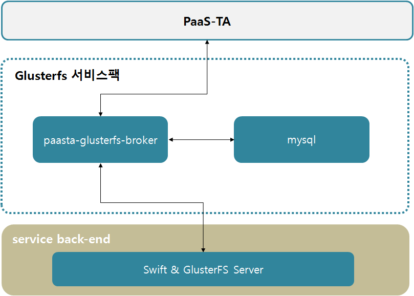
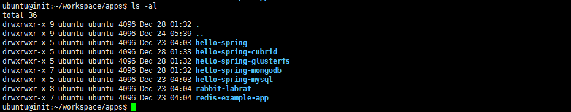
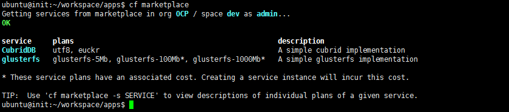
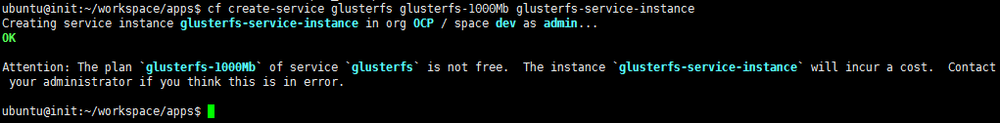
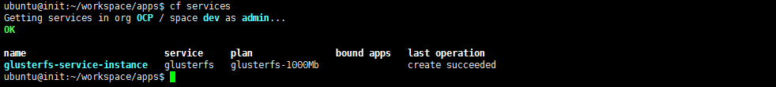
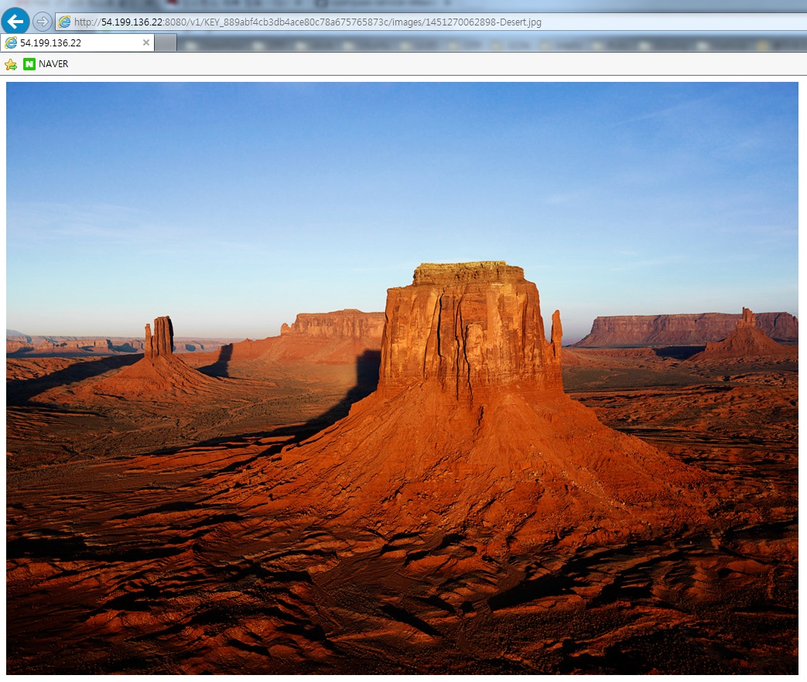

# PAAS-TA\_GLUSTERFS\_SERVICE\_INSTALL\_GUIDE\_V1.0

### Table of Contents

1. [문서 개요](paas-ta_glusterfs_service_install_guide_v1.0.md#1) 1.1. [목적](paas-ta_glusterfs_service_install_guide_v1.0.md#1.1) 1.2. [범위](paas-ta_glusterfs_service_install_guide_v1.0.md#1.2) 1.3. [시스템 구성도](paas-ta_glusterfs_service_install_guide_v1.0.md#1.3) 1.4. [참고자료](paas-ta_glusterfs_service_install_guide_v1.0.md#1.4)
2. [GlusterFS 서비스 설치](paas-ta_glusterfs_service_install_guide_v1.0.md#2) 2.1. [Prerequisite](paas-ta_glusterfs_service_install_guide_v1.0.md#2.1) 2.2. [Stemcell 확인](paas-ta_glusterfs_service_install_guide_v1.0.md#2.2) 2.3. [Deployment 다운로드](paas-ta_glusterfs_service_install_guide_v1.0.md#2.3) 2.4. [Deployment 파일 수정](paas-ta_glusterfs_service_install_guide_v1.0.md#2.4) 2.5. [서비스 설치](paas-ta_glusterfs_service_install_guide_v1.0.md#2.5) 2.6. [서비스 설치 - 다운로드 된 PaaS-TA Release 파일 이용 방식](paas-ta_glusterfs_service_install_guide_v1.0.md#2.6) 2.7. [서비스 설치 확인](paas-ta_glusterfs_service_install_guide_v1.0.md#2.7)
3. [GlusterFS 연동 Sample App 설명](paas-ta_glusterfs_service_install_guide_v1.0.md#3) 3.1. [서비스 브로커 등록](paas-ta_glusterfs_service_install_guide_v1.0.md#3.1) 3.2. [Sample App 구조](paas-ta_glusterfs_service_install_guide_v1.0.md#3.2) 3.3. [PaaS-TA에서 서비스 신청](paas-ta_glusterfs_service_install_guide_v1.0.md#3.3)

### 1. 문서 개요

#### 1.1. 목적

본 문서\(GlusterFS 서비스팩 설치 가이드\)는 전자정부 표준 프레임워크 기반의 PaaS-TA에서 제공되는 서비스팩인 GlusterFS 서비스팩을 Bosh를 이용하여 설치 하는 방법과 PaaS-TA의 SaaS 형태로 제공하는 Application 에서GlusterFS 서비스를 사용하는 방법을 기술하였다. PaaS-TA 3.5 버전부터는 Bosh2.0 기반으로 deploy를 진행하며 기존 Bosh1.0 기반으로 설치를 원할경우에는 PaaS-TA 3.1 이하 버전의 문서를 참고한다.

#### 1.2. 범위

설치 범위는 GlusterFS 서비스팩을 검증하기 위한 기본 설치를 기준으로 작성하였다.

#### 1.3. 시스템 구성도

본 문서의 설치된 시스템 구성도이다. Mysql Server, GlusterFS 서비스 브로커로 최소사항을 구성하였고 서비스 백엔드는 외부에 구성되어 있다. 

* 설치할때 cloud config에서 사용하는 VM\_Tpye명과 스펙 

| VM\_Type | 스펙 |
| :--- | :--- |
| minimal | 1vCPU / 1GB RAM / 8GB Disk |

* 각 Instance의 Resource Pool과 스펙

| 구분 | Resource Pool | 스펙 |
| :--- | :--- | :--- |
| paasta-glusterfs-broker | minimal | 1vCPU / 1GB RAM / 8GB Disk |
| mysql | minimal | 1vCPU / 1GB RAM / 8GB Disk |

#### 1.4. 참고자료

[**http://bosh.io/docs**](http://bosh.io/docs)   
 [**http://docs.cloudfoundry.org/**](http://docs.cloudfoundry.org/)

### 2. GlusterFS 서비스 설치

#### 2.1. Prerequisite

본 설치 가이드는 Linux 환경에서 설치하는 것을 기준으로 하였다. 서비스 설치를 위해서는 BOSH 2.0과 PaaS-TA 5.0 이상, PaaS-TA 포털이 설치되어 있어야 한다.

#### 2.2. Stemcell 확인

Stemcell 목록을 확인하여 서비스 설치에 필요한 Stemcell이 업로드 되어 있는 것을 확인한다. \(PaaS-TA 5.5.1 과 동일 stemcell 사용\)

> $ bosh -e micro-bosh stemcells

```text
Using environment '10.0.1.6' as client 'admin'

Name                                     Version  OS             CPI  CID  
bosh-aws-xen-hvm-ubuntu-xenial-go_agent  621.94*  ubuntu-xenial  -    ami-0297ff649e8eea21b  

(*) Currently deployed

1 stemcells

Succeeded
```

#### 2.3. Deployment 다운로드

서비스 설치에 필요한 Deployment를 Git Repository에서 받아 서비스 설치 작업 경로로 위치시킨다.

* Service Deployment Git Repository URL : [https://github.com/PaaS-TA/service-deployment/tree/v5.0.6](https://github.com/PaaS-TA/service-deployment/tree/v5.0.6)

```text
# Deployment 다운로드 파일 위치 경로 생성 및 설치 경로 이동
$ mkdir -p ~/workspace/paasta-5.5.1/deployment
$ cd ~/workspace/paasta-5.5.1/deployment

# Deployment 파일 다운로드
$ git clone https://github.com/PaaS-TA/service-deployment.git -b v5.0.6

# common_vars.yml 파일 다운로드(common_vars.yml가 존재하지 않는다면 다운로드)
$ git clone https://github.com/PaaS-TA/common.git
```

#### 2.4. Deployment 파일 수정

BOSH Deployment manifest는 Components 요소 및 배포의 속성을 정의한 YAML 파일이다. Deployment 파일에서 사용하는 network, vm\_type, disk\_type 등은 Cloud config를 활용하고, 활용 방법은 BOSH 2.0 가이드를 참고한다.

* Cloud config 설정 내용을 확인한다.   

> $ bosh -e micro-bosh cloud-config

```text
Using environment '10.0.1.6' as client 'admin'

azs:
- cloud_properties:
    availability_zone: ap-northeast-2a
  name: z1
- cloud_properties:
    availability_zone: ap-northeast-2a
  name: z2

... ((생략)) ...

disk_types:
- disk_size: 1024
  name: default
- disk_size: 1024
  name: 1GB

... ((생략)) ...

networks:
- name: default
  subnets:
  - az: z1
    cloud_properties:
      security_groups: paasta-security-group
      subnet: subnet-00000000000000000
    dns:
    - 8.8.8.8
    gateway: 10.0.1.1
    range: 10.0.1.0/24
    reserved:
    - 10.0.1.2 - 10.0.1.9
    static:
    - 10.0.1.10 - 10.0.1.120

... ((생략)) ...

vm_types:
- cloud_properties:
    ephemeral_disk:
      size: 3000
      type: gp2
    instance_type: t2.small
  name: minimal
- cloud_properties:
    ephemeral_disk:
      size: 10000
      type: gp2
    instance_type: t2.small
  name: small

... ((생략)) ...

Succeeded
```

* common\_vars.yml을 서버 환경에 맞게 수정한다. 
* glusterfs에서 사용하는 변수는 system\_domain, paasta\_admin\_username, paasta\_admin\_password 이다.

> $ vi ~/workspace/paasta-5.5.1/deployment/common/common\_vars.yml
>
> \`\`\`
>
> ## BOSH INFO
>
> bosh\_ip: "10.0.1.6" \# BOSH IP bosh\_url: "[https://10.0.1.6](https://10.0.1.6)" \# BOSH URL \(e.g. "[https://00.000.0.0](https://00.000.0.0)"\) bosh\_client\_admin\_id: "admin" \# BOSH Client Admin ID bosh\_client\_admin\_secret: "ert7na4jpew48" \# BOSH Client Admin Secret\('echo $\(bosh int ~/workspace/paasta-5.5.1/deployment/paasta-deployment/bosh/{iaas}/creds.yml --path /admin\_password\)' 명령어를 통해 확인 가능\) bosh\_director\_port: 25555 \# BOSH director port bosh\_oauth\_port: 8443 \# BOSH oauth port bosh\_version: 271.2 \# BOSH version\('bosh env' 명령어를 통해 확인 가능, on-demand service용, e.g. "271.2"\)

## PAAS-TA INFO

system\_domain: "61.252.53.246.xip.io" \# Domain \(xip.io를 사용하는 경우 HAProxy Public IP와 동일\) paasta\_admin\_username: "admin" \# PaaS-TA Admin Username paasta\_admin\_password: "admin" \# PaaS-TA Admin Password paasta\_nats\_ip: "10.0.1.121" paasta\_nats\_port: 4222 paasta\_nats\_user: "nats" paasta\_nats\_password: "7EZB5ZkMLMqT73h2Jh3UsqO" \# PaaS-TA Nats Password \(CredHub 로그인후 'credhub get -n /micro-bosh/paasta/nats\_password' 명령어를 통해 확인 가능\) paasta\_nats\_private\_networks\_name: "default" \# PaaS-TA Nats 의 Network 이름 paasta\_database\_ips: "10.0.1.123" \# PaaS-TA Database IP \(e.g. "10.0.1.123"\) paasta\_database\_port: 5524 \# PaaS-TA Database Port \(e.g. 5524\(postgresql\)/13307\(mysql\)\) -- Do Not Use "3306"&"13306" in mysql paasta\_database\_type: "postgresql" \# PaaS-TA Database Type \(e.g. "postgresql" or "mysql"\) paasta\_database\_driver\_class: "org.postgresql.Driver" \# PaaS-TA Database driver-class \(e.g. "org.postgresql.Driver" or "com.mysql.jdbc.Driver"\) paasta\_cc\_db\_id: "cloud\_controller" \# CCDB ID \(e.g. "cloud\_controller"\) paasta\_cc\_db\_password: "cc\_admin" \# CCDB Password \(e.g. "cc\_admin"\) paasta\_uaa\_db\_id: "uaa" \# UAADB ID \(e.g. "uaa"\) paasta\_uaa\_db\_password: "uaa\_admin" \# UAADB Password \(e.g. "uaa\_admin"\) paasta\_api\_version: "v3"

## UAAC INFO

uaa\_client\_admin\_id: "admin" \# UAAC Admin Client Admin ID uaa\_client\_admin\_secret: "admin-secret" \# UAAC Admin Client에 접근하기 위한 Secret 변수 uaa\_client\_portal\_secret: "clientsecret" \# UAAC Portal Client에 접근하기 위한 Secret 변수

## Monitoring INFO

metric\_url: "10.0.161.101" \# Monitoring InfluxDB IP syslog\_address: "10.0.121.100" \# Logsearch의 ls-router IP syslog\_port: "2514" \# Logsearch의 ls-router Port syslog\_transport: "relp" \# Logsearch Protocol saas\_monitoring\_url: "61.252.53.248" \# Pinpoint HAProxy WEBUI의 Public IP monitoring\_api\_url: "61.252.53.241" \# Monitoring-WEB의 Public IP

#### Portal INFO

portal\_web\_user\_ip: "52.78.88.252" portal\_web\_user\_url: "[http://portal-web-user.52.78.88.252.xip.io](http://portal-web-user.52.78.88.252.xip.io)"

#### ETC INFO

abacus\_url: "[http://abacus.61.252.53.248.xip.io](http://abacus.61.252.53.248.xip.io)" \# abacus url \(e.g. "[http://abacus.xxx.xxx.xxx.xxx.xip.io](http://abacus.xxx.xxx.xxx.xxx.xip.io)"\)

```text
- Deployment YAML에서 사용하는 변수 파일을 서버 환경에 맞게 수정한다.

> $ vi ~/workspace/paasta-5.5.1/deployment/service-deployment/glusterfs/vars.yml
```

## STEMCELL

stemcell\_os: "ubuntu-xenial" \# stemcell os stemcell\_version: "621.94" \# stemcell version

## NETWORK

private\_networks\_name: "default" \# private network name public\_networks\_name: "vip" \# public network name

## MYSQL

mysql\_azs: \[z4\] \# mysql azs mysql\_instances: 1 \# mysql instances mysql\_vm\_type: "medium" \# mysql vm type mysql\_persistent\_disk\_type: "1GB" \# mysql persistent disk type mysql\_port: 13306 \# mysql port \(e.g. 13306\) -- Do Not Use "3306" mysql\_admin\_username: "" \# mysql admin username \(e.g. "root"\) mysql\_admin\_password: "" \# mysql admin password \(e.g. "admin1234"\)

## GLUSTERFS SERVER

glusterfs\_url: "" \# Glusterfs 서비스 public 주소 glusterfs\_tenantname: "" \# Glusterfs 서비스 테넌트 이름\(e.g. "service"\) glusterfs\_username: "" \# Glusterfs 서비스 계정 아이디\(e.g. "swift"\) glusterfs\_password: "" \# Glusterfs 서비스 암호\(e.g. "password"\)

## GLUSTERFS\_BROKER

broker\_azs: \[z4\] \# glusterfs broker azs broker\_instances: 1 \# glusterfs broker instances broker\_persistent\_disk\_type: "4GB" \# glusterfs broker persistent disk type broker\_vm\_type: "small" \# glusterfs broker vm type

## GLUSTERFS\_BROKER\_REGISTRAR

broker\_registrar\_azs: \[z4\] \# broker registrar azs broker\_registrar\_instances: 1 \# broker registrar instances broker\_registrar\_vm\_type: "small" \# broker registrar vm type

## GLUSTERFS\_BROKER\_DEREGISTRAR

broker\_deregistrar\_azs: \[z4\] \# broker deregistrar azs broker\_deregistrar\_instances: 1 \# broker deregistrar instances broker\_deregistrar\_vm\_type: "small" \# broker deregistrar vm type

```text
### <div id="2.5"/> 2.5. 서비스 설치

- 서버 환경에 맞추어 Deploy 스크립트 파일의 VARIABLES 설정을 수정하고, Option file을 추가할지 선택한다.  
     (선택) -o operations/use-compiled-releases.yml (ubuntu-xenial/621.94로 컴파일 된 릴리즈 사용)

> $ vi ~/workspace/paasta-5.5.1/deployment/service-deployment/glusterfs/deploy.sh
```

## !/bin/bash

## VARIABLES

COMMON\_VARS\_PATH="" \# common\_vars.yml File Path \(e.g. ../../common/common\_vars.yml\) BOSH\_ENVIRONMENT="${BOSH\_ENVIRONMENT}" \# bosh director alias name \(PaaS-TA에서 제공되는 create-bosh-login.sh 미 사용시 bosh envs에서 이름을 확인하여 입력\)

bosh -e ${BOSH\_ENVIRONMENT} -n -d glusterfs deploy --no-redact glusterfs.yml  -l ${COMMON\_VARS\_PATH}  -l vars.yml

```text
- 서비스를 설치한다.
```

$ cd ~/workspace/paasta-5.5.1/deployment/service-deployment/glusterfs  
$ sh ./deploy.sh

```text
### <div id="2.6"/> 2.6. 서비스 설치 - 다운로드 된 PaaS-TA Release 파일 이용 방식

- 서비스 설치에 필요한 릴리즈 파일을 다운로드 받아 Local machine의 서비스 설치 작업 경로로 위치시킨다.  

  - 설치 릴리즈 파일 다운로드 : [paasta-glusterfs-2.0.1.tgz](http://45.248.73.44/index.php/s/Y3dirSrzNtQ9WPf/download)
```

## 릴리즈 다운로드 파일 위치 경로 생성

$ mkdir -p ~/workspace/paasta-5.5.1/release/service

## 릴리즈 파일 다운로드 및 파일 경로 확인

$ ls ~/workspace/paasta-5.5.1/release/service paasta-glusterfs-2.0.1.tgz

```text
- 서버 환경에 맞추어 Deploy 스크립트 파일의 VARIABLES 설정을 수정하고 Option file 및 변수를 추가한다.  
     (추가) -o operations/use-offline-releases.yml (미리 다운받은 offline 릴리즈 사용)  
     (추가) -v releases_dir="<RELEASE_DIRECTORY>"  

> $ vi ~/workspace/paasta-5.5.1/deployment/service-deployment/glusterfs/deploy.sh
```

## !/bin/bash

## VARIABLES

COMMON\_VARS\_PATH="" \# common\_vars.yml File Path \(e.g. ../../common/common\_vars.yml\) BOSH\_ENVIRONMENT="${BOSH\_ENVIRONMENT}" \# bosh director alias name \(PaaS-TA에서 제공되는 create-bosh-login.sh 미 사용시 bosh envs에서 이름을 확인하여 입력\)

bosh -e ${BOSH\_ENVIRONMENT} -n -d glusterfs deploy --no-redact glusterfs.yml  -l ${COMMON\_VARS\_PATH}  -l vars.yml  -v releases\_dir="/home/ubuntu/workspace/paasta-5.5.1/release"

```text
- 서비스를 설치한다.
```

$ cd ~/workspace/paasta-5.5.1/deployment/service-deployment/glusterfs  
$ sh ./deploy.sh

```text
### <div id="2.7"/> 2.7. 서비스 설치 확인

설치 완료된 서비스를 확인한다.  

> $ bosh -e micro-bosh -d glusterfs vms
```

Using environment '10.0.1.6' as client 'admin'

Task 1343. Done

Deployment 'glusterfs'

Instance Process State AZ IPs VM CID VM Type Active  
mysql/8770bc70-8681-4079-8360-086219d6231b running z3 10.30.52.10 vm-96697221-0ff9-4520-8a68-2314c62057a5 medium true  
paasta-glusterfs-broker/229fb890-645b-4213-89a1-fc2116de3f54 running z3 10.30.52.11 vm-ace55b8f-3ce0-4482-b03b-96fbc567592e medium true

2 vms

Succeeded

```text
## <div id="3"/>3. GlusterFS 연동 Sample App 설명
본 Sample Web App은 PaaS-TA에 배포되며 GlusterFS의 서비스를 Provision과 Bind를 한 상태에서 사용이 가능하다.

### <div id="3.1"/> 3.1. 서비스 브로커 등록  

GlusterFS 서비스팩 배포가 완료 되었으면 Application에서 서비스 팩을 사용하기 위해서 먼저 GlusterFS 서비스 브로커를 등록해 주어야 한다.
서비스 브로커 등록시에는 PaaS-TA에서 서비스 브로커를 등록할 수 있는 사용자로 로그인 하여야 한다

##### 서비스 브로커 목록을 확인한다.

>`$ cf service-brokers`
```

$ cf service-brokers Getting service brokers as admin...

name url No service brokers found

```text
##### GlusterFS 서비스 브로커를 등록한다.  
> $ cf create-service-broker [SERVICE_BROKER] [USERNAME] [PASSWORD] [SERVICE_BROKER_URL]
> 
> [SERVICE_BROKER] : 서비스 브로커 명
> [USERNAME] / [PASSWORD] : 서비스 브로커에 접근할 수 있는 사용자 ID / PASSWORD
> [SERVICE_BROKER_URL] : 서비스 브로커 접근 URL
>`$ cf create-service-broker glusterfs-service admin cloudfoundry http://10.30.107.197:8080`
```

$ cf create-service-broker glusterfs-service admin cloudfoundry [http://10.30.107.197:8080](http://10.30.107.197:8080) Creating service broker glusterfs-service as admin... OK

```text
##### 등록된 GlusterFS 서비스 브로커를 확인한다.

>`$ cf service-brokers`
```

$ cf service-brokers Getting service brokers as admin...

name url glusterfs-service [http://10.30.107.197:8080](http://10.30.107.197:8080)

```text
##### 접근 가능한 서비스 목록을 확인한다.

>`$ cf service-access`
```

$ cf service-access Getting service access as admin... broker: glusterfs-service service plan access orgs glusterfs glusterfs-5Mb none glusterfs glusterfs-100Mb none glusterfs glusterfs-1000Mb none

```text
>서비스 브로커 등록시 최초에는 접근을 허용하지 않는다. 따라서 access는 none으로 설정된다.

##### 특정 조직에 해당 서비스 접근 허용을 할당하고 접근 서비스 목록을 다시 확인한다. (전체 조직)

>`$ cf enable-service-access glusterfs`  
>`$ cf service-access`
```

$ cf enable-service-access glusterfs Enabling access to all plans of service glusterfs for all orgs as admin... OK

$ cf service-access Getting service access as admin... broker: glusterfs-service service plan access orgs glusterfs glusterfs-5Mb all glusterfs glusterfs-100Mb all glusterfs glusterfs-1000Mb all

\`\`\`

#### 3.2. Sample App 구조

Sample Web App은 PaaS-TA에 App으로 배포가 된다. 배포 완료 후 정상적으로 App 이 구동되면 브라우저나 curl로 해당 App에 접속 하여 GlusterFS 환경정보\(서비스 연결 정보\)와파일 업로드하고 확인하는 기능을 제공한다.

Sample App 구조는 다음과 같다.

| 이름 | 설명 |
| :--- | :--- |
| src | Sample 소스디렉토리 |
| manifest | PaaS-TA에 app 배포시 필요한 설정을 저장하는 파일 |
| pom.xml | maven project 설정 파일 |
| target | maven build시 생성되는 디렉토리\(war 파일, classes 폴더 등\) |

**PaaSTA-Sample-Apps.zip 파일 압축을 풀고 Service폴더안에 있는 GlusterFSSample Web App인 hello-spring-glusterfs를 복사한다.**

> `$ ls -all`
>
> 

#### 3.3. PaaS-TA에서 서비스 신청

Sample App에서 GlusterFS 서비스를 사용하기 위해서는 서비스 신청\(Provision\)을 해야 한다. \*참고: 서비스 신청시 PaaS-TA에서 서비스를 신청 할 수 있는 사용자로 로그인이 되어 있어야 한다.

**먼저 PaaS-TA Marketplace에서 서비스가 있는지 확인을 한다.**

> `$ cf marketplace`
>
> 

**Marketplace에서 원하는 서비스가 있으면 서비스 신청\(Provision\)을 한다.**

> `$ cf create-service {서비스명} {서비스 플랜} {내 서비스명}`
>
> * **서비스명** : p-rabbitmq로 Marketplace에서 보여지는 서비스 명칭이다.
> * **서비스플랜** : 서비스에 대한 정책으로 plans에 있는 정보 중 하나를 선택한다. RabbitMQ 서비스는 standard plan만 지원한다.
> * **내 서비스명** : 내 서비스에서 보여지는 명칭이다. 이 명칭을 기준으로 환경 설정 정보를 가져온다.
>
> `$ cf create-service glusterfs glusterfs-1000Mb glusterfs-service-instance`
>
> 

**생성된 GlusterFS 서비스 인스턴스를 확인한다.**

> `$ cf services`
>
> 

**브라우에서 이미지 확인**

> 

