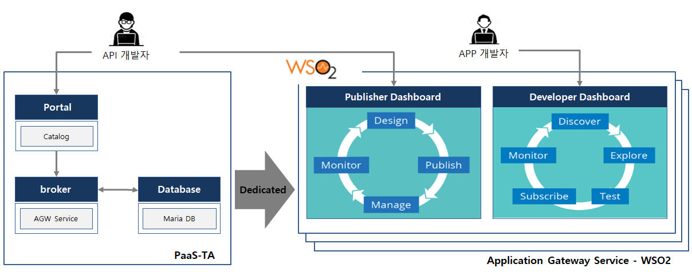
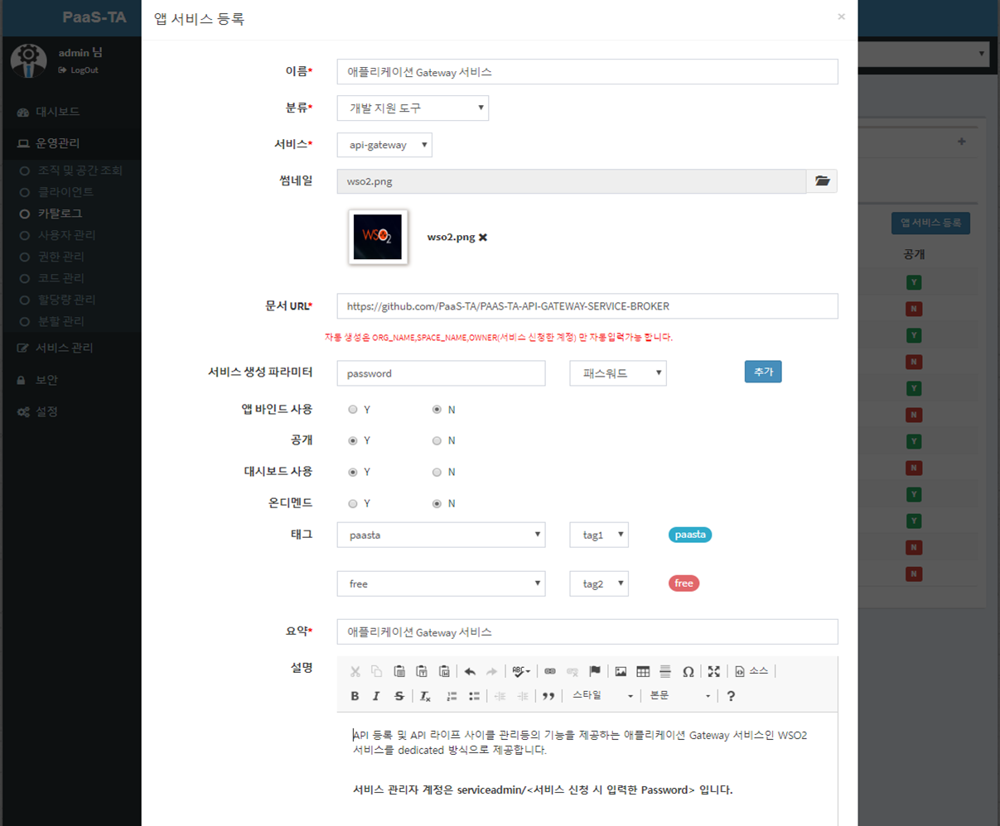
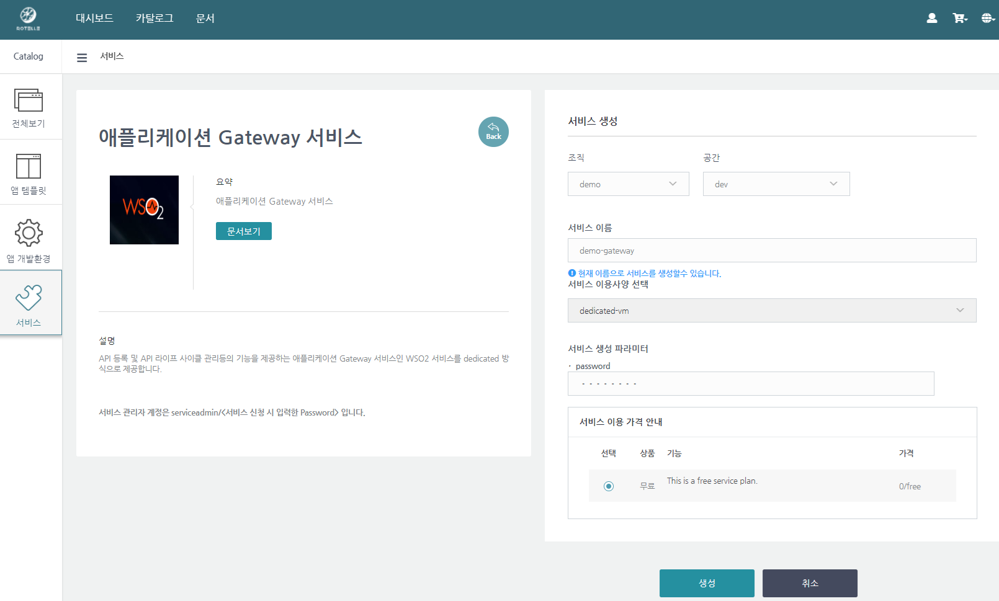
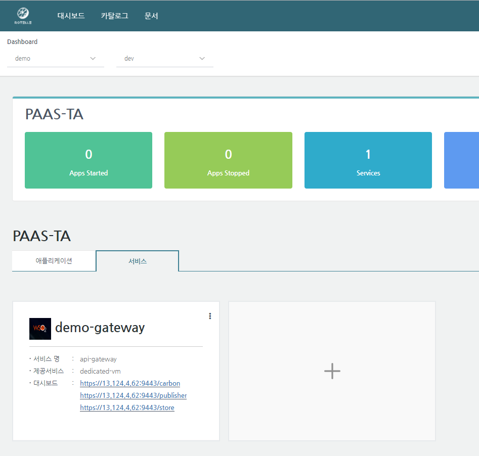
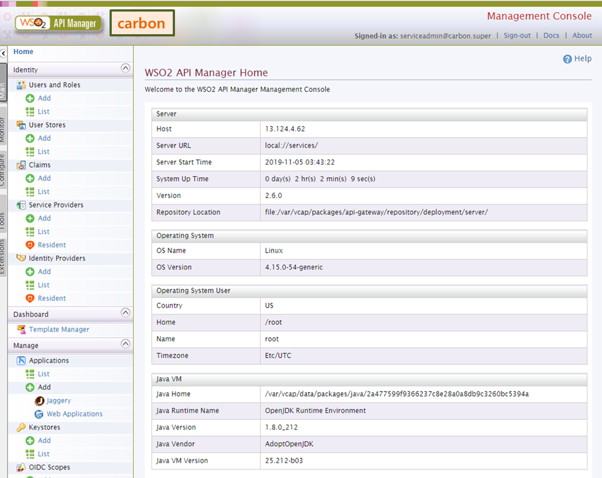
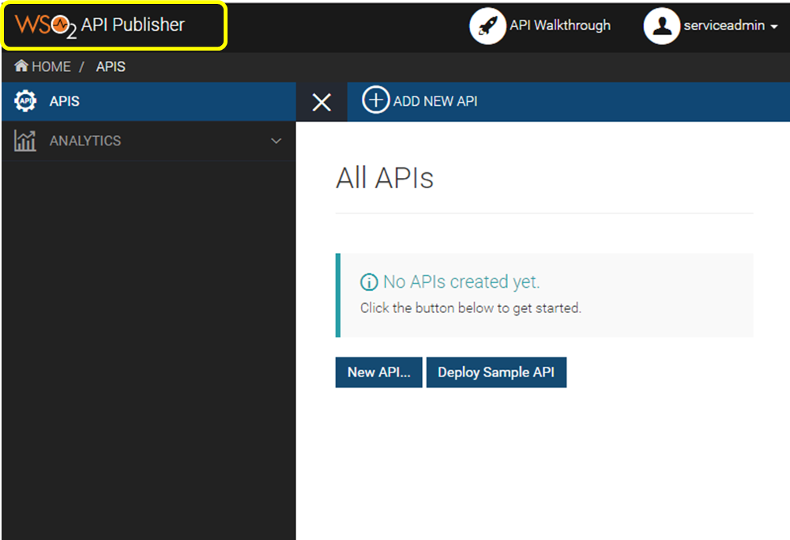
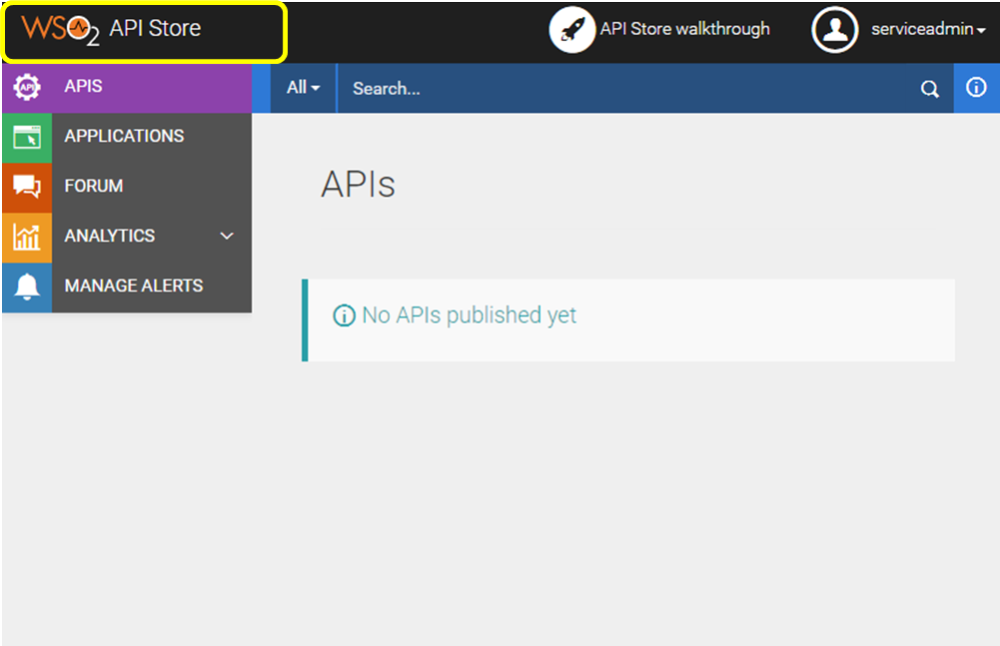

# PAAS-TA\_APPLICATION\_GATEWAY\_SERVICE\_INSTALL\_GUIDE\_V1.0

### Table of Contents

1. [문서 개요](paas-ta_application_gateway_service_install_guide_v1.0.md#1) 1.1. [목적](paas-ta_application_gateway_service_install_guide_v1.0.md#1.1) 1.2. [범위](paas-ta_application_gateway_service_install_guide_v1.0.md#1.2) 1.3. [시스템 구성](paas-ta_application_gateway_service_install_guide_v1.0.md#1.3) 1.4. [참고자료](paas-ta_application_gateway_service_install_guide_v1.0.md#1.4)
2. [애플리케이션 Gateway 서비스 설치](paas-ta_application_gateway_service_install_guide_v1.0.md#2) 2.1. [Prerequisite](paas-ta_application_gateway_service_install_guide_v1.0.md#2.1) 2.2. [Stemcell 확인](paas-ta_application_gateway_service_install_guide_v1.0.md#2.2) 2.3. [Deployment 다운로드](paas-ta_application_gateway_service_install_guide_v1.0.md#2.3) 2.4. [Deployment 파일 수정](paas-ta_application_gateway_service_install_guide_v1.0.md#2.4) 2.5. [서비스 설치](paas-ta_application_gateway_service_install_guide_v1.0.md#2.5) 2.6. [서비스 설치 - 다운로드 된 PaaS-TA Release 파일 이용 방식](paas-ta_application_gateway_service_install_guide_v1.0.md#2.6) 2.7. [서비스 설치 확인](paas-ta_application_gateway_service_install_guide_v1.0.md#2.7)
3. [애플리케이션 Gateway 서비스 관리 및 신청](paas-ta_application_gateway_service_install_guide_v1.0.md#3) 3.1. [서비스 브로커 등록](paas-ta_application_gateway_service_install_guide_v1.0.md#3.1) 3.2. [PaaS-TA 운영자 포탈 - 서비스 등록](paas-ta_application_gateway_service_install_guide_v1.0.md#3.2) 3.3. [PaaS-TA 사용자 포탈 - 서비스 신청](paas-ta_application_gateway_service_install_guide_v1.0.md#3.3)

### 1. 문서 개요

#### 1.1. 목적

본 문서는 애플리케이션 Gateway 서비스 Release를 Bosh2.0을 이용하여 설치 하는 방법을 기술하였다.

#### 1.2. 범위

설치 범위는 애플리케이션 Gateway 서비스 Release를 검증하기 위한 기본 설치를 기준으로 작성하였다.

#### 1.3. 시스템 구성

본 장에서는 애플리케이션 Gateway 서비스의 시스템 구성에 대해 기술하였다. 애플리케이션 Gateway 서비스 시스템은 service-broker, mariadb, api-gateway\(WSO2\)서비스의 최소사항을 구성하였다.  


| VM명 | 인스턴스 수 | vCPU수 | 메모리\(GB\) | 디스크\(GB\) |
| :--- | :---: | :---: | :---: | :--- |
| service-broker | 1 | 1 | 1 |  |
| mariadb | 1 | 1 | 2 | Root 8G + Persistent disk 10G |
| api-gateway | N | 2 | 4 | Root 10G + Persistent disk 20G |

#### 1.4. 참고자료

> [http://bosh.io/docs](http://bosh.io/docs)  
> [http://docs.cloudfoundry.org/](http://docs.cloudfoundry.org/)

### 2. 애플리케이션 Gateway 서비스 설치

#### 2.1. Prerequisite

본 설치 가이드는 Linux 환경에서 설치하는 것을 기준으로 하였다. 서비스 설치를 위해서는 BOSH 2.0과 PaaS-TA 5.0 이상, PaaS-TA 포털이 설치되어 있어야 한다.

#### 2.2. Stemcell 확인

Stemcell 목록을 확인하여 서비스 설치에 필요한 Stemcell이 업로드 되어 있는 것을 확인한다. \(PaaS-TA 5.5.1 과 동일 stemcell 사용\)

> $ bosh -e micro-bosh stemcells

```text
Using environment '10.0.1.6' as client 'admin'

Name                                     Version  OS             CPI  CID  
bosh-aws-xen-hvm-ubuntu-xenial-go_agent  621.94*  ubuntu-xenial  -    ami-0297ff649e8eea21b  

(*) Currently deployed

1 stemcells

Succeeded
```

#### 2.3. Deployment 다운로드

서비스 설치에 필요한 Deployment를 Git Repository에서 받아 서비스 설치 작업 경로로 위치시킨다.

* Service Deployment Git Repository URL : [https://github.com/PaaS-TA/service-deployment/tree/v5.0.6](https://github.com/PaaS-TA/service-deployment/tree/v5.0.6)

```text
# Deployment 다운로드 파일 위치 경로 생성 및 설치 경로 이동
$ mkdir -p ~/workspace/paasta-5.5.1/deployment
$ cd ~/workspace/paasta-5.5.1/deployment

# Deployment 파일 다운로드
$ git clone https://github.com/PaaS-TA/service-deployment.git -b v5.0.6

# common_vars.yml 파일 다운로드(common_vars.yml가 존재하지 않는다면 다운로드)
$ git clone https://github.com/PaaS-TA/common.git
```

#### 2.4. Deployment 파일 수정

BOSH Deployment manifest는 Components 요소 및 배포의 속성을 정의한 YAML 파일이다. Deployment 파일에서 사용하는 network, vm\_type, disk\_type 등은 Cloud config를 활용하고, 활용 방법은 BOSH 2.0 가이드를 참고한다.

* Cloud config 설정 내용을 확인한다.   

> $ bosh -e micro-bosh cloud-config

```text
Using environment '10.0.1.6' as client 'admin'

azs:
- cloud_properties:
    availability_zone: ap-northeast-2a
  name: z1
- cloud_properties:
    availability_zone: ap-northeast-2a
  name: z2

... ((생략)) ...

disk_types:
- disk_size: 1024
  name: default
- disk_size: 1024
  name: 1GB

... ((생략)) ...

networks:
- name: default
  subnets:
  - az: z1
    cloud_properties:
      security_groups: paasta-security-group
      subnet: subnet-00000000000000000
    dns:
    - 8.8.8.8
    gateway: 10.0.1.1
    range: 10.0.1.0/24
    reserved:
    - 10.0.1.2 - 10.0.1.9
    static:
    - 10.0.1.10 - 10.0.1.120

... ((생략)) ...

vm_types:
- cloud_properties:
    ephemeral_disk:
      size: 3000
      type: gp2
    instance_type: t2.small
  name: minimal
- cloud_properties:
    ephemeral_disk:
      size: 10000
      type: gp2
    instance_type: t2.small
  name: small

... ((생략)) ...

Succeeded
```

* common\_vars.yml을 서버 환경에 맞게 수정한다. 
* redis에서 사용하는 변수는 bosh\_url, bosh\_client\_admin\_id, bosh\_client\_admin\_secret, bosh\_director\_port, bosh\_oauth\_port이다.

> $ vi ~/workspace/paasta-5.5.1/deployment/common/common\_vars.yml
>
> \`\`\`
>
> ## BOSH INFO
>
> bosh\_ip: "10.0.1.6" \# BOSH IP bosh\_url: "[https://10.0.1.6](https://10.0.1.6)" \# BOSH URL \(e.g. "[https://00.000.0.0](https://00.000.0.0)"\) bosh\_client\_admin\_id: "admin" \# BOSH Client Admin ID bosh\_client\_admin\_secret: "ert7na4jpew48" \# BOSH Client Admin Secret\('echo $\(bosh int ~/workspace/paasta-5.5.1/deployment/paasta-deployment/bosh/{iaas}/creds.yml --path /admin\_password\)' 명령어를 통해 확인 가능\) bosh\_director\_port: 25555 \# BOSH director port bosh\_oauth\_port: 8443 \# BOSH oauth port bosh\_version: 271.2 \# BOSH version\('bosh env' 명령어를 통해 확인 가능, on-demand service용, e.g. "271.2"\)

## PAAS-TA INFO

system\_domain: "61.252.53.246.xip.io" \# Domain \(xip.io를 사용하는 경우 HAProxy Public IP와 동일\) paasta\_admin\_username: "admin" \# PaaS-TA Admin Username paasta\_admin\_password: "admin" \# PaaS-TA Admin Password paasta\_nats\_ip: "10.0.1.121" paasta\_nats\_port: 4222 paasta\_nats\_user: "nats" paasta\_nats\_password: "7EZB5ZkMLMqT73h2Jh3UsqO" \# PaaS-TA Nats Password \(CredHub 로그인후 'credhub get -n /micro-bosh/paasta/nats\_password' 명령어를 통해 확인 가능\) paasta\_nats\_private\_networks\_name: "default" \# PaaS-TA Nats 의 Network 이름 paasta\_database\_ips: "10.0.1.123" \# PaaS-TA Database IP \(e.g. "10.0.1.123"\) paasta\_database\_port: 5524 \# PaaS-TA Database Port \(e.g. 5524\(postgresql\)/13307\(mysql\)\) -- Do Not Use "3306"&"13306" in mysql paasta\_database\_type: "postgresql" \# PaaS-TA Database Type \(e.g. "postgresql" or "mysql"\) paasta\_database\_driver\_class: "org.postgresql.Driver" \# PaaS-TA Database driver-class \(e.g. "org.postgresql.Driver" or "com.mysql.jdbc.Driver"\) paasta\_cc\_db\_id: "cloud\_controller" \# CCDB ID \(e.g. "cloud\_controller"\) paasta\_cc\_db\_password: "cc\_admin" \# CCDB Password \(e.g. "cc\_admin"\) paasta\_uaa\_db\_id: "uaa" \# UAADB ID \(e.g. "uaa"\) paasta\_uaa\_db\_password: "uaa\_admin" \# UAADB Password \(e.g. "uaa\_admin"\) paasta\_api\_version: "v3"

## UAAC INFO

uaa\_client\_admin\_id: "admin" \# UAAC Admin Client Admin ID uaa\_client\_admin\_secret: "admin-secret" \# UAAC Admin Client에 접근하기 위한 Secret 변수 uaa\_client\_portal\_secret: "clientsecret" \# UAAC Portal Client에 접근하기 위한 Secret 변수

## Monitoring INFO

metric\_url: "10.0.161.101" \# Monitoring InfluxDB IP syslog\_address: "10.0.121.100" \# Logsearch의 ls-router IP syslog\_port: "2514" \# Logsearch의 ls-router Port syslog\_transport: "relp" \# Logsearch Protocol saas\_monitoring\_url: "61.252.53.248" \# Pinpoint HAProxy WEBUI의 Public IP monitoring\_api\_url: "61.252.53.241" \# Monitoring-WEB의 Public IP

#### Portal INFO

portal\_web\_user\_ip: "52.78.88.252" portal\_web\_user\_url: "[http://portal-web-user.52.78.88.252.xip.io](http://portal-web-user.52.78.88.252.xip.io)"

#### ETC INFO

abacus\_url: "[http://abacus.61.252.53.248.xip.io](http://abacus.61.252.53.248.xip.io)" \# abacus url \(e.g. "[http://abacus.xxx.xxx.xxx.xxx.xip.io](http://abacus.xxx.xxx.xxx.xxx.xip.io)"\)

```text
- Deployment YAML에서 사용하는 변수 파일을 서버 환경에 맞게 수정한다.

> $ vi ~/workspace/paasta-5.5.1/deployment/service-deployment/gateway-service/vars.yml
```

## STEMCELL

stemcell\_os: "ubuntu-xenial" \# stemcell os stemcell\_version: "621.94" \# stemcell version

## VM\_TYPE

vm\_type\_default: "medium" \# vm type default vm\_type\_highmem: "small-highmem-16GB" \# vm type highmemory

## NETWORK

private\_networks\_name: "default" \# private network name public\_networks\_name: "vip" \# public network name :: The public network name can only use "vip" or "service\_public".

## MARIA\_DB

mariadb\_azs: \[z3\] \# mariadb : azs mariadb\_instances: 1 \# mariadb : instances \(1\) mariadb\_persistent\_disk\_type: "10GB" \# mariadb : persistent disk type mariadb\_port: "" \# mariadb : database port \(e.g. 31306\) -- Do Not Use "3306" mariadb\_admin\_password: "" \# mariadb : database admin password \(e.g. "paas-ta!admin"\) mariadb\_broker\_username: "" \# mariadb : service-broker-user id \(e.g. "apigateway"\) mariadb\_broker\_password: "" \# mariadb : service-broker-user password \(e.g. "broker!admin"\)

## SERVICE-BROKER

broker\_azs: \[z3\] \# service-broker : azs broker\_instances: 1 \# service-broker : instances \(1\) broker\_port: "" \# service-broker : broker port \(e.g. "8080"\) broker\_logging\_level\_broker: "INFO" \# service-broker : broker logging level broker\_logging\_level\_hibernate: "INFO" \# service-broker : hibernate logging level broker\_services\_id: "" \# service-broker : service guid \(e.g. "8b78dfb6-1fb6-4586-b767-45b5f77e0d42"\) broker\_services\_plans\_id: "" \# service-broker : service plan id \(e.g. "b5e33932-8f87-4712-9776-887bfb73c584"\)

## API-GATEWAY

api\_gateway\_azs: \[z7\] \# api-gateway : azs api\_gateway\_instances: 2 \# api-gateway : instances \(N\) api\_gateway\_persistent\_disk\_type: "20GB" \# api-gateway : persistent disk type api\_gateway\_public\_ips: "" \# api-gateway : public ips \(e.g. \["00.00.00.00" , "11.11.11.11"\]\) api\_gateway\_admin\_password: "" \# api-gateway : api-gateway super admin password \(e.g. "admin!Service"\)

```text
### <div id="2.5"/> 2.5. 서비스 설치

- 서버 환경에 맞추어 Deploy 스크립트 파일의 VARIABLES 설정을 수정하고, Option file을 추가할지 선택한다.  
     (선택) -o operations/use-compiled-releases.yml (ubuntu-xenial/621.94로 컴파일 된 릴리즈 사용) 

> $ vi ~/workspace/paasta-5.5.1/deployment/service-deployment/gateway-service/deploy.sh
```

## !/bin/bash

## VARIABLES

COMMON\_VARS\_PATH="" \# common\_vars.yml File Path \(e.g. ../../common/common\_vars.yml\) CURRENT\_IAAS="${CURRENT\_IAAS}" \# IaaS Information \(PaaS-TA에서 제공되는 create-bosh-login.sh 미 사용시 aws/azure/gcp/openstack/vsphere 입력\) BOSH\_ENVIRONMENT="${BOSH\_ENVIRONMENT}" \# bosh director alias name \(PaaS-TA에서 제공되는 create-bosh-login.sh 미 사용시 bosh envs에서 이름을 확인하여 입력\)

## DEPLOY

bosh -e ${BOSH\_ENVIRONMENT} -n -d gateway-service deploy --no-redact gateway-service.yml  -o operations/${CURRENT\_IAAS}-network.yml  -l ${COMMON\_VARS\_PATH}  -l vars.yml

```text
- 서비스를 설치한다.
```

$ cd ~/workspace/paasta-5.5.1/deployment/service-deployment/gateway-service  
$ sh ./deploy.sh

```text
### <div id="2.6"/> 2.6. 서비스 설치 - 다운로드 된 PaaS-TA Release 파일 이용 방식

- 서비스 설치에 필요한 릴리즈 파일을 다운로드 받아 Local machine의 서비스 설치 작업 경로로 위치시킨다.  

  - 설치 릴리즈 파일 다운로드 : [paasta-api-gateway-service-release.tgz](http://45.248.73.44/index.php/s/9q5gyTL5txPdLS3/download)
```

## 릴리즈 다운로드 파일 위치 경로 생성

$ mkdir -p ~/workspace/paasta-5.5.1/release/service

## 릴리즈 파일 다운로드 및 파일 경로 확인

$ ls ~/workspace/paasta-5.5.1/release/service paasta-api-gateway-service-release.tgz

```text
- 서버 환경에 맞추어 Deploy 스크립트 파일의 VARIABLES 설정을 수정하고 Option file 및 변수를 추가한다.  
     (추가) -o operations/use-offline-releases.yml (미리 다운받은 offline 릴리즈 사용)  
     (추가) -v releases_dir="<RELEASE_DIRECTORY>"  

> $ vi ~/workspace/paasta-5.5.1/deployment/service-deployment/gateway-service/deploy.sh
```

## !/bin/bash

## VARIABLES

COMMON\_VARS\_PATH="" \# common\_vars.yml File Path \(e.g. ../../common/common\_vars.yml\) CURRENT\_IAAS="${CURRENT\_IAAS}" \# IaaS Information \(PaaS-TA에서 제공되는 create-bosh-login.sh 미 사용시 aws/azure/gcp/openstack/vsphere 입력\) BOSH\_ENVIRONMENT="${BOSH\_ENVIRONMENT}" \# bosh director alias name \(PaaS-TA에서 제공되는 create-bosh-login.sh 미 사용시 bosh envs에서 이름을 확인하여 입력\)

## DEPLOY

bosh -e ${BOSH\_ENVIRONMENT} -n -d gateway-service deploy --no-redact gateway-service.yml  -o operations/${CURRENT\_IAAS}-network.yml  -l ${COMMON\_VARS\_PATH}  -l vars.yml  -v releases\_dir="/home/ubuntu/workspace/paasta-5.5.1/release"

```text
- 서비스를 설치한다.
```

$ cd ~/workspace/paasta-5.5.1/deployment/service-deployment/gateway-service  
$ sh ./deploy.sh

```text
### <div id="2.7"/> 2.7. 서비스 설치 확인

설치 완료된 서비스를 확인한다.  

> $ bosh -e micro-bosh -d gateway-service vms
```

Using environment '10.0.1.6' as client 'admin'

Task 53. Done

Deployment 'gateway-service'

Instance Process State AZ IPs VM CID VM Type Active  
api-gateway/248133ba-73e4-4fd5-bf29-834cd4345f33 running z7 10.0.0.123 i-0e7eee082646e7097 medium true  
52.78.10.153  
api-gateway/de1608fc-e254-40fd-a190-4d9366b50658 running z7 10.0.0.122 i-0e457a121da8afaa8 medium true  
13.124.4.62  
mariadb/5b19e4ba-ea0b-4e76-b37b-8e6c991907ef running z3 10.0.81.122 i-0d7296803b6a2d36e medium true  
service-broker/6bcc651a-f94e-4b38-aee7-3640407315b6 running z3 10.0.81.123 i-043331991d8beeda7 medium true

4 vms

Succeeded

```text
## <div id="3"/>3.  애플리케이션 Gateway 서비스 관리 및 신청

PaaS-TA 운영자 포탈을 통해 서비스를 등록하고 공개하면, PaaS-TA 사용자 포탈을 통해 서비스를 신청 하여 사용할 수 있다.

### <div id="3.1"/> 3.1. 서비스 브로커 등록

서비스의 설치가 완료 되면, PaaS-TA 포탈에서 서비스를 사용하기 위해 애플리케이션 Gateway 서비스 브로커를 등록해 주어야 한다.  
서비스 브로커 등록 시에는 개방형 클라우드 플랫폼에서 서비스 브로커를 등록 할 수 있는 권한을 가진 사용자로 로그인 되어 있어야 한다.  

- 서비스 브로커 목록을 확인한다  
> $ cf service-brokers
```

Getting service brokers as admin...

name url No service brokers found

```text
- 애플리케이션 Gateway 서비스 브로커를 등록한다.  
> $ cf create-service-broker [SERVICE_BROKER] [USERNAME] [PASSWORD] [SERVICE_BROKER_URL]  
> - [SERVICE_BROKER] : 서비스 브로커 명  
> - [USERNAME] / [PASSWORD] : 서비스 브로커에 접근할 수 있는 사용자 ID / PASSWORD  
> - [SERVICE_BROKER_URL] : 서비스 브로커 접근 URL
```

#### e.g. 애플리케이션 Gateway 서비스 브로커 등록

$ cf create-service-broker api-gateway-service-broker admin cloudfoundry [http://10.0.81.123:8080](http://10.0.81.123:8080) Creating service broker api-gateway-service-broker as admin...  
OK

```text
- 등록된 애플리케이션 Gateway 서비스 브로커를 확인한다.  
> $ cf service-brokers
```

Getting service brokers as admin...

name url api-gateway-service-broker [http://10.0.81.123:8080](http://10.0.81.123:8080)

```text
- 애플리케이션 Gateway 서비스의 서비스 접근 정보를 확인한다.  
> $ cf service-access -b api-gateway-service-broker
```

Getting service access for broker api-gateway-service-broker as admin... broker: api-gateway-service-broker service plan access orgs api-gateway dedicated-vm none

```text
- 애플리케이션 Gateway 서비스의 서비스 접근 허용을 설정(전체)하고 서비스 접근 정보를 재확인 한다.  
> $ cf enable-service-access api-gateway   
> $ cf service-access -b api-gateway-service-broker
```

$ cf enable-service-access api-gateway Enabling access to all plans of service api-gateway for all orgs as admin... OK

$ cf service-access -b api-gateway-service-broker Getting service access for broker api-gateway-service-broker as admin... broker: api-gateway-service-broker service plan access orgs api-gateway dedicated-vm all

\`\`\`

#### 3.2.    PaaS-TA 운영자 포탈 - 서비스 등록

PaaS-TA 운영자 포탈에 접속하여 서비스를 등록한다.

> ※ 운영관리 &gt; 카탈로그 &gt; 앱서비스 등록
>
> * 이름 : 애플리케이션 Gateway 서비스
> * 분류 :  개발 지원 도구
> * 서비스 : api-gateway
> * 썸네일 : \[애플리케이션 Gateway 서비스 썸네일\]
> * 문서 URL : [https://github.com/PaaS-TA/PAAS-TA-API-GATEWAY-SERVICE-BROKER](https://github.com/PaaS-TA/PAAS-TA-API-GATEWAY-SERVICE-BROKER)
> * 서비스 생성 파라미터 : password / 패스워드
> * 앱 바인드 사용 : N
> * 공개 : Y
> * 대시보드 사용 : Y
> * 온디멘드 : N
> * 태그 : paasta / tag1, free / tag2
> * 요약 : 애플리케이션 Gateway 서비스
> * 설명 : API 등록 및 API 라이프 사이클 관리등의 기능을 제공하는 애플리케이션 Gateway 서비스인 WSO2 서비스를 dedicated 방식으로 제공합니다.  
>   서비스 관리자 계정은 serviceadmin/&lt;서비스 신청 시 입력한 Password&gt; 입니다.
>
>   

#### 3.3. PaaS-TA 사용자 포탈 - 서비스 신청

* PaaS-TA 사용자  포탈에 접속하여, 카탈로그를 통해 서비스를 신청한다.   



* 대시보드 URL을 통해 서비스에 접근한다.  \(서비스의 관리자 계정은 serviceadmin/\[서비스 신청시 입력받은 패스워드\]\)  



> 애플리케이션 Gateway 서비스 대시보드
>
>   

* 애플리케이션 Gateway 서비스\(WSO2\) 참고 자료  

  [https://docs.wso2.com/display/AM260/Introduction](https://docs.wso2.com/display/AM260/Introduction)

