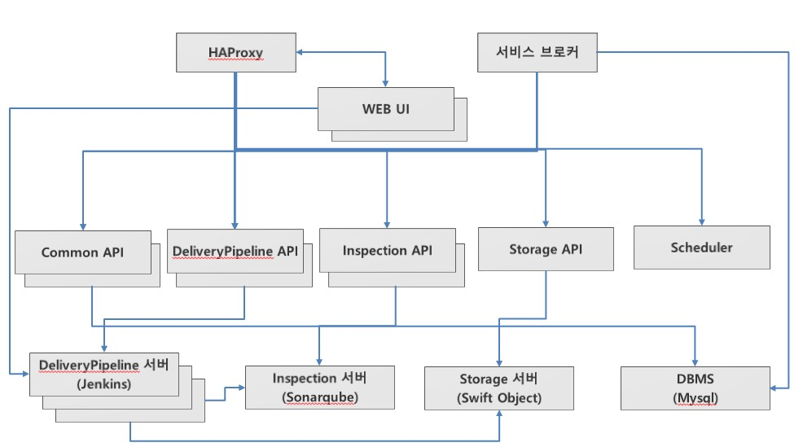

# PAAS-TA\_DELIVERY\_PIPELINE\_SERVICE\_INSTALL\_GUIDE\_V1.0

### Table of Contents

1. [문서 개요](paas-ta_delivery_pipeline_service_install_guide_v1.0.md#1) 1.1. [목적](paas-ta_delivery_pipeline_service_install_guide_v1.0.md#1.1) 1.2. [범위](paas-ta_delivery_pipeline_service_install_guide_v1.0.md#1.2) 1.3. [시스템 구성도](paas-ta_delivery_pipeline_service_install_guide_v1.0.md#1.3) 1.4. [참고자료](paas-ta_delivery_pipeline_service_install_guide_v1.0.md#1.4)
2. [배포 파이프라인 서비스 설치](paas-ta_delivery_pipeline_service_install_guide_v1.0.md#2) 2.1. [Prerequisite](paas-ta_delivery_pipeline_service_install_guide_v1.0.md#2.1) 2.2. [Stemcell 확인](paas-ta_delivery_pipeline_service_install_guide_v1.0.md#2.2) 2.3. [Deployment 다운로드](paas-ta_delivery_pipeline_service_install_guide_v1.0.md#2.3) 2.4. [Deployment 파일 수정](paas-ta_delivery_pipeline_service_install_guide_v1.0.md#2.4) 2.5. [서비스 설치](paas-ta_delivery_pipeline_service_install_guide_v1.0.md#2.5) 2.6. [서비스 설치 - 다운로드 된 PaaS-TA Release 파일 이용 방식](paas-ta_delivery_pipeline_service_install_guide_v1.0.md#2.6) 2.7. [서비스 설치 확인](paas-ta_delivery_pipeline_service_install_guide_v1.0.md#2.7)
3. [배포 파이프라인 서비스 관리 및 신청](paas-ta_delivery_pipeline_service_install_guide_v1.0.md#3) 3.1. [서비스 브로커 등록](paas-ta_delivery_pipeline_service_install_guide_v1.0.md#3.1) 3.2. [UAA Client 등록](paas-ta_delivery_pipeline_service_install_guide_v1.0.md#3.2) 3.3. [Java Offline Buildpack 등록](paas-ta_delivery_pipeline_service_install_guide_v1.0.md#3.3) 3.4. [서비스 신청](paas-ta_delivery_pipeline_service_install_guide_v1.0.md#3.4) 3.5. [서비스 신청 - CF CLI](paas-ta_delivery_pipeline_service_install_guide_v1.0.md#3.5)

### 1. 문서 개요

#### 1.1. 목적

본 문서\(배포 파이프라인 서비스팩 설치 가이드\)는 개방형 PaaS 플랫폼 고도화 및 개발자 지원 환경 기반의 Open PaaS에서 제공되는 서비스팩인 배포 파이프라인 서비스팩을 Bosh를 이용하여 설치 및 서비스 등록하는 방법을 기술하였다. PaaS-TA 3.5 버전부터는 Bosh2.0 기반으로 deploy를 진행하며 기존 Bosh1.0 기반으로 설치를 원할경우에는 PaaS-TA 3.1 이하 버전의 문서를 참고한다.

#### 1.2. 범위

설치 범위는 배포 파이프라인 서비스팩을 검증하기 위한 기본 설치를 기준으로 작성하였다.

#### 1.3. 시스템 구성도

본 문서의 설치된 시스템 구성도이다. 배포 파이프라인 Server, 형상관리 서비스 브로커로 최소사항을 구성하였다. 

| VM 명 | 인스턴스 수 | vCPU 수 | 메모리\(GB\) | 디스크\(GB\) |
| :--- | :--- | :--- | :--- | :--- |
| HAProxy | 1 | 1 | 2 | Root 4G |
| WEB UI | N | 1 | 2 | Root 4G |
| Service broker | 1 | 1 | 2 | Root 4G |
| Common API | N | 1 | 2 | Root 4G |
| DeliveryPipeline API | N | 1 | 2 | Root 4G |
| Inspection API | N | 1 | 2 | Root 4G |
| Storage API | 1 | 1 | 2 | Root 4G |
| Scheduler | 1 | 1 | 2 | Root 4G |
| DeliveryPipeline | N | 1 | 2 | Root 8G + 영구디스크 10G |
| Inspection | 1 | 1 | 2 | Root 4G |
| Storage | 1 | 1 | 4 | Root 4G + 영구디스크 50G |
| DBMS\(mariadb\) | 1 | 1 | 4 | Root 6G + 영구디스크 4G |
| Postgres | 1 | 1 | 2 | Root 6G + 영구디스크 4G |

#### 1.4. 참고 자료

> [http://bosh.io/docs](http://bosh.io/docs)   
>  [http://docs.cloudfoundry.org/](http://docs.cloudfoundry.org/)

### 2. 배포 파이프라인 서비스 설치

#### 2.1. Prerequisite

본 설치 가이드는 Linux 환경에서 설치하는 것을 기준으로 하였다. 서비스팩 설치를 위해서는 BOSH 2.0과 PaaS-TA 5.0 이상, PaaS-TA 포털이 설치되어 있어야 한다.

#### 2.2. Stemcell 확인

Stemcell 목록을 확인하여 서비스 설치에 필요한 Stemcell이 업로드 되어 있는 것을 확인한다. \(PaaS-TA 5.5.1 과 동일 stemcell 사용\)

> $ bosh -e micro-bosh stemcells

```text
Using environment '10.0.1.6' as client 'admin'

Name                                     Version  OS             CPI  CID  
bosh-aws-xen-hvm-ubuntu-xenial-go_agent  621.94*  ubuntu-xenial  -    ami-0297ff649e8eea21b  

(*) Currently deployed

1 stemcells

Succeeded
```

#### 2.3. Deployment 다운로드

서비스 설치에 필요한 Deployment를 Git Repository에서 받아 서비스 설치 작업 경로로 위치시킨다.

* Service Deployment Git Repository URL : [https://github.com/PaaS-TA/service-deployment/tree/v5.0.6](https://github.com/PaaS-TA/service-deployment/tree/v5.0.6)

```text
# Deployment 다운로드 파일 위치 경로 생성 및 설치 경로 이동
$ mkdir -p ~/workspace/paasta-5.5.1/deployment
$ cd ~/workspace/paasta-5.5.1/deployment

# Deployment 파일 다운로드
$ git clone https://github.com/PaaS-TA/service-deployment.git -b v5.0.6

# common_vars.yml 파일 다운로드(common_vars.yml가 존재하지 않는다면 다운로드)
$ git clone https://github.com/PaaS-TA/common.git
```

#### 2.4. Deployment 파일 수정

BOSH Deployment manifest는 Components 요소 및 배포의 속성을 정의한 YAML 파일이다. Deployment 파일에서 사용하는 network, vm\_type, disk\_type 등은 Cloud config를 활용하고, 활용 방법은 BOSH 2.0 가이드를 참고한다.

* Cloud config 설정 내용을 확인한다.   

> $ bosh -e micro-bosh cloud-config

```text
Using environment '10.0.1.6' as client 'admin'

azs:
- cloud_properties:
    availability_zone: ap-northeast-2a
  name: z1
- cloud_properties:
    availability_zone: ap-northeast-2a
  name: z2

... ((생략)) ...

disk_types:
- disk_size: 1024
  name: default
- disk_size: 1024
  name: 1GB

... ((생략)) ...

networks:
- name: default
  subnets:
  - az: z1
    cloud_properties:
      security_groups: paasta-security-group
      subnet: subnet-00000000000000000
    dns:
    - 8.8.8.8
    gateway: 10.0.1.1
    range: 10.0.1.0/24
    reserved:
    - 10.0.1.2 - 10.0.1.9
    static:
    - 10.0.1.10 - 10.0.1.120

... ((생략)) ...

vm_types:
- cloud_properties:
    ephemeral_disk:
      size: 3000
      type: gp2
    instance_type: t2.small
  name: minimal
- cloud_properties:
    ephemeral_disk:
      size: 10000
      type: gp2
    instance_type: t2.small
  name: small

... ((생략)) ...

Succeeded
```

* common\_vars.yml을 서버 환경에 맞게 수정한다. 
* 배포 파이프라인에서 사용하는 변수는 system\_domain 이다.

> $ vi ~/workspace/paasta-5.5.1/deployment/common/common\_vars.yml
>
> \`\`\`
>
> ## BOSH INFO
>
> bosh\_ip: "10.0.1.6" \# BOSH IP bosh\_url: "[https://10.0.1.6](https://10.0.1.6)" \# BOSH URL \(e.g. "[https://00.000.0.0](https://00.000.0.0)"\) bosh\_client\_admin\_id: "admin" \# BOSH Client Admin ID bosh\_client\_admin\_secret: "ert7na4jpew48" \# BOSH Client Admin Secret\('echo $\(bosh int ~/workspace/paasta-5.5.1/deployment/paasta-deployment/bosh/{iaas}/creds.yml --path /admin\_password\)' 명령어를 통해 확인 가능\) bosh\_director\_port: 25555 \# BOSH director port bosh\_oauth\_port: 8443 \# BOSH oauth port bosh\_version: 271.2 \# BOSH version\('bosh env' 명령어를 통해 확인 가능, on-demand service용, e.g. "271.2"\)

## PAAS-TA INFO

system\_domain: "61.252.53.246.xip.io" \# Domain \(xip.io를 사용하는 경우 HAProxy Public IP와 동일\) paasta\_admin\_username: "admin" \# PaaS-TA Admin Username paasta\_admin\_password: "admin" \# PaaS-TA Admin Password paasta\_nats\_ip: "10.0.1.121" paasta\_nats\_port: 4222 paasta\_nats\_user: "nats" paasta\_nats\_password: "7EZB5ZkMLMqT73h2Jh3UsqO" \# PaaS-TA Nats Password \(CredHub 로그인후 'credhub get -n /micro-bosh/paasta/nats\_password' 명령어를 통해 확인 가능\) paasta\_nats\_private\_networks\_name: "default" \# PaaS-TA Nats 의 Network 이름 paasta\_database\_ips: "10.0.1.123" \# PaaS-TA Database IP \(e.g. "10.0.1.123"\) paasta\_database\_port: 5524 \# PaaS-TA Database Port \(e.g. 5524\(postgresql\)/13307\(mysql\)\) -- Do Not Use "3306"&"13306" in mysql paasta\_database\_type: "postgresql" \# PaaS-TA Database Type \(e.g. "postgresql" or "mysql"\) paasta\_database\_driver\_class: "org.postgresql.Driver" \# PaaS-TA Database driver-class \(e.g. "org.postgresql.Driver" or "com.mysql.jdbc.Driver"\) paasta\_cc\_db\_id: "cloud\_controller" \# CCDB ID \(e.g. "cloud\_controller"\) paasta\_cc\_db\_password: "cc\_admin" \# CCDB Password \(e.g. "cc\_admin"\) paasta\_uaa\_db\_id: "uaa" \# UAADB ID \(e.g. "uaa"\) paasta\_uaa\_db\_password: "uaa\_admin" \# UAADB Password \(e.g. "uaa\_admin"\) paasta\_api\_version: "v3"

## UAAC INFO

uaa\_client\_admin\_id: "admin" \# UAAC Admin Client Admin ID uaa\_client\_admin\_secret: "admin-secret" \# UAAC Admin Client에 접근하기 위한 Secret 변수 uaa\_client\_portal\_secret: "clientsecret" \# UAAC Portal Client에 접근하기 위한 Secret 변수

## Monitoring INFO

metric\_url: "10.0.161.101" \# Monitoring InfluxDB IP syslog\_address: "10.0.121.100" \# Logsearch의 ls-router IP syslog\_port: "2514" \# Logsearch의 ls-router Port syslog\_transport: "relp" \# Logsearch Protocol saas\_monitoring\_url: "61.252.53.248" \# Pinpoint HAProxy WEBUI의 Public IP monitoring\_api\_url: "61.252.53.241" \# Monitoring-WEB의 Public IP

#### Portal INFO

portal\_web\_user\_ip: "52.78.88.252" portal\_web\_user\_url: "[http://portal-web-user.52.78.88.252.xip.io](http://portal-web-user.52.78.88.252.xip.io)"

#### ETC INFO

abacus\_url: "[http://abacus.61.252.53.248.xip.io](http://abacus.61.252.53.248.xip.io)" \# abacus url \(e.g. "[http://abacus.xxx.xxx.xxx.xxx.xip.io](http://abacus.xxx.xxx.xxx.xxx.xip.io)"\)

```text
- Deployment YAML에서 사용하는 변수 파일을 서버 환경에 맞게 수정한다.

> $ vi ~/workspace/paasta-5.5.1/deployment/service-deployment/pipeline-service/vars.yml
```

## STEMCELL

stemcell\_os: "ubuntu-xenial" \# stemcell os stemcell\_version: "621.94" \# stemcell version

## NETWORK

private\_networks\_name: "default" \# private network name public\_networks\_name: "vip" \# public network name

## UAAC

pipeline\_clinet\_id: "pipeclient" \# pipeline client id for UAA pipeline\_clinet\_secret: "clientsecret" \# pipeline client password for UAA

## MARIADB

mariadb\_port: "13306" \# mariadb database port \(default : 13306\) -- Do Not Use "3306" mariadb\_azs: \[z5\] \# mariadb azs mariadb\_instances: 1 \# mariadb instances mariadb\_persistent\_disk\_type: "2GB" \# mariadb persistent disk type mariadb\_vm\_type: "small" \# mariadb vm type \(e.g. small/medium/large etc\) mariadb\_internal\_static\_ips: "" \# mariadb's private IP \(e.g. "10.0.161.30"\) mariadb\_admin\_password: "" \# mariadb admin password \(e.g. "admin!Service"\)

## POSTGRES

postgres\_port: "5532" \# postgresql port \(default : 5532\) -- Do Not Use "5432" postgres\_azs: \[z5\] \# postgresql azs postgres\_instances: 1 \# postgresql instances postgres\_persistent\_disk\_type: "2GB" \# postgresql persistent disk type postgres\_vm\_type: "small" \# postgresql vm type postgres\_internal\_static\_ips: "" \# postgresql's private IP \(e.g. "10.0.161.31"\) postgres\_datasource\_username: "" \# postgresql username \(e.g. sonar\) postgres\_datasource\_password: "" \# postgresql password \(e.g. sonar@2020\)

## INSPECTION\_SERVER

inspection\_azs: \[z5\] \# inspection server\(SonarQube\) azs inspection\_instances: 1 \# inspection server\(SonarQube\) instances inspection\_vm\_type: "small" \# inspection server\(SonarQube\) vm type inspection\_internal\_static\_ips: "" \# inspection server\(SonarQube\)'s private IP \(e.g. "10.0.161.32"\)

## HAPROXY

haproxy\_azs: \[z7\] \# haproxy azs haproxy\_instances: 1 \# haproxy instances haproxy\_vm\_type: "small" \# haproxy vm type haproxy\_internal\_static\_ips: "" \# haproxy's private IP \(e.g. "10.0.0.11"\) haproxy\_public\_static\_ips: "" \# haproxy's public IP

## CI\_SERVER

ci\_server\_azs: \[z5\] \# ci server\(Jenkins\) azs ci\_server\_instances: 2 \# ci server\(Jenkins\) instances ci\_server\_persistent\_disk\_type: "5GB" \# ci server\(Jenkins\) persistent disk type ci\_server\_vm\_type: "small" \# ci server\(Jenkins\) vm type ci\_server\_shared\_internal\_static\_ip: "" \# ci server\(Jenkins\)'s private IP for shared \(e.g. "10.0.161.33"\) ci\_server\_dedicated\_internal\_static\_ip: "" \# ci server\(Jenkins\)'s public IP for dedicated \(e.g. "10.0.161.34"\) ci\_server\_password: "" \# ci server\(Jenkins\) password \(e.g. "admin!@\#"\) ci\_server\_admin\_user\_username: "" \# ci server\(Jenkins\) admin username \(e.g. "admin"\) ci\_server\_admin\_user\_password: "" \# ci server\(Jenkins\) admin password \(e.g. "admin!@\#"\) ci\_server\_http\_url: "" \# ci server\(Jenkins\) 내부 IP 앞 두자리 입력 \(e.g. 10.110.10.10 의 경우, "10.110" 입력\)

## BINARY\_STORAGE

binary\_storage\_azs: \[z5\] \# binary storage azs binary\_storage\_instances: 1 \# binary storage instances binary\_storage\_persistent\_disk\_type: "5GB" \# binary storage persistent disk type binary\_storage\_vm\_type: "small" \# binary storage vm type binary\_storage\_internal\_static\_ips: "" \# binary storage's private IP \(e.g. "10.0.161.35"\) binary\_storage\_proxy\_port: "10008" \# binary storage 프록시 서버 Port\(Object Storage 접속 Port\) \(default : 10008\) binary\_storage\_auth\_port: 15001 \# binary storage keystone port \(e.g. 15001\) -- Do Not Use "5000" binary\_storage\_username: "paasta-pipeline" \# binary storage 최초 생성되는 유저이름\(Object Storage 접속 유저이름\) binary\_storage\_password: "paasta-pipeline" \# binary storage 최초 생성되는 유저 비밀번호\(Object Storage 접속 유저 비밀번호\) binary\_storage\_tenantname: "paasta-pipeline" \# binary storage 최초 생성되는 테넌트 이름\(Object Storage 접속 테넌트 이름\) binary\_storage\_email: "email@email.com" \# binary storage 최소 생성되는 유저의 이메일 binary\_storage\_binary\_desc: "paasta-pipeline-object service" \# binary storage 설명 binary\_storage\_container: "delivery-pipeline-container" \# binary storage 최소 생성되는container 이름

## COMMON\_API

common\_api\_port: "8081" \# common api port common\_api\_azs: \[z5\] \# common api azs common\_api\_instances: 1 \# common api instances common\_api\_vm\_type: "small" \# common api vm type common\_api\_internal\_static\_ips: "" \# common api's private IP \(e.g. "10.0.161.36"\)

## INSPECTION\_API

inspection\_api\_port: "8083" \# inspection api port inspection\_api\_azs: \[z5\] \# inspection api azs inspection\_api\_instances: 1 \# inspection api instances inspection\_api\_vm\_type: "small" \# inspection api vm type inspection\_api\_internal\_static\_ips: "" \# inspection api's private IP \(e.g. "10.0.161.37"\)

## BINARY\_STORAGE\_API

storage\_api\_port: "8080" \# storage api port storage\_api\_azs: \[z5\] \# storage api azs storage\_api\_instances: 1 \# storage api instances storage\_api\_vm\_type: "small" \# storage api vm type storage\_api\_internal\_static\_ips: "" \# storage api's private IP \(e.g. "10.0.161.38"\)

## API

api\_port: "8082" \# api port api\_azs: \[z5\] \# api azs api\_instances: 1 \# api instances api\_persistent\_disk\_type: "2GB" \# api persistent disk type api\_vm\_type: "small" \# api vm type api\_internal\_static\_ips: "" \# api's private IP \(e.g. "10.0.161.39"\)

## SERVICE\_BROKER

service\_broker\_port: "8080" \# pipeline service broker port service\_broker\_azs: \[z5\] \# pipeline service broker azs service\_broker\_instances: 1 \# pipeline service broker instances service\_broker\_persistent\_disk\_type: "2GB" \# pipeline service broker persistent disk type service\_broker\_vm\_type: "small" \# pipeline service broker vm type service\_broker\_internal\_static\_ips: "" \# pipeline service broker's private IP \(e.g. "10.0.161.40"\)

## UI\(DASHBOARD\)

ui\_port: "8084" \# ui\(dahsboard\) port ui\_azs: \[z5\] \# ui\(dahsboard\) azs ui\_instances: 1 \# ui\(dahsboard\) instances ui\_vm\_type: "small" \# ui\(dahsboard\) vm type ui\_internal\_static\_ips: "" \# ui\(dahsboard\)'s private IP \(e.g. "10.0.161.41"\)

## SCHEDULER

scheduler\_port: "8080" \# scheduler port scheduler\_azs: \[z5\] \# scheduler azs scheduler\_instances: 1 \# scheduler instances scheduler\_vm\_type: "small" \# scheduler vm type scheduler\_internal\_static\_ips: "" \# scheduler's private IP \(e.g. "10.0.161.42"\)

```text
### <div id='2.5'/> 2.5. 서비스 설치

- 서버 환경에 맞추어 Deploy 스크립트 파일의 VARIABLES 설정을 수정하고, Option file을 추가할지 선택한다.  
     (선택) -o operations/use-compiled-releases.yml (ubuntu-xenial/621.94로 컴파일 된 릴리즈 사용) 

> $ vi ~/workspace/paasta-5.5.1/deployment/service-deployment/pipeline-service/deploy.sh
```

## !/bin/bash

## VARIABLES

COMMON\_VARS\_PATH="" \# common\_vars.yml File Path \(e.g. ../../common/common\_vars.yml\) CURRENT\_IAAS="${CURRENT\_IAAS}" \# IaaS Information \(PaaS-TA에서 제공되는 create-bosh-login.sh 미 사용시 aws/azure/gcp/openstack/vsphere 입력\) BOSH\_ENVIRONMENT="${BOSH\_ENVIRONMENT}" \# bosh director alias name \(PaaS-TA에서 제공되는 create-bosh-login.sh 미 사용시 bosh envs에서 이름을 확인하여 입력\)

## DEPLOY

bosh -e ${BOSH\_ENVIRONMENT} -n -d pipeline-service deploy --no-redact pipeline-service.yml  -o operations/${CURRENT\_IAAS}-network.yml  -l ${COMMON\_VARS\_PATH}  -l vars.yml

```text
- 서비스를 설치한다.
```

$ cd ~/workspace/paasta-5.5.1/deployment/service-deployment/pipeline-service  
$ sh ./deploy.sh

```text
### <div id='2.6'/> 2.6. 서비스 설치 - 다운로드 된 PaaS-TA Release 파일 이용 방식

- 서비스 설치에 필요한 릴리즈 파일을 다운로드 받아 Local machine의 서비스 설치 작업 경로로 위치시킨다.  

  - 설치 릴리즈 파일 다운로드 : [paasta-delivery-pipeline-release-1.0.2.tgz](http://45.248.73.44/index.php/s/maQQNLmYNEAG78y/download)
```

## 릴리즈 다운로드 파일 위치 경로 생성

$ mkdir -p ~/workspace/paasta-5.5.1/release/service

## 릴리즈 파일 다운로드\(paasta-delivery-pipeline-release.tgz\) 및 파일 경로 확인

$ ls ~/workspace/paasta-5.5.1/release/service paasta-delivery-pipeline-release-1.0.2.tgz

```text
- 서버 환경에 맞추어 Deploy 스크립트 파일의 VARIABLES 설정을 수정하고 Option file 및 변수를 추가한다.  
     (추가) -o operations/use-offline-releases.yml (미리 다운받은 offline 릴리즈 사용)  
     (추가) -v releases_dir="<RELEASE_DIRECTORY>"  

> $ vi ~/workspace/paasta-5.5.1/deployment/service-deployment/pipeline-service/deploy.sh
```

## !/bin/bash

## VARIABLES

COMMON\_VARS\_PATH="" \# common\_vars.yml File Path \(e.g. ../../common/common\_vars.yml\) CURRENT\_IAAS="${CURRENT\_IAAS}" \# IaaS Information \(PaaS-TA에서 제공되는 create-bosh-login.sh 미 사용시 aws/azure/gcp/openstack/vsphere 입력\) BOSH\_ENVIRONMENT="${BOSH\_ENVIRONMENT}" \# bosh director alias name \(PaaS-TA에서 제공되는 create-bosh-login.sh 미 사용시 bosh envs에서 이름을 확인하여 입력\)

## DEPLOY

bosh -e ${BOSH\_ENVIRONMENT} -n -d pipeline-service deploy --no-redact pipeline-service.yml  -o operations/${CURRENT\_IAAS}-network.yml  -l ${COMMON\_VARS\_PATH}  -l vars.yml  -v releases\_dir="/home/ubuntu/workspace/paasta-5.5.1/release"

```text
- 서비스를 설치한다.
```

$ cd ~/workspace/paasta-5.5.1/deployment/service-deployment/pipeline-service  
$ sh ./deploy.sh

```text
### <div id='2.7'/> 2.7. 서비스 설치 확인

설치 된 서비스를 확인한다.  

> $ bosh -e micro-bosh -d pipeline-service vms
```

Using environment '10.0.1.6' as client 'admin'

Task 296077. Done

Deployment 'pipeline-service'

Instance Process State AZ IPs VM CID VM Type Active Stemcell  
binary\_storage/63b0c3de-0037-46c7-add7-c7fe54a9ac6c running z5 10.0.161.17 28b7e75b-6fb4-4e3a-8a90-68d20e934441 small true -  
ci\_server/48d7ffb1-9ac2-42af-915c-9adc7a215656 running z5 10.0.161.15 9694f782-acc2-4958-946c-1a21010c6325 small true -  
ci\_server/de71d530-6b95-482e-a419-32e3c1e64f21 running z5 10.0.161.16 c7858b61-2dc1-4878-9e21-5ff5cd07d47b small true -  
delivery-pipeline-api/ea2486ff-6477-4899-9e95-7370ed27efbe running z5 10.0.161.21 ca7c0346-b086-4948-9da1-5410c5eec778 small true -  
delivery-pipeline-binary-storage-api/9d70363c-7e42-4d67-a452-b50a21a4e373 running z5 10.0.161.20 fbc6441e-73e1-41c8-a5f4-c5fc00336936 small true -  
delivery-pipeline-common-api/87ce092c-2fc6-4b1b-9921-78a73e191c9e running z5 10.0.161.18 23e8e141-c869-449c-873e-f48a49252521 small true -  
delivery-pipeline-inspection-api/b8f8d86a-443a-482e-a668-b94624a882fb running z5 10.0.161.19 88425e31-68a2-42cd-9431-5a7cc372b9e6 small true -  
delivery-pipeline-scheduler/d2c02e3c-e545-47e1-a98a-d81de281a166 running z5 10.0.161.24 8401e44a-16d5-4639-990c-876655500773 small true -  
delivery-pipeline-service-broker/151af074-db1f-4650-b789-477e69c51016 running z5 10.0.161.22 d1f474ed-48cf-43e3-b7e8-a4cb05c00dbf small true -  
delivery-pipeline-ui/d3ff6d00-93b9-4481-ac07-66cea65322f9 running z5 10.0.161.23 c65f56c5-13f8-4c12-8726-295a384b0a63 small true -  
haproxy/5a35c6b2-ac18-45cd-9705-a7a401721989 running z5 10.0.161.14 a1d70ef6-064d-46b1-b8fc-83ffb08ad82f small true -  
101.55.50.208  
inspection/0a91abe1-b888-4f86-a082-efd6aa9936de running z5 10.0.161.13 5c7a1f2e-b406-44d2-b5fe-2f694c36036c small true -  
mariadb/521553a6-4145-4c5c-9d8f-475db29c5807 running z5 10.0.161.11 5476fe5d-a4b2-4b25-8db7-00a0afa30186 small true -  
postgres/6a8a4d71-e46f-49ca-b992-407441a90965 running z5 10.0.161.12 c87ffcd0-599e-4f07-8d03-3b52d7ae3762 small true -

14 vms

Succeeded

```text
## <div id='3'/> 3. 배포 파이프라인 서비스 관리 및 신청 
PaaS-TA 운영자 포탈을 통해 배포파이프라인 서비스를 등록 및 공개하면, PaaS-TA 사용자 포탈을 통해 서비스를 신청 하여 사용할 수 있다.

### <div id='3.1'/> 3.1. 서비스 브로커 등록

배포 파이프라인 서비스팩 배포가 완료되었으면 파스-타 포탈에서 서비스 팩을 사용하기 위해서 먼저 배포 파이프라인 서비스 브로커를 등록해 주어야 한다.
서비스 브로커 등록 시 개방형 클라우드 플랫폼에서 서비스 브로커를 등록할 수 있는 사용자로 로그인이 되어있어야 한다.

##### 서비스 브로커 목록을 확인한다.

>`$ cf service-brokers`
```

$ cf service-brokers Getting service brokers as admin...

name url No service brokers found

```text
##### 배포 파이프라인 서비스 브로커를 등록한다.
>`$ cf create-service-broker {서비스팩 이름} {서비스팩 사용자ID} {서비스팩 사용자비밀번호} http://{서비스팩 URL}`  

  **서비스팩 이름** : 서비스 팩 관리를 위해 PaaS-TA에서 보여지는 명칭이다. 서비스 Marketplace에서는 각각의 API 서비스 명이 보여지니 여기서 명칭은 서비스팩 리스트의 명칭이다.<br>
  **서비스팩 사용자ID** / 비밀번호 : 서비스팩에 접근할 수 있는 사용자 ID입니다. 서비스팩도 하나의 API 서버이기 때문에 아무나 접근을 허용할 수 없어 접근이 가능한 ID/비밀번호를 입력한다.<br>
  **서비스팩 URL** : 서비스팩이 제공하는 API를 사용할 수 있는 URL을 입력한다.

>`$ cf create-service-broker delivery-pipeline admin cloudfoundry http://10.30.107.64:8080`
```

$ cf create-service-broker delivery-pipeline-broker admin cloudfoundry [http://10.30.107.64:8080](http://10.30.107.64:8080) Creating service broker delivery-pipeline-broker as admin... OK

```text
##### 등록된 배포 파이프라인 서비스 브로커를 확인한다.

>`$ cf service-brokers`
```

$ cf service-brokers Getting service brokers as admin...

name url delivery-pipeline-broker [http://10.30.107.64:8080](http://10.30.107.64:8080)

```text
##### 접근 가능한 서비스 목록을 확인한다.
>`$ cf service-access`
```

## 서비스 브로커 생성시 디폴트로 접근을 허용하지 않는다.

$ cf service-access Getting service access as admin... broker: delivery-pipeline-broker service plan access orgs delivery-pipeline delivery-pipeline-shared none delivery-pipeline delivery-pipeline-dedicated none

```text
##### 특정 조직에 해당 서비스 접근 허용을 할당하고 접근 서비스 목록을 다시 확인한다. (전체 조직)  
>`$ cf enable-service-access delivery-pipeline`  
>`$ cf service-access`
```

$ cf enable-service-access delivery-pipeline  
Enabling access to all plans of service delivery-pipeline for all orgs as admin...  
OK

$ cf service-access Getting service access as admin... broker: delivery-pipeline-broker service plan access orgs delivery-pipeline delivery-pipeline-shared all delivery-pipeline delivery-pipeline-dedicated all

```text
### <div id='3.2'/> 3.2. UAAC Client 등록
UAAC Client 계정 등록 절차에 대한 순서를 확인한다.

- 배포 파이프라인 UAAC Client를 등록한다.
> $ uaac client add {클라이언트 명} -s {클라이언트 비밀번호} --redirect_URL{대시보드 URL} --scope {퍼미션 범위} --authorized_grant_types {권한 타입} --authorities={권한 퍼미션} --autoapprove={자동승인권한}  
> 클라이언트 명 : uaac 클라이언트 명 (pipeclient)  
> 클라이언트 비밀번호 : uaac 클라이언트 비밀번호  
> 대시보드 URL: 성공적으로 리다이렉션 할 대시보드 URL   
> 퍼미션 범위: 클라이언트가 사용자를 대신하여 얻을 수있는 허용 범위 목록  
> 권한 타입 : 서비스팩이 제공하는 API를 사용할 수 있는 권한 목록  
> 권한 퍼미션 : 클라이언트에 부여 된 권한 목록  
> 자동승인권한: 사용자 승인이 필요하지 않은 권한 목록  

>$ uaac client add pipeclient -s clientsecret --redirect_uri "[DASHBOARD_URL]" /  
>--scope "cloud_controller_service_permissions.read , openid , cloud_controller.read , cloud_controller.write , cloud_controller.admin" /  
>--authorized_grant_types "authorization_code , client_credentials , refresh_token" /  
>--authorities="uaa.resource" /  
>--autoapprove="openid , cloud_controller_service_permissions.read"
```

#### uaac endpoint 설정

$ uaac target [https://uaa](https://uaa). --skip-ssl-validation

#### target 확인

$ uaac target Target: [https://uaa](https://uaa). Context: uaa\_admin, from client uaa\_admin

#### uaac 로그인

$ uaac token client get  -s 

#### 배포파이프라인 uaac client 등록

$ uaac client add pipeclient -s clientsecret --redirect\_uri "[http://115.68.47.175:8084](http://115.68.47.175:8084) [http://115.68.47.175:8084/dashboard](http://115.68.47.175:8084/dashboard)"  --scope "cloud\_controller\_service\_permissions.read , openid , cloud\_controller.read , cloud\_controller.write , cloud\_controller.admin"  --authorized\_grant\_types "authorization\_code , client\_credentials , refresh\_token"  --authorities="uaa.resource"  --autoapprove="openid , cloud\_controller\_service\_permissions.read"

```text
### <div id='3.3'/> 3.3. Java Offline Buildpack 등록
- 배포 파이프라인 서비스 사용을 위해 Java Offline Buildpack을 등록한다.
> `$ cf create-buildpack [BUILDPACK] [PATH] [POSITION] `  
> **[BUILDPACK]** : java_buildpack_offline (buildpack 명)  
> **[PATH]** : buildpack zip 파일의 경로     
> **[POSITION]** : 우선순위  

- Java Offline Buildpack 다운로드 
> wget -O java-buildpack-offline-v4.25.zip http://45.248.73.44/index.php/s/mcaBZQCqwbyzC6a/download  

**buildpack 등록**  

>`$ cf create-buildpack java_buildpack_offline ..\buildpack\java-buildpack-offline-v4.25.zip 3`  

**buildpack 등록 확인**  

>`$ cf buildpacks`
```

$ cf buildpacks Getting buildpacks...

buildpack position enabled locked filename staticfile\_buildpack 1 true false staticfile\_buildpack-cflinuxfs3-v1.4.43.zip java\_buildpack 2 true false java-buildpack-cflinuxfs3-v4.19.1.zip java\_buildpack\_offline 3 true false java-buildpack-offline-v4.25.zip ruby\_buildpack 4 true false ruby\_buildpack-cflinuxfs3-v1.7.40.zip dotnet\_core\_buildpack 5 true false dotnet-core\_buildpack-cflinuxfs3-v2.2.12.zip nodejs\_buildpack 6 true false nodejs\_buildpack-cflinuxfs3-v1.6.51.zip go\_buildpack 7 true false go\_buildpack-cflinuxfs3-v1.8.40.zip python\_buildpack 8 true false python\_buildpack-cflinuxfs3-v1.6.34.zip php\_buildpack 9 true false php\_buildpack-cflinuxfs3-v4.3.77.zip nginx\_buildpack 10 true false nginx\_buildpack-cflinuxfs3-v1.0.13.zip r\_buildpack 11 true false r\_buildpack-cflinuxfs3-v1.0.10.zip binary\_buildpack 12 true false binary\_buildpack-cflinuxfs3-v1.0.32.zip

```text
※ 참고 URL : https://github.com/cloudfoundry/java-buildpack  


### <div id='3.4'/> 3.4. 서비스 신청
1. PaaS-Ta 운영자 포탈에 접속하여 로그인한다.
![3-1-1]

2. 로그인 후 서비스 관리 > 서비스 브로커 페이지에서 배포 파이프라인 서비스 브로커를 확인한다.
![3-1-2]

3. 서비스 관리 > 서비스 제어 페이지에서 배포 파이프라인 서비스 플랜 접근 가능 권한을 확인한다.
![3-1-3]

4. 운영관리 > 카탈로그 > 앱서비스 페이지를 확인하여 "파이프라인" 서비스 이름을 클릭한다.  
![3-2-1]

- 아래의 내용을 상세 페이지에 입력한다.

> ※ 카탈로그 관리 > 앱 서비스
> - 이름 : 파이프라인
> - 분류 :  개발 지원 도구
> - 서비스 : delivery-pipeline
> - 썸네일 : [배포 파이프라인 서비스 썸네일]
> - 문서 URL : https://github.com/PaaS-TA/DELIVERY-PIPELINE-SERVICE-BROKER
> - 서비스 생성 파라미터 : owner
> - 앱 바인드 사용 : N
> - 공개 : Y
> - 대시보드 사용 : Y
> - 온디멘드 : N
> - 태그 : paasta / tag6, free / tag2
> - 요약 : 개발용으로 만들어진 파이프라인
> - 설명 :
> 개발용으로 만들어진 파이프라인
> 배포 파이프라인 Server, 배포 파이프라인 서비스 브로커로 최소사항을 구성하였다.
>  
> ![3-2-2]


### <div id='3.5'/> 3.5. 서비스 신청 - CF CLI
- CF CLI 를 통한 파이프라인 서비스 신청 방법을 설명한다.

> $ cf create-service [SERVICE] [PLAN] [SERVICE_INSTANCE] [-c PARAMETERS_AS_JSON]
> - [SERVICE] / [PLAN] : 서비스 명과 서비스 플랜
> - [SERVICE_INSTANCE] : 서비스 인스턴스 명 (내 서비스 목록에서 보여지는 명칭)
> - [-c PARAMETERS_AS_JSON] : JSON 형식의 파라미터 (파이프라인 서비스 신청 시, owner 파라미터는 필수)
```

#### e.g. 파이프라인 서비스 신청

$ cf create-service delivery-pipeline delivery-pipeline-shared pipeline-service -c '{"owner":"demo"}'

#### e.g. 파이프라인 서비스 확인

$ cf services Getting services in org system / space dev as admin...

name service plan bound apps last operation broker upgrade available pipeline delivery-pipeline delivery-pipeline-shared create succeeded delivery-pipeline

```text
- 서비스 상세의 대시보드 URL 정보를 확인하여 서비스에 접근한다.
```

#### 서비스 상세 정보의 Dashboard URL을 확인한다.

$ cf service pipeline ... \(생략\) ... Dashboard: [http://115.68.47.201:8084/dashboard/2bcbe484-e235-441e-bdb6-ef88f73cb516/](http://115.68.47.201:8084/dashboard/2bcbe484-e235-441e-bdb6-ef88f73cb516/) Service broker: delivery-pipeline ... \(생략\) ...

\`\`\`

